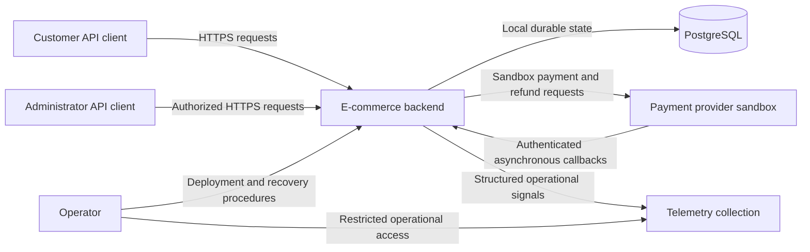
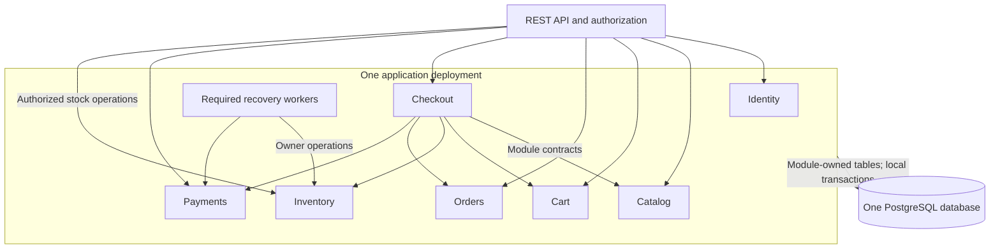
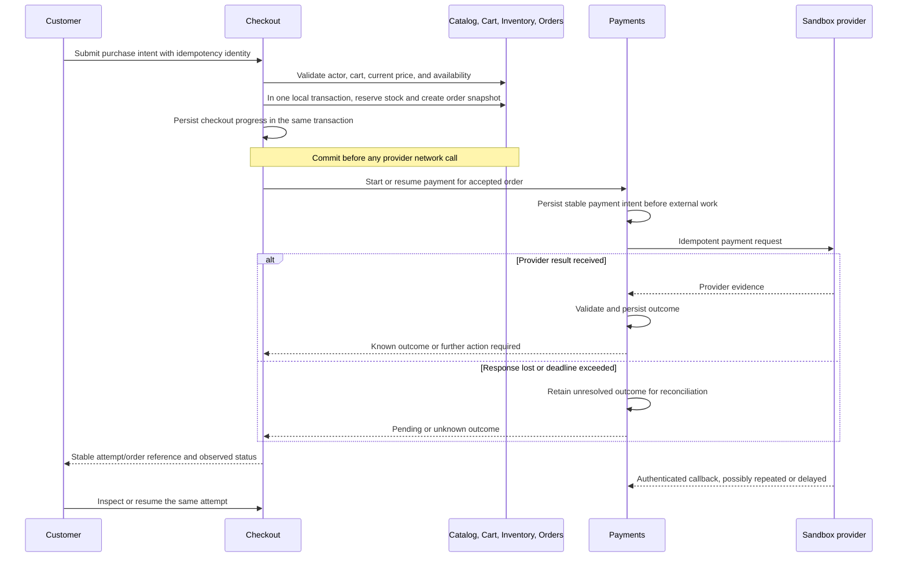
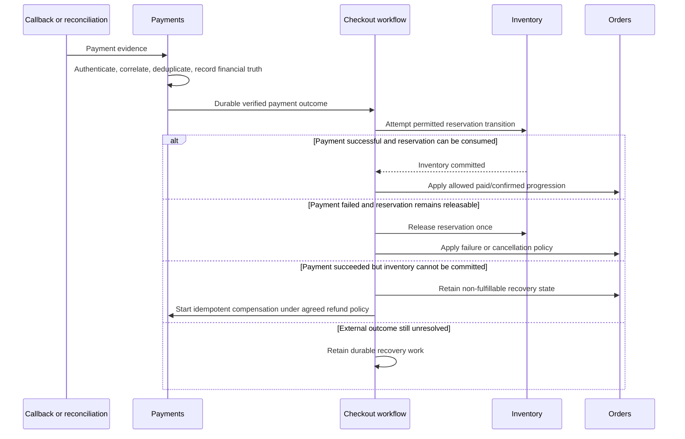
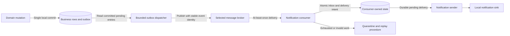
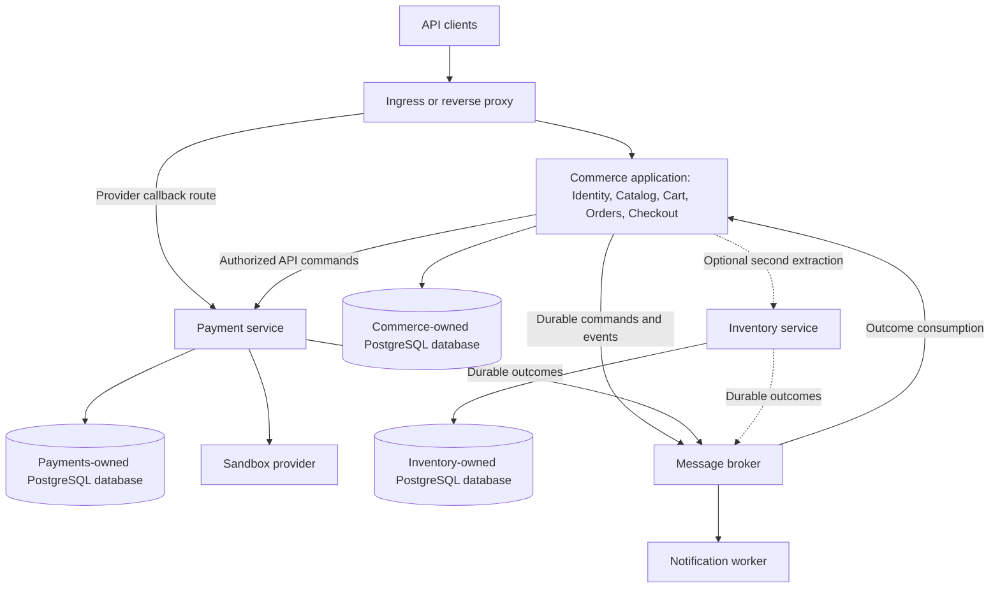
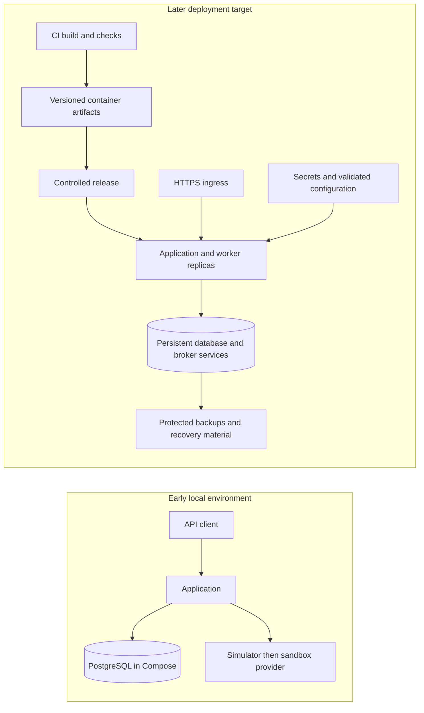
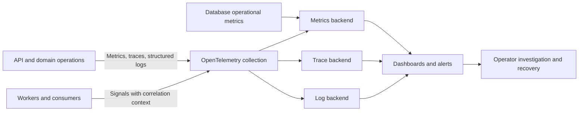

# Global Architecture and Evolution

| Field | Value |
| --- | --- |
| Document | ARC-001 |
| Status | Draft architecture; modular-monolith starting point required by the project brief |
| Scope | System boundaries, data ownership, architecture progression, and decision rationale |
| Related documents | [Scope](overview-and-learning-objectives.md), [Actors](system-actors-and-roles.md), [Roadmap](phase-roadmap-and-scrum-plan.md) |

## 1. Architecture principles

1. Begin with one deployable application and PostgreSQL. Keep domain ownership explicit inside that application.
2. Put stock, order, and money invariants at their authoritative write boundaries. Caches, clients, and search results cannot authorize a purchase.
3. Preserve a durable record of work that may outlive an HTTP request. Timeouts are uncertain outcomes until authoritative evidence establishes otherwise.
4. Add asynchronous delivery and service boundaries only when a documented experiment establishes a benefit worth their operating cost.
5. Preserve the existing purchase contract and correctness scenarios through each architecture change.
6. Introduce essential security, diagnostics, deadlines, and recovery with the feature that requires them. Later phases improve depth and scale.

The diagrams show planned architecture, not deployed resources. Optional components appear only in the stages that evaluate them. Frameworks, broker products, cache products, and hosting vendors remain unselected.

## 2. System context

Customers and administrators use the public API with different permissions. PostgreSQL stores authoritative local state. Payment requests are outbound network calls; provider callbacks arrive independently of the original request. Operators inspect telemetry and use controlled deployment/recovery paths.

The main failure boundaries are the database connection and payment-provider network. A provider outage may prevent payment progress while catalog browsing continues. A database outage prevents authoritative mutations. Telemetry export failure must be bounded and must not indefinitely block business requests.

## 3. Modular monolith

The boxes are code and ownership boundaries, not network services. Public APIs call application operations; Checkout coordinates module contracts. Modules may participate in one explicit local database transaction when consistency requires it. Worker execution may initially share the deployment, but its progress is durable and cannot depend on one process staying alive.

One database simplifies atomic stock/order changes, migrations, and local development. The costs are shared deployment, shared database capacity, and a larger process failure domain. Module contracts MUST prevent arbitrary writes to another module's tables. Required relational constraints are allowed in the monolith; extracting a boundary later requires an explicit plan for any cross-module foreign keys.

### 3.1 Data and operation ownership

| Module | Owns | Exposes to other modules | Does not own |
| --- | --- | --- | --- |
| Identity | Accounts, credential state, privileges, sessions | Validated actor identity and authorization context | Orders, cart contents, payment state |
| Catalog | Products, categories, publication state, current prices | Product lookup and authoritative price/version information | Historical order prices or available stock |
| Inventory | Stock quantities, adjustments, reservations and their lifecycle | Reserve, consume, release, inspect reservation outcome | Payment-provider truth or product pricing |
| Cart | Customer cart and item quantities | A versioned or otherwise concurrency-controlled checkout input | Guaranteed price, stock ownership, or payment intent |
| Orders | Order identity, immutable purchase/address snapshots, fulfillment and cancellation lifecycle | Create order snapshot, inspect order, apply permitted transitions | Raw credentials or provider-specific callback processing |
| Checkout | Attempt identity, idempotency coordination, progress across purchase steps | Start or resume a purchase attempt; inspect progress | Independent copies of stock balances or captured money |
| Payments | Payment attempts, provider mappings, verified outcomes, refunds, reconciliation progress | Start an idempotent payment/refund operation; inspect authoritative local financial status | Permission to bypass order or stock invariants |
| Notification processing, introduced in 09 | Delivery work and deduplication state | Delivery outcome and operational diagnostics | Order, payment, or inventory truth |

Checkout coordinates the workflow; it does not become a second source of truth for every participating domain. Orders, payment attempts, refunds, reservations, and checkout attempts have separate lifecycles. The state names in the brief are candidate business vocabulary, not a single universal enum.

### 3.2 Global invariants and consistency

| ID | Invariant or consistency requirement | Owning boundary | Review evidence |
| --- | --- | --- | --- |
| INV-01 | Stock available for new reservation MUST NOT fall below zero under the proposed no-backorder policy | Inventory transaction | Final-unit contention scenario; conservation check across reserve/consume/release |
| INV-02 | Each reservation MUST be consumed or released at most once; expiry and payment processing cannot both win incompatible transitions | Inventory lifecycle | Concurrent completion/expiry scenario with one final outcome |
| INV-03 | Order quantities, accepted prices, currency, totals, and address snapshot MUST remain historically stable after acceptance | Orders | Catalog/address edits do not rewrite an accepted purchase |
| INV-04 | One logical checkout submission MUST map to at most one order; same-key requests with different intent MUST NOT be treated as a successful replay | Checkout and database uniqueness | Concurrent duplicate submission and payload-mismatch scenarios |
| INV-05 | Verified capture and refund outcomes MUST be recorded without duplicate financial effects; cumulative successful plus outstanding reserved refund amounts MUST NOT exceed refundable captured funds | Payments | Parallel refunds, duplicate callbacks, timeout and reconciliation scenarios |
| INV-06 | An order MUST NOT become eligible for fulfillment unless payment and committed inventory satisfy the agreed purchase policy | Orders with evidence from Payments and Inventory | Late payment after reservation loss cannot authorize shipment |
| INV-07 | Refund success MUST NOT automatically restock an item | Orders/Inventory policy | Refund of a shipped item leaves stock unchanged unless a separate allowed stock operation occurs |
| INV-08 | Durable internal state MUST distinguish an unresolved external outcome from confirmed success or failure | Payments and Checkout | Lost provider response leaves a recoverable attempt with a reconciliation path |

Local stock, idempotency, and refund-limit decisions require transactional consistency. Notification delivery, caches, and derived search views may lag. Public read contracts MUST state any permitted staleness. Checkout MUST validate against authoritative owners even when browsing used cached data.

After extraction, no local transaction can atomically commit changes across all service databases. Each owner protects its own invariants; the workflow records pending work and compensation until the overall purchase reaches a valid outcome. Exactly-once execution across arbitrary external side effects is not assumed.

## 4. Checkout and payment interaction

### 4.1 Initial purchase flow at the end of phase 07

The customer submits intent; the server determines authoritative totals and stock eligibility. Checkout commits the local order/reservation/attempt before Payments contacts the provider. Payments persists its own durable intent before the call. A crash between those steps leaves recoverable Checkout progress.

All module operations before the provider call are synchronous; callbacks and reconciliation are asynchronous. Database locks MUST NOT be held while waiting for the provider. Exact transaction isolation, cart version policy, price-change confirmation, deadlines, and response schemas belong to phases 03–07.

Phase 06 uses a bounded development payment simulator through the intended boundary. Phase 07 owns the real sandbox adapter and financial semantics. Simulator results are learning evidence only and MUST NOT be presented as completed provider integration.

### 4.2 Applying payment evidence to order and inventory

Payments records what happened to money, including success that arrives too late. Inventory decides whether its reservation can still change. Orders records the business consequence. The workflow MUST NOT erase a valid capture because stock has expired, or confirm fulfillment without stock.

In the monolith, compatible local updates may share a transaction; after extraction, these steps use durable commands and outcomes with intermediate states. A compensation failure stays visible and retryable or explicitly escalated. Phase 06 specifies reservation expiry versus unknown-payment policy; phase 07 verifies it against the provider's behavior. A refund does not undo time or guarantee that an external operation never occurred.

## 5. Architecture stages and technology admission

| Architecture stage from the brief | Work packages | New capability | Admission evidence and new risk |
| --- | --- | --- | --- |
| 1. Modular monolith | 01–07 | Complete sandbox purchase and refund path on PostgreSQL | Core invariants demonstrated; shared process/database remain failure boundaries |
| 2. Production-ready monolith | 08 | Measured query tuning, bounded workers, stronger diagnostics and protection; caching if justified | Reproduce the latency or capacity issue first; caching introduces stale data and stampedes |
| 3. Event-driven architecture | 09 | Durable publication and independently retried notification processing | Demonstrate lost dual writes or synchronous dependency coupling; delivery introduces duplicates, lag, and backlog |
| 4. Microservices | 10 | Independently deploy one justified domain with exclusive data ownership | Demonstrate isolation or independent deployment/scaling value; network and migration failures become part of the contract |
| 5. Distributed system reliability | 11 | Deeper workflow recovery, compensation, bulkheads, tracing, message repair | Reproduce partial failures in the extracted topology; policies can cause retry storms or stranded workflows |
| 6. Scalability | 12 | Scale the measured bottleneck under a declared workload | Compare a simpler indexed/scaled baseline first; replicas, partitioning, or new caches add consistency/operating costs |
| 7. Production infrastructure | 13 | Repeatable deployment, rollback, recovery, and capacity operations | Deployment and outage drills establish the need and effect; orchestration increases configuration and security surface |

The label “production-ready monolith” is a roadmap stage, not a readiness claim. Each stage must satisfy its own evidence gates. Docker/Compose, basic CI, migrations, configuration validation, logs, and necessary workers can begin in phase 01 or their first consuming domain. They are not withheld until phase 13.

### 5.1 Decisions to retain or defer

| Candidate | Initial position | Trigger for reconsideration |
| --- | --- | --- |
| Redis or another shared cache | Deferred; PostgreSQL remains authoritative | Measured repeated-read cost or a justified distributed coordination requirement; define outage and eviction behavior |
| Kafka or RabbitMQ | Select at most one broker in 09 if the async workload warrants it | Compare durable database dispatch against routing, retention, replay, throughput, and consumer needs; do not introduce both for practice alone |
| Dedicated search engine | Deferred; catalog search begins with PostgreSQL | Search requirements or measured query limits exceed the simpler design after tuning |
| Read replica | Deferred | Measured read pressure plus an explicit lag budget; purchasing decisions still use authoritative writes |
| Partitioning | Deferred | Dataset growth creates a measured maintenance, pruning, or write-management problem; row count alone is insufficient |
| Distributed lock | Deferred | A cross-process invariant cannot be protected adequately by existing ownership, database constraints, or atomic operations |
| CQRS | No separate infrastructure initially | A distinct read model materially reduces a demonstrated query burden; its rebuild and lag semantics must be defined |
| Kubernetes | Late learning milestone | Multiple deployments need rollout, resource, and scaling controls that simpler hosting no longer demonstrates adequately |

GiST indexing is studied only if the selected query operators need it. The project MUST NOT add geographic shipping or other business features merely to use a particular index type.

## 6. Event-driven architecture

The domain transaction stores its state and an outbox record together. The dispatcher publishes committed records and marks progress after broker confirmation; a crash can produce another delivery. The consumer uses event identity to avoid duplicate local effects. Notification sending has its own durable progress because database commits cannot atomically include an external sink.

The new asynchronous boundaries are dispatcher-to-broker and broker-to-consumer. Broker failure increases outbox age; consumer failure increases backlog. Quarantine requires inspection and controlled replay. External delivery duplicates remain possible unless the sink supports a stable idempotency identity. This design applies the [transactional outbox pattern](https://docs.aws.amazon.com/prescriptive-guidance/latest/cloud-design-patterns/transactional-outbox.html).

Event contracts in phase 09 MUST define identity, type, source, schema version, causation/correlation, payload, ordering scope, and retention. Use the [CloudEvents specification](https://github.com/cloudevents/spec/blob/v1.0.2/cloudevents/spec.md) for the envelope; it does not supply business deduplication, ordering, or delivery guarantees.

## 7. Target microservices learning topology

This is the proposed final learning topology, subject to the phase 10 extraction decision. Payments is the first candidate because provider latency, secrets, callback handling, and recovery have distinct operating needs. Inventory is an optional second candidate when independent isolation or deployment has measurable value; extraction by itself does not remove stock-row contention. The remaining modules stay together until evidence justifies further separation.

Each extracted service exclusively owns its database and accepts work through explicit APIs or events. Separate logical databases may share a development PostgreSQL server; that is not physical failure isolation. The dotted Inventory boundary is optional: before extraction, Inventory remains inside Commerce. The broker, provider, service network, and independent database commits are new failure boundaries.

Phase 10 MUST establish safe recovery at the first extraction. It cannot postpone idempotency, durable workflow progress, or uncertain-result handling until phase 11. Phase 11 deepens recovery experiments and operational controls. A migration requires one designated writer, a data transfer and reconciliation plan, a cutover boundary, compatibility rules, and rollback criteria before traffic moves.

## 8. Deployment evolution

The early environment minimizes setup while preserving real PostgreSQL semantics. Later deployment separates build artifacts, release authority, runtime configuration, persistent state, and recovery material. User requests and database operations are synchronous; releases, backups, and worker processing proceed independently.

A Kubernetes environment may implement the later runtime in phase 13, with resource limits, readiness, liveness, graceful shutdown, and rollout controls. Persistent services require their own durability and recovery plan; container orchestration alone does not supply it. Migration compatibility must cover overlapping application versions. Rolling application deployment does not prove a database change is safe. Study the official [Deployment documentation](https://kubernetes.io/docs/concepts/workloads/controllers/deployment/) for rollout mechanics.

## 9. Observability architecture

Applications and workers emit signals; collection routes them to backends. PostgreSQL health also needs direct operational metrics. Prometheus and Grafana are the planned metrics/visualization learning tools; trace and log storage are selected in phase 08. Signals explain requests and delayed processing but do not replace authoritative payment or audit records.

Export is asynchronous and bounded. A collector outage must not create unbounded memory queues. Correlation must survive background work without placing secrets or full customer data in telemetry. Metrics cover request rate/errors/latency, database connections and waits, reservation expiry, payment uncertainty, reconciliation age, cache hit ratio when applicable, and queue lag after phase 09. The [OpenTelemetry signals overview](https://opentelemetry.io/docs/concepts/signals/) is the starting reference.

## 10. Architecture decision records

These records capture overview-level direction. Later phase ADRs select exact mechanisms and supersede these records explicitly when evidence changes the decision.

### ADR-001 — Start with a modular monolith

- **Status:** required by the project brief.
- **Problem:** implementing distributed coordination before understanding the purchase invariants would make failures harder to explain and reproduce.
- **Options:** an unstructured single application, a modular monolith, or independent services from the beginning.
- **Decision:** use one deployable application with explicit domain contracts and one PostgreSQL database initially.
- **Rationale:** local transactions expose the correctness problem with fewer network and operational variables; module ownership creates a later extraction boundary.
- **Consequences:** shared deployment and database capacity remain; enforcing module boundaries requires review and architectural checks.
- **Failure experiment:** interrupt a local purchase transaction and prove that its order/reservation changes commit together or both roll back.

### ADR-002 — Keep stock and money decisions at authoritative owners

- **Status:** proposed invariant enforcement direction; mechanism selected in each domain.
- **Problem:** read-then-write checks race under concurrency, and stale browsing data cannot promise inventory or prices.
- **Options:** application pre-checks alone, guarded database updates/locking, or external distributed coordination.
- **Decision:** Inventory and Payments use local transactions, constraints, and an explicit concurrency protocol; Checkout validates current authoritative inputs.
- **Rationale:** the owner can make the decision together with its write. PostgreSQL [locking](https://www.postgresql.org/docs/current/explicit-locking.html) and [isolation](https://www.postgresql.org/docs/current/transaction-iso.html) provide mechanisms whose behavior must be understood and measured.
- **Consequences:** contention, deadlocks, and serialization retries need bounded handling; external provider state still requires reconciliation.
- **Failure experiment:** contend for one unit and run concurrent refunds against one captured amount; verify both invariants after all attempts settle.

### ADR-003 — Persist intent before external work

- **Status:** proposed cross-domain recovery rule, detailed in phases 06–07.
- **Problem:** a process can crash after a provider accepts work but before the application records the response.
- **Options:** hold a database transaction over the network, trust the synchronous response, or persist intent and reconcile.
- **Decision:** persist a stable operation identity before provider work; reuse supported provider idempotency and query authoritative outcomes after uncertainty.
- **Rationale:** durable intent survives request/process failure and can be resumed without inventing a new financial operation.
- **Consequences:** intermediate states, recovery workers, deduplication retention, and manual-review outcomes are required.
- **Failure experiment:** lose the provider response after success, restart the application, and prove that recovery finds the original operation without another charge.

### ADR-004 — Introduce durable asynchronous delivery in phase 09

- **Status:** direction required by the architecture roadmap; broker selection deferred.
- **Problem:** synchronously sending notifications couples purchase latency to delivery; separate database and broker writes can lose work.
- **Options:** synchronous delivery, a durable database queue, or outbox dispatch to a broker.
- **Decision:** start from durable publication and idempotent consumption; justify the selected broker against a database queue.
- **Rationale:** committed business work can be delivered independently and retried after a process outage.
- **Consequences:** duplicated delivery, backlog management, event compatibility, and replay become operating responsibilities.
- **Failure experiment:** terminate the dispatcher after publish confirmation but before its progress update; replay must not duplicate the consumer's business record.

### ADR-005 — Extract one domain before expanding distributed workflows

- **Status:** proposed Payments-first candidate; phase 10 evidence determines extraction.
- **Problem:** provider-dependent work may require deployment and resource isolation from browsing and checkout acceptance.
- **Options:** keep the monolith with bounded worker resources, extract Payments, or split all domains.
- **Decision:** compare the bounded-worker option first; extract one domain when the demonstrated isolation or deployment benefit warrants it.
- **Rationale:** one boundary teaches network contracts, ownership, migration, and recovery without multiplying services indiscriminately.
- **Consequences:** local atomicity across the boundary is lost; durable coordination and safe cutover become mandatory immediately.
- **Failure experiment:** stop the candidate service mid-operation; unrelated reads continue while affected purchases remain visible and recoverable.

### ADR-006 — Use explicit workflow coordination when transactions span services

- **Status:** proposed direction for phases 10–11.
- **Problem:** a payment may succeed while another service cannot complete its part of a purchase.
- **Options:** distributed two-phase commit, event choreography, or a durable orchestrated workflow.
- **Decision:** prefer explicit orchestration in Checkout for the learning baseline; implement the minimum recovery at extraction and deepen it in 11.
- **Rationale:** a persisted coordinator makes progress and compensation inspectable. Study the [saga orchestration pattern](https://docs.aws.amazon.com/prescriptive-guidance/latest/cloud-design-patterns/saga-orchestration.html); the exact workflow is a project decision.
- **Consequences:** the coordinator needs concurrency control and recovery; compensation can fail and does not provide database-style rollback. Two-phase commit would not include a typical external payment provider.
- **Failure experiment:** interrupt each boundary between payment, inventory, and order updates, then demonstrate convergence or an explicit alerted manual-review outcome.

## 11. System Design Prerequisites & Concepts to Learn

Study module ownership and local transactions before the monolith; durable intent before payment integration; outbox/inbox and delivery semantics before events; network ambiguity and data migration before extraction; compensation and retry budgets before advanced recovery; query plans and workload modeling before scaling.

For each concept, trace a normal request, a concurrent duplicate, and a crash immediately before and after persistence. Identify which record proves what happened, who may change it next, and what happens if that actor never receives a response.

The [roadmap](phase-roadmap-and-scrum-plan.md) assigns these studies and experiments to each work package. The [Global Definition of Done](global-definition-of-done.md) defines the evidence required before the architecture can be described as implemented or operationally demonstrated.
