# Phase Roadmap and Scrum Plan

| Field | Value |
| --- | --- |
| Document | MAP-001 |
| Status | Shared roadmap; phases 00–07 documented; implementation evidence remains pending |
| Scope | Ordered work packages, architectural milestones, learning prerequisites, and exit evidence |
| Related documents | [Overview](overview-and-learning-objectives.md), [Architecture](global-architecture-and-evolution.md), [Definition of Done](global-definition-of-done.md) |

## 1. How to use the roadmap

The numbered folders are ordered work packages, called “Scrums” in the project brief. They are not fixed-duration Sprints. A work package may span several Sprints, and each Sprint should produce a usable increment toward its goal. Scrum uses a Product Goal, Product Backlog, Sprint Goal, and Definition of Done; the folder convention is specific to this project. See the [Scrum Guide](https://scrumguides.org/scrum-guide.html).

The project has seven architecture stages. Stage 1 contains work packages 01–07; stages 2–7 map to folders 08–13. Folder 00 establishes the shared project context.

Execution follows the existing folder numbers. Phases 00–07 contain specifications; phases 08–13 remain empty until explicitly requested. Each phase's implementation and operational gates remain open until actual evidence is recorded. A roadmap entry defines an outcome and its dependencies; it does not authorize application implementation, additional documentation folders, test files, or infrastructure purchases.

## 2. Architecture stages and dependencies

| Stage | Folder sequence | Milestone |
| --- | --- | --- |
| Project foundation | `00-project-overview` | Agreed scope, ownership, architecture direction, and evidence standards |
| 1. Modular monolith | `01-identity-and-auth` through `07-payments-and-refunds` | Complete sandbox purchase, cancellation, and refund journey |
| 2. Production-ready monolith | `08-production-ready-monolith` | Measured operational baseline and demonstrated recovery |
| 3. Event-driven architecture | `09-event-driven-architecture` | Durable asynchronous work with safe replay |
| 4. Microservices | `10-microservices` | One justified extraction with exclusive data ownership and safe recovery |
| 5. Distributed system reliability | `11-distributed-system-reliability` | Verified workflow recovery under partial failure |
| 6. Scalability | `12-scalability` | Measured capacity progression with retained correctness |
| 7. Production infrastructure | `13-production-infrastructure` | Repeatable deployment, rollback, restore, and operational drills |

```mermaid
flowchart LR
    P00[00 Overview] --> P01[01 Identity]
    P01 --> P02[02 Catalog]
    P02 --> P03[03 Inventory]
    P03 --> P04[04 Cart]
    P04 --> P05[05 Orders]
    P05 --> P06[06 Checkout with simulator]
    P06 --> P07[07 Sandbox payments and refunds]
    P07 --> P08[08 Monolith hardening]
    P08 --> P09[09 Events]
    P09 --> P10[10 Service extraction]
    P10 --> P11[11 Distributed recovery]
    P11 --> P12[12 Scaling]
    P12 --> P13[13 Infrastructure]
```

Arrows represent development order, not runtime calls or a promise that each package fits one Sprint. Existing guarantees carry forward. If evidence invalidates an earlier decision, update its owning specification and dependent contracts before continuing.

### Checkout before Payments

Phase 05 defines order behavior without pretending provider integration exists. Phase 06 defines the payment boundary and uses a development simulator to exercise success, failure, delay, and unknown outcomes. Phase 07 supplies the sandbox provider integration and proves financial behavior. The first complete purchase milestone is the end of 07.

The phase 06 simulator is an explicit interim learning dependency. Its interface and deterministic scenarios are defined with the checkout specification, not invented opportunistically during coding. It MUST NOT authorize production use. A durable development simulator may remain useful for later load/failure experiments when real sandbox rate limits would distort results.

## 3. Work packages

The exit evidence below supplements the [global quality gates](global-definition-of-done.md). These are future criteria, not results already achieved.

### 00 — Project overview

**Objective:** establish a shared product and learning direction.

**Work packages:** scope selection; actors and ownership; architecture evolution; roadmap; shared completion criteria.

**Dependencies and decisions:** project brief and confirmation of the operating baseline. Remaining product and stack decisions are assigned to their first dependent phase.

#### System Design Prerequisites & Concepts to Learn

Distinguish product behavior from implementation decisions, invariants from happy paths, and evidence from assumptions. Trace the same purchase through a local transaction and a failed external call to identify the boundary between known and unknown state.

**Exit evidence:** the five overview documents cover the brief without inventing completed software; every candidate domain has a disposition; future decision gates have owners; later phase folders remain untouched.

### 01 — Identity and authentication

**Objective:** establish customer/admin trust boundaries and the minimum runnable backend foundation.

**Work packages:** registration and authentication; session lifecycle and revocation; object ownership and roles; controlled administrator provisioning; application/database bootstrap.

**Dependencies and decisions:** 00; [Phase 01](../01-identity-and-auth/README.md) specifies ASP.NET Core/EF Core/Npgsql 10 with PostgreSQL 18, JSON JWT/rotating-refresh Bearer authentication, operator-assisted sandbox recovery and restricted Admin access. Pin supported stable patches and demonstrate the security contract during implementation.

#### System Design Prerequisites & Concepts to Learn

Authentication establishes identity; authorization checks an operation and resource; session state determines how access can be revoked. Follow a credential from verification through session issuance and later revocation. Study the [actor model](system-actors-and-roles.md) and its OWASP reference before choosing the session mechanism.

**Engineering focus:** Identity-owned PostgreSQL schema and migrations; secret/configuration boundaries; minimal local startup and CI; structured logs with credential redaction; authentication abuse controls and security audit points.

**Exit evidence:** customer and administrator paths are distinct; public signup cannot elevate privileges; revoked access follows the documented policy; a second customer cannot access the first customer's resources. Verification includes invalid credentials and session-expiry boundaries.

### 02 — Catalog and products

**Objective:** make simple products discoverable and administratively maintainable.

**Work packages:** products and categories; publication rules; price representation; bounded listing and basic search.

**Dependencies and decisions:** 01; [Phase 02](../02-catalog-and-products/README.md) specifies USD integer cents with two decimal places and no silent rounding. Current Catalog prices remain distinct from later immutable accepted Order prices.

#### System Design Prerequisites & Concepts to Learn

An index trades write/storage cost for a shorter read path. Pagination needs deterministic ordering; a current catalog price is not historical order truth. Study PostgreSQL [indexes](https://www.postgresql.org/docs/current/indexes.html) and [EXPLAIN](https://www.postgresql.org/docs/current/using-explain.html); compare query plans before introducing caching.

**Engineering focus:** catalog constraints, publication predicates, pagination indexes, query timing, authorized administrative mutations, and reproducible synthetic data for measurement. External search infrastructure is deferred.

**Exit evidence:** unpublished products are not exposed publicly; list/search results obey ordering and limits; price input cannot lose monetary precision; query evidence records dataset size and plans. Later catalog edits can be distinguished from prior accepted order snapshots.

### 03 — Inventory and stock

**Objective:** enforce stock conservation under concurrency and failure.

**Work packages:** stock adjustments; reservation; consumption; release; expiry; reconciliation of reservation state.

**Dependencies and decisions:** 01–02; [Phase 03](../03-inventory-and-stock/README.md) specifies one whole-unit stock record per product at the single location, no backorders and a fifteen-minute reservation deadline. Inventory exposes outcomes required by later checkout.

#### System Design Prerequisites & Concepts to Learn

Study row locks, guarded writes, isolation, deadlocks, and optimistic concurrency. Read the available amount, determine whether the requested transition is valid, and commit the decision under one concurrency protocol. Compare guarded updates and row locking; an application read followed by an unguarded write is insufficient.

**Engineering focus:** database constraints and transition conditions; consistent lock order; bounded retry where safe; authoritative expiry time; durable expiry work; stock-change audit; lock-wait and expiry metrics.

**Exit evidence:** concurrent attempts for one unit yield at most one winner; consumption and expiry cannot both take effect; duplicate release cannot add stock twice; worker restart does not lose expiry work. Compare the final stock ledger/balances after every scenario.

### 04 — Shopping cart

**Objective:** persist a customer's purchase intent without promising price or stock.

**Work packages:** cart reads and mutations; quantity validation; ownership; concurrent update behavior; checkout input.

**Dependencies and decisions:** 01–03; [Phase 04](../04-shopping-cart/README.md) specifies one persistent Customer cart, at most 20 products and 100 units per product, whole-cart expectedVersion checks with stale-write 409, current display prices and removable blocked lines. Carts have no automatic expiry. Wishlists and guest-cart merging remain excluded.

#### System Design Prerequisites & Concepts to Learn

Study lost updates and optimistic version checks. Two clients can edit the same cart from different versions; the API must reject or resolve that conflict according to an explicit policy. Distinguish a durable cart from a cache and distinguish displayed availability from a reservation.

**Engineering focus:** cart persistence and uniqueness; bounded item counts; ownership on every operation; mutation/query diagnostics; explicit representation of unavailable products.

**Exit evidence:** customer isolation holds; simultaneous edits follow the selected policy; an inactive or repriced product does not become a silently accepted purchase. A cart write does not consume or reserve stock.

### 05 — Orders

**Objective:** define the durable business record and legal lifecycle of a purchase.

**Work packages:** order snapshots; customer history; cancellation; minimal fulfillment and address handling; lifecycle constraints.

**Dependencies and decisions:** 01–04; [Phase 05](../05-orders/README.md) specifies PendingPayment → Confirmed → Processing → Shipped → Delivered, with Cancelled/Failed outcomes. Cancellation is requested before Processing and blocks fulfillment while Checkout resolves it. Confirmation requires verified full capture and consumed stock; payment/refund states remain separate. Detailed financial outcomes are integrated in 07.

#### System Design Prerequisites & Concepts to Learn

Study aggregates, state machines, historical snapshots, and transition concurrency. A command validates the current state and writes the next state atomically; an address or product update cannot rewrite history. Compare guarded transitions with an unrestricted generic status update.

**Engineering focus:** immutable line/total/address data; constraints and history indexes; owner-scoped reads; administrative action audit; state-transition metrics. No carrier or return-logistics integration.

**Exit evidence:** forbidden transitions leave state unchanged; simultaneous cancellation and fulfillment do not both succeed; order snapshots survive catalog changes. Payment-dependent paths are explicitly simulated until 07.

### 06 — Checkout

**Objective:** coordinate a recoverable purchase attempt inside the monolith.

**Work packages:** total calculation and customer confirmation; order/reservation transaction; request idempotency; durable workflow progress; development payment boundary.

**Dependencies and decisions:** 01–05; [Phase 06](../06-checkout/README.md) specifies five-minute preview quotes and explicit acceptance, US destinations, USD 5.00 flat shipping and simulated 0% tax. Unknown payment leaves the fifteen-minute reservation deadline unchanged; late success without stock requires compensation. Confirmed cleanup clears only the unchanged purchased cart. The development simulator supplies the financial boundary until 07.

#### System Design Prerequisites & Concepts to Learn

Study transaction scope, idempotency identities, request fingerprints, and ambiguous outcomes. Persist local intent before an external step; replay the same logical attempt after a lost response. Compare the coordinator with spreading purchase orchestration across controllers and domain callbacks.

**Engineering focus:** one durable checkout identity; atomic local order/reservation work; no provider call under database locks; safe error responses; correlation across modules; deterministic simulator outcomes and restart recovery.

**Exit evidence:** same-intent retries cannot create another order; key reuse with different intent is rejected; price/stock changes follow the accepted policy; a crash after local commit leaves resumable work. Actual provider correctness remains pending phase 07.

### 07 — Payments and refunds

**Objective:** complete the end-to-end purchase and refund journey using a sandbox provider.

**Work packages:** provider integration; payment attempts; authenticated callbacks; reconciliation; full/partial refunds; late-success compensation.

**Dependencies and decisions:** 01–06; [Phase 07](../07-payments-and-refunds/README.md) specifies Stripe sandbox/test mode with protected backend-only test methods and restricted Admin full/partial refunds, including after shipment/delivery. A refund before historical confirmation stops that purchase and requires full remaining compensation. Validate the pinned provider/SDK contracts and preserve the original operation identity across uncertainty; existing simulator purchases keep their source.

#### System Design Prerequisites & Concepts to Learn

Study durable intent, idempotency scope/retention, callback deduplication, financial state machines, and reconciliation. A provider may accept a charge before the client sees a result. Match the original operation and recover its authoritative outcome; never use a fresh operation merely because the earlier response was lost.

**Engineering focus:** payment/refund uniqueness and amount limits; pending refund reservations; provider timeouts; credentials and payload redaction; durable reconciliation worker; financial audit and unresolved-outcome alerts.

**Exit evidence:** sandbox success, failure, timeout, duplicate request/callback, late success, partial refund, concurrent refund, and provider outage are exercised. No double charge/refund or overselling occurs. Failed compensation remains visible. Real-money operation remains excluded.

### 08 — Production-ready monolith

**Objective:** establish a measured and recoverable operating baseline for the complete monolith.

**Work packages:** query and connection-pool analysis; optional caching; worker limits; abuse protection; OpenTelemetry signals; backup/restore rehearsal; performance baseline.

**Dependencies and decisions:** 01–07; capture slow paths and resource use before selecting new infrastructure. Preserve existing idempotency and security controls.

#### System Design Prerequisites & Concepts to Learn

Study queueing, connection-pool saturation, cache-aside behavior, stampede prevention, SLI/SLO measurement, and backup recovery. A cache miss sends work to the source; many simultaneous misses can overload it. Compare indexes and bounded access with a shared cache before choosing one.

**Engineering focus:** measured index changes; bounded background work; cache invalidation/staleness/outage policy if introduced; metrics/traces/logs; controlled configuration; restore evidence; reference workload in the Global Definition of Done.

**Exit evidence:** baseline latency/throughput targets are evaluated; slow queries and pool limits are visible; dependency failure and recovery remain bounded; a backup restores into an isolated environment. Any cache can fail without changing stock or money truth.

### 09 — Event-driven architecture

**Objective:** decouple noncritical delivery while preserving committed work.

**Work packages:** event contracts; outbox publication; idempotent consumption; notification delivery; retry, quarantine, and replay.

**Dependencies and decisions:** 08; compare a durable database queue with one broker against actual routing, replay, retention, and throughput needs.

#### System Design Prerequisites & Concepts to Learn

Study local events versus integration events, dual-write failure, delivery acknowledgments, inbox deduplication, and ordering scope. Commit business state and its publication intent together, then expect retries at each later boundary. Follow the [outbox rationale](global-architecture-and-evolution.md#6-event-driven-architecture) before choosing messaging APIs.

**Engineering focus:** outbox/inbox schema and retention; versioned CloudEvents envelopes; consumer credentials; bounded retry/backoff; broker health; oldest pending work and quarantine metrics; local notification sink.

**Exit evidence:** crashes before/after publication, broker outage, repeated/delayed/out-of-order messages, worker restart, and poison messages have documented outcomes. Notification failure leaves a valid paid order intact. Replay does not duplicate local business effects.

### 10 — Microservices

**Objective:** extract one domain for a demonstrated isolation, deployment, or scaling benefit.

**Work packages:** extraction ADR; service/API/event contracts; database ownership; data migration/cutover; minimum distributed recovery; independent deployment.

**Dependencies and decisions:** 09; evaluate Payments first against a bounded worker in the monolith. Additional extraction requires separate evidence.

#### System Design Prerequisites & Concepts to Learn

Study partial failure, network timeouts, compatibility, single-writer migration, and loss of cross-boundary atomicity. A successful command in one service does not prove another service committed its part. Persist coordination and reconcile local outcomes immediately at the first extraction.

**Engineering focus:** exclusive data access and credentials; service authentication; timeout budgets; durable workflow progress; migration reconciliation and rollback; distributed correlation; contract compatibility.

**Exit evidence:** the extracted domain operates without cross-service table access; cutover preserves records and ownership; stopping the service isolates the intended failure; affected purchases recover safely. Phase 11 cannot be used to waive these minimum correctness gates.

### 11 — Distributed system reliability

**Objective:** make distributed workflow failure and repair observable and repeatable.

**Work packages:** persisted orchestration; compensation; retry budgets and exhaustion; circuit breakers/bulkheads where justified; delayed-message handling; recovery operations.

**Dependencies and decisions:** 10; use the actual extracted topology and observed failure paths rather than adding a workflow engine by default.

#### System Design Prerequisites & Concepts to Learn

Study sagas, orchestration versus choreography, compensation limits, jitter, and bounded concurrency. A coordinator records a step and resumes after failure; a compensation is another fallible action with its own identity and outcome. Consult the [saga ADR](global-architecture-and-evolution.md#adr-006--use-explicit-workflow-coordination-when-transactions-span-services).

**Engineering focus:** workflow version/concurrency control; durable deadlines; recovery authorization; dependency timeout allocation; trace continuity; stuck-workflow and compensation-failure alerts.

**Exit evidence:** crashes at each workflow boundary, dependency slowness, queue backlog, and reordered outcomes preserve stock/money rules. Each attempt converges or reaches a documented alerted manual-review state; retries cannot continue without a bound and escalation policy.

### 12 — Scalability

**Objective:** determine and improve capacity while preserving earlier guarantees.

**Work packages:** workload models; flash-sale contention; read and write scaling; large datasets; replica/partition experiments when justified; capacity and cost reporting.

**Dependencies and decisions:** 11; define the next workload, hardware envelope, data volume, and success target before each experiment. Do not prescribe capacity from registered-user counts.

#### System Design Prerequisites & Concepts to Learn

Study hot rows/keys, queueing, replication lag, partition pruning, consumer concurrency, and connection budgeting. More application replicas create more database clients; they may worsen a shared bottleneck. Compare tuning and bounded concurrency with replication or partitioning before adding either.

**Engineering focus:** stable request mix; query plans and lock waits; realistic skew; read-staleness policy; bounded queues/pools; global versus per-replica limits; resource and throughput measurements.

**Exit evidence:** each claimed tier has repeatable results and correctness checks. The report identifies the limiting resource and cost. Unreached tiers remain capacity goals with evidence explaining the limit.

### 13 — Production infrastructure

**Objective:** demonstrate repeatable operation of the selected architecture.

**Work packages:** reproducible artifacts; deployment automation; ingress/TLS; secrets/configuration; rollout/rollback; safe migrations; restore; autoscaling experiments; operational runbooks.

**Dependencies and decisions:** 12; choose hosting and a budget. Evaluate Kubernetes as the planned orchestration learning exercise and record its operational justification.

#### System Design Prerequisites & Concepts to Learn

Study readiness versus liveness, graceful shutdown, rolling compatibility, expand/contract migrations, recovery point/time objectives, and autoscaling delay. A new application version overlaps with the old version; both must tolerate the active schema until migration cleanup is safe. Study [PostgreSQL recovery](https://www.postgresql.org/docs/current/continuous-archiving.html) and [Kubernetes Deployments](https://kubernetes.io/docs/concepts/workloads/controllers/deployment/).

**Engineering focus:** distinct build/deploy identities; secret access limits; resource budgets; deployment health; backup integrity; per-service recovery and cross-service reconciliation; alert routing; reversible release procedures.

**Exit evidence:** rollout, rollback, process interruption, dependency outage, and restore drills run against the documented topology. Demonstrated availability and recovery bounds are reported with their observation periods. Sandbox completion does not authorize real customer payments.

## 4. Capacity learning milestones

| Milestone | Workload meaning | Main question | Evidence required |
| --- | --- | --- | --- |
| Local baseline | One complete journey with synthetic data | Are contracts and invariants correct? | Normal, concurrent, and failed-path outcomes |
| 100 concurrent users | The reference profile defined in the Global Definition of Done | Can the monolith sustain bounded mixed activity? | Latency distributions, throughput, errors, database waits, resource use |
| 1,000 concurrent users | A newly declared active-session/arrival model | Which shared resource limits growth? | Compare indexed/scaled baseline, pool limits, and contention |
| 10,000 concurrent users | A budgeted workload with explicit browsing/checkout mix and skew | Can the topology handle peaks and backlog recovery? | Load-generator validity, saturation, degraded behavior, recovery time |
| 100,000+ users | State explicitly whether this means registered accounts, active sessions, or simultaneous requests | What capacity and cost follow from that model? | Capacity analysis and achieved measurements; no claim that unrun load passed |

These are learning milestones, not promised infrastructure capacity or a mandate to buy resources. Resource-limited experiments may establish a measured ceiling and a next hypothesis. The measured ceiling must remain visible.

## 5. Scrum working agreement

The following is a proposed lightweight cadence for a solo learning project:

- Use a two-week Sprint timebox once implementation begins; forecast scope from available time and observed delivery, not folder count.
- Maintain one ordered Product Backlog. Refine only the next work package deeply enough to select useful increments.
- Choose a Sprint Goal that demonstrates behavior or resolves a measurable architecture problem.
- Inspect progress and blockers briefly each working day. Preserve time for prerequisite study and verification.
- At Sprint Review, demonstrate the increment and its evidence. At the retrospective, choose a concrete improvement to the next Sprint's working method.

Product Owner, Developer, and Scrum Master responsibilities still need attention when one learner performs them; the project should describe this as a learning adaptation rather than claiming a staffed Scrum team. These accountabilities and events come from the [Scrum Guide](https://scrumguides.org/scrum-guide.html); the proposed cadence and folder organization are local choices.

Future work is organized as architecture stage → work package/epic → user story or technical story → acceptance criteria. User stories describe actor outcomes; technical stories explain the invariant, capability, or measurable limit they support. Epics and technical stories are planning conventions, not additional Scrum artifacts mandated by the guide.

Before a story enters implementation planning, its actor, preconditions, behavior, contracts, failure paths, authorization, consistency, prerequisite learning, and acceptance evidence MUST be clear. Full stories and Sprint tasks are created only when the corresponding phase is requested.
