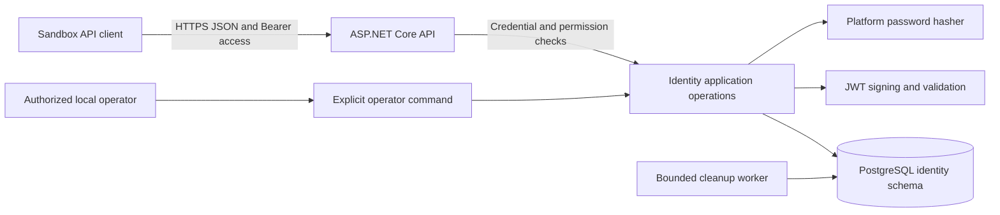

# Identity Architecture and Decisions

**Status:** proposed design under the confirmed Phase 01 scope. Contracts in this folder are specifications, not implemented behavior.

## 1. Module boundary



The API accepts untrusted input; Identity owns users, sessions, refresh credentials, its audit records, and admission counters. EF Core maps those records to PostgreSQL. Password hashing occurs outside database transactions; credential validity is rechecked under a user lock before issuing access. The operator command invokes the same domain rules through a separate, locally authorized entry point.

API work is synchronous. Cleanup runs independently and does not determine whether expired credentials are accepted. Database or required signing-key failure stops credential issuance. Audit events for successful security mutations commit with the mutation.

## 2. ADR-ID-01 — Framework and persistence baseline

**Context:** the project needs a supported platform, PostgreSQL transactions, and explicit module ownership without a distributed deployment.

**Decision:** target .NET/ASP.NET Core 10, EF Core 10, Npgsql EF provider 10, and PostgreSQL 18. Use supported stable patches selected and pinned when application scaffolding is requested. [.NET support policy](https://dotnet.microsoft.com/en-us/platform/support/policy/dotnet-core) identifies the supported runtime line; [Npgsql 10 notes](https://www.npgsql.org/efcore/release-notes/10.0.html) document the provider generation.

**Alternatives:** another runtime would contradict the selected stack; preview runtime releases add no learning benefit here. A generic repository framework and full identity-provider product are not needed for this first-party sandbox API.

**Rationale and costs:** reuse ASP.NET Core authentication, password hashing, Options validation, logging, and hosted-worker facilities. Own the small identity data model and operations explicitly; reuse cryptographic implementations instead of writing algorithms. Database transactions and parameterized SQL remain necessary for operations that EF tracking alone cannot serialize.

**Experiment:** inspect the generated migration against the documented schema; use two real database connections to verify the lock protocol before accepting it.

## 3. ADR-ID-02 — JSON Bearer credentials with authoritative session checks

**Context:** the user selected JWT access tokens and JSON refresh credentials. Logout and account recovery must also affect unexpired access credentials.

**Decision:** issue short-lived signed access JWTs bound to a durable session. Every protected request checks current user/session state in PostgreSQL. Refresh tokens are random opaque secrets stored only as digests.

**Alternatives:** opaque cookie sessions were not selected. Purely stateless JWT validation leaves access usable until expiration and cannot satisfy this phase's revocation contract. A distributed denylist adds a second state store before it is needed.

**Rationale:** the Bearer contract remains explicit while PostgreSQL supplies one authoritative revocation boundary. JWTs do not make this phase database-independent.

**Costs and failures:** each protected request needs a bounded state read. Database outage denies protected work with a dependency error. Later services need a new ADR for validation availability and revocation propagation.

**Experiment:** log out through replica A, then reuse the JWT through replica B after the logout commit; authorization must fail. Study [Microsoft JWT validation](https://learn.microsoft.com/en-us/aspnet/core/security/authentication/configure-jwt-bearer-authentication?view=aspnetcore-10.0) and [RFC 8725](https://www.rfc-editor.org/rfc/rfc8725).

## 4. ADR-ID-03 — Strict refresh rotation per session

**Context:** a stolen refresh token can otherwise continue creating access tokens. Concurrent refreshes and lost responses make rotation ambiguous.

**Decision:** each refresh consumes one token and creates exactly one successor in the same transaction. Reuse of a consumed token revokes that session, including its successor. Other sessions belonging to the account remain valid. Retain consumed digests for the original session's full absolute lifetime plus the retention margin.

**Alternatives:** a grace window improves multi-tab behavior but also permits a stolen credential to remain useful. Returning the same successor requires recoverable secret storage or derivation and adds complexity. Both are deferred.

**Rationale:** strict rotation makes the failure boundary explicit and keeps stored secrets one-way. Clients MUST serialize refresh requests and must log in again after an uncertain refresh response.

**Costs and failures:** a legitimate duplicate refresh or response loss may revoke that session. The API does not pretend it can distinguish that event from theft. This is a deliberate security/usability trade-off, informed by the rotation discussion in [RFC 9700](https://www.rfc-editor.org/rfc/rfc9700).

**Experiment:** refresh simultaneously on two replicas. At most one successor is created; after both transactions settle, replay revocation makes that session unusable.

```mermaid
sequenceDiagram
    participant C as Client
    participant API as Identity API
    participant DB as PostgreSQL
    C->>API: Refresh with opaque token
    API->>DB: Locate digest; lock user, session, token in order
    alt Active token and eligible session
        API->>DB: Consume token, insert successor, update idle deadline, append audit
        DB-->>API: Commit
        API-->>C: Access JWT and new refresh token
    else Consumed token replayed
        API->>DB: Revoke originating session and append audit
        DB-->>API: Commit
        API-->>C: 401 Invalid refresh token
    else Unknown, expired, or revoked credential
        API-->>C: 401 Invalid refresh token
    end
```

These are synchronous local database transactions. The replay response follows a committed revocation; throwing an exception that rolls back that revocation is incorrect. A lost successful response cannot be recovered by replaying the old token. The client starts a new login instead.

## 5. ADR-ID-04 — Explicit account lock for security mutations

**Context:** login can verify an old password while an operator resets it; two logins can exceed the active-session limit; revocation can race with refresh.

**Decision:** security mutations serialize through the target user row. Lock order is user → session(s) in ID order → refresh token(s) in ID order. Login rechecks the password hash and security version after acquiring the user lock. Reset, disable, enable, and account-wide session revocation use the same boundary.

**Alternatives:** in-memory locks do not coordinate replicas; independent optimistic checks across several records complicate this small aggregate. PostgreSQL locks make the serialization point inspectable.

**Costs and failures:** operations on one account serialize. Database deadlines and bounded retries prevent indefinite waits. Password hashing and JWT preparation must not extend lock duration unnecessarily. See [PostgreSQL explicit locking](https://www.postgresql.org/docs/current/explicit-locking.html).

**Experiment:** pause login after password verification, reset the account, then resume login. It must not issue credentials from the old verifier.

## 6. ADR-ID-05 — Restricted sandbox administrator and operator recovery

**Context:** the user deferred email verification, self-service recovery, and MFA. A guessed or attacker-controlled mailbox is not evidence for account recovery.

**Decision:** no public reset, verification, email-change, or MFA API exists. An authorized local operator provisions Admin accounts and performs password resets through commands with a reason and audit. Admin credentials may be issued or used only from configured narrow source networks, behind a private/VPN access boundary.

**Alternatives:** email reset would add an unselected external channel and verification model. Broad public password-only Admin access would exceed the chosen scope. Automatic Admin seeding at every startup risks repeated credential replacement.

**Rationale and costs:** separate application roles from infrastructure authority. Sandbox recovery relies on the operator's control of synthetic fixtures and environment access. It is not a real-customer identity-proofing process and must not be presented as one.

**Experiment:** try public privilege fields, a reset route, a forged forwarded address, an Admin token from outside its network, and repeated provisioning. None may silently grant or overwrite authority.

## 7. ADR-ID-06 — Platform password hashing and bounded work

**Context:** secure password verification is intentionally expensive; unrestricted hashing can exhaust the API.

**Decision:** use ASP.NET Core `PasswordHasher<TUser>` in IdentityV3 mode with at least 220,000 PBKDF2-HMAC-SHA512 iterations. Use the framework's versioned verifier format and constant-time verification path. Admit at most two password-hash operations per application replica, without an unbounded waiting queue.

**Alternatives:** Argon2id is a strong candidate but needs an additional vetted implementation in this stack; defer that dependency unless a security/performance review justifies it. Fast digests and custom password cryptography are rejected. [OWASP lists password-hashing options and PBKDF2 work factors](https://cheatsheetseries.owasp.org/cheatsheets/Password_Storage_Cheat_Sheet.html).

**Costs and failures:** PBKDF2 is CPU-intensive and not memory-hard. Benchmark the configured cost; scale or reduce admission rather than silently weakening it. A future algorithm migration must support verifying old hashes and safely upgrading them.

**Experiment:** exhaust the hash-work slots and verify bounded 503 responses while already-authenticated reads remain responsive.

## 8. Evolution boundary

Security hardening in phase 08 must explicitly reconsider verified email, self-service recovery, MFA or stronger administrator authentication, account lifecycle policy, and the public deployment threat model. Adding them requires new requirements, migrations, and client contracts; these documents do not silently enable them later.

Identity remains inside the monolith. No identity events, message broker, Redis store, distributed lock, or identity microservice is required for this phase.
