# Identity Workflows and Acceptance Criteria

**Status:** proposed Phase 01 requirements. [API contracts](api-contracts.md) define all public payloads and errors; [database transactions](../database/schema-and-transactions.md) define atomicity. Scope and lifetime values are owned by the [phase overview](../README.md).

## 1. Actors, invariants, and validation

- Anonymous callers may register, log in, present a refresh credential, or log out its session.
- Customer and Admin are mutually exclusive account roles in this phase. Public registration creates only Customer.
- The local operator is an environment authority, not an application role or remotely callable administrator API.
- One normalized email identifies at most one account. Email ownership is unverified and no email is sent.
- Accounts are `Active` or `Disabled`. Disabled accounts cannot issue or use credentials.
- Each login creates a separate session. Every active session has at most one unconsumed refresh token; it may have many retained consumed tokens.
- No token may outlive its session's original absolute deadline. Only successful refresh extends inactivity, capped by that deadline.
- Successful security mutations and their required audit records commit together. No secret appears in audit records.

### Common input rules

**Email:** strip leading/trailing ASCII spaces; accept 3–254 ASCII characters, exactly one `@`, local part 1–64 characters from letters, digits, `.`, `_`, `%`, `+`, `-`; reject leading/trailing or consecutive local-part dots. Domain must have at least two dot-separated labels, each 1–63 ASCII letters/digits/hyphens, without leading/trailing hyphens. Lowercase the entire accepted address using invariant ASCII rules for storage and uniqueness. Do not remove dots or plus suffixes. Internationalized/quoted addresses are outside this deliberately narrow sandbox contract.

**New password:** normalize to Unicode NFC; require 15–128 Unicode scalar values and at most 512 UTF-8 bytes after normalization; reject invalid Unicode and U+0000. Preserve whitespace and case; do not trim or impose character-class rules. Reject exact normalized matches in the configured local compromised/common-password digest list. Login accepts the same encoding/size bounds but does not apply the new-password minimum or blocklist, so a later policy change cannot prevent verification of an existing valid password.

**Opaque token:** exactly 43 unpadded Base64url characters encoding 32 random bytes; reject noncanonical encoding. **User ID:** canonical UUID string. Unknown JSON members, duplicate object keys, incorrect JSON types, and missing required members are validation failures. Limits and errors are in the API contract.

## 2. E-01 — Account entry

### ID-FR-01 — Register a Customer

**Story:** as a sandbox customer, I can establish an account without acquiring administrator authority.

**Preconditions/trigger:** anonymous `POST /api/v1/auth/register` with a valid email and new password; network and identifier admission limits permit work.

**Main flow:** normalize/validate input; admit password work; hash the password; atomically insert an Active Customer and `account.registered` audit record if the normalized email is unused. Return the same `202` message whether insertion occurred or the address already exists. Do not issue credentials.

**Business and authorization rules:** role, user ID, account status, and security version are server-owned. A duplicate must not replace an existing password or change account state, even if that account is Disabled or Admin. Existing-address requests still follow the same validation and hashing admission path.

**Errors/edges:** invalid or weak password → `400 Validation.Failed`; admission rejection → `429` or hash-capacity `503`; database/audit failure → `503`, without a partial account. Concurrent duplicates are resolved by database uniqueness and both return the generic `202` after a known commit/no-op outcome.

**Acceptance:** given two simultaneous normalized-equivalent addresses, when registration completes, then exactly one account exists and neither response identifies whether it created that account. Given a `role` property, the request fails validation and creates no account.

### ID-FR-02 — Log in

**Story:** as an active account holder, I can obtain credentials for a distinct device/session.

**Preconditions/trigger:** `POST /api/v1/auth/login`; syntactically valid credentials; admission permits verification.

**Main flow:** locate the normalized account; verify using the platform hasher or an equivalent-cost dummy verifier for missing accounts; apply Active/Admin-network rules; acquire the user row lock; recheck the verified hash/security version and state; count active sessions; create a session and refresh digest; append `session.created`; sign a JWT and commit before returning the token pair. Precommit signing failure rolls back issuance.

**Business rules:** each login is independent. At five active sessions return `409 Auth.SessionLimitReached`; do not silently evict another device. An expired or revoked session does not count. Credentials are usable only after commit. Operator intervention may revoke sessions when a customer cannot access an older session.

**Errors/edges:** unknown email, wrong password, Disabled account, or Admin from a disallowed network → identical `401 Auth.InvalidCredentials`. If the password/security version changes after verification, deny the stale result with that same error. Rehash an outdated valid password only if the locked record still matches the verified credential. Hash-format corruption is logged without its value and causes a generic failure, never an empty-password fallback.

**Acceptance:** given two valid logins, both sessions work independently. Given four active sessions and two concurrent logins, at most one more session is issued. Given an operator reset after password verification, the old verification result issues no new credentials.

## 3. E-02 — Session lifecycle

### ID-FR-03 — Rotate a refresh token

**Story:** as a logged-in client, I can renew access while my original session remains eligible.

**Preconditions/trigger:** `POST /api/v1/auth/refresh` with a canonical refresh token. No access JWT is required. Admin sessions additionally require the allowed source network.

**Main flow:** digest and locate the token; serialize through its user/session/token records; recheck account state/version and session revocation/absolute/inactivity deadlines using database time. If the token is unconsumed and unexpired, consume it, create one successor, advance inactivity to `min(now + role idle lifetime, original absolute deadline)`, append `session.refreshed`, sign and commit, then return the new pair.

**Replay rule:** a consumed token for a still-eligible session is a replay even if that old token's own expiration has passed. Revoke its entire session, append `session.replay_detected`, commit, and return generic `401 Auth.InvalidRefreshToken`. The successor also becomes invalid. The user's other sessions remain unchanged. Unknown, expired-session, revoked-session, and invalid-account credentials return the same public error.

**Errors/edges:** do not automatically retry an uncertain successful refresh at the HTTP client. A client must serialize refreshes across its own requests/tabs. A lost refresh response requires fresh login; there is no replay grace window or recoverable successor secret. Concurrent refreshes may leave the winning response's credentials unusable after the replay transaction commits.

**Acceptance:** two consumers of one token create at most one successor; after both settle the session is revoked. A Customer session cannot extend beyond 14 days and an Admin session cannot extend beyond 8 hours. API activity alone does not extend refresh inactivity.

### ID-FR-04 — Log out the presented session

**Story:** as a client, I can invalidate my current session without logging out other devices.

**Preconditions/trigger:** `POST /api/v1/auth/logout` with a canonical refresh token. Access JWT is unnecessary; a lost/expired access JWT must not prevent logout.

**Main flow:** locate any retained refresh digest, including a consumed one; acquire the documented locks; revoke its session and append `session.logged_out` if not already revoked. Return `204`. Unknown credentials or an already revoked session also return `204`; no account/session existence is revealed.

**Rules:** possession of the refresh secret authorizes only revocation of its originating session. Logout is permitted from any source, including outside an Admin allowlist, because it grants no access. A retry never creates an audit duplicate for the same completed logout transition.

**Errors/edges:** malformed body → `400`; database outage → `503`, not a false success. If no database evidence can be read, the server cannot assert that revocation is unnecessary. Clients clear their local credentials even when the server result is uncertain and must distinguish local clearing from confirmed revocation.

**Acceptance:** after successful logout commits, the next authoritative check rejects that session's access/refresh credentials on every replica; a second independent session still works.

## 4. E-03 — Authorization

### ID-FR-05 — Read the current user

**Story:** as an authenticated account holder, I can read my own minimal identity record.

**Preconditions/trigger:** `GET /api/v1/users/me` with a valid Bearer JWT and eligible database account/session. Admin additionally passes its network restriction.

**Main flow:** derive the user ID from verified subject/session binding; return only `id`, normalized `email`, `role`, and `createdAt`.

**Rules/errors:** no request user ID is accepted. No credential digests, token history, security version, or database diagnostics are returned. Invalid/revoked access → `401 Auth.Unauthorized`; database outage → `503`; Admin network denial → `403 Auth.Forbidden`.

**Acceptance:** customer A's credential always yields A's record. Adding an identifier or unsupported query parameter fails validation instead of switching the target user.

### ID-FR-06 — Restricted administrator identity lookup

**Story:** as a sandbox administrator on an approved network, I can inspect the minimal account state needed to request operator assistance.

**Preconditions/trigger:** `GET /api/v1/admin/users/{userId}`; eligible Admin session; effective source address in the configured allowlist.

**Main flow:** authorize Admin and network before resource lookup; load the requested user; append `admin.user_read` without logging the email; return the public user fields plus `status`.

**Rules/errors:** Customer → `403 Auth.Forbidden`, regardless of whether the target exists. Authorized Admin with unknown UUID → `404 User.NotFound`. Audit failure → `503`, with no data returned. This endpoint cannot modify passwords, roles, status, or credentials. No list/search/export endpoint is included.

**Acceptance:** an Admin outside the network cannot use the same JWT on this or another protected endpoint; spoofing forwarded headers cannot change the effective source. Only the response allowlist is returned.

## 5. E-04 — Local operator lifecycle

### ID-FR-07 — Provision and recover sandbox accounts

**Story:** as an authorized operator of this private sandbox, I can provision an administrator or recover/restrict a synthetic account through explicit commands.

**Preconditions/trigger:** authenticated local process execution with the operator credential and a required reason. Passwords are supplied through a hidden terminal prompt or protected input stream, never command arguments or ordinary environment logging. [Operations](../deployment-and-devops/configuration-and-operations.md) defines the commands.

**Main flows:**

| Command | Atomic effect | Repeated execution |
| --- | --- | --- |
| `create-admin` | Insert a new Active Admin with a freshly hashed password and provisioning audit | Existing normalized email fails; never upgrades a Customer or overwrites a password |
| `reset-password` | Replace verifier, increment security version, revoke all sessions, append audit | Each deliberate new invocation is a new reset; after uncertain result inspect audit before repeating |
| `disable-user` | Set Disabled, increment version and revoke all sessions on the first transition, append audit | Already Disabled is a successful no-op |
| `enable-user` | Set Active and increment version on the first transition, append audit | Already Active is a successful no-op; old sessions stay revoked |
| `revoke-sessions` | Increment version, revoke all currently unrevoked sessions, append audit | Safe to repeat but each invocation is a recorded security action |

**Rules:** the operator identifies the intended synthetic fixture by user ID and its known ownership; possession of an unverified email is not recovery proof. Reset does not automatically enable a Disabled user. Commands operate on Admin or Customer accounts, do not expose an HTTP bypass, and cannot change an existing role. A new password must satisfy registration's new-password policy.

**Failures/consistency:** missing target → nonzero exit; invalid input → nonzero exit; unavailable audit/database → rollback and nonzero exit. Operations use the user lock, and a successful exit occurs only after commit. Secrets never appear in exit text. Lost final output requires inspection/reconciliation as documented; no automatic destructive repeat.

**Acceptance:** after reset or disable commits, old JWTs and refresh credentials fail everywhere. A login verified before reset cannot create a usable session afterward. Repeated provisioning cannot acquire an existing customer account.

## 6. State transitions and forbidden paths

```mermaid
stateDiagram-v2
    [*] --> Active: Register or explicit Admin provisioning
    Active --> Disabled: Operator disable; revoke sessions
    Disabled --> Active: Operator enable; old sessions stay invalid
    Active --> Active: Operator reset or revoke sessions; increment version
    Disabled --> Disabled: Operator reset; remain disabled
```

These are account states in PostgreSQL, changed synchronously with audit and revocation. There is no PendingVerification state in this phase. Database failure cannot leave half of a transition committed. Public APIs have no account-status transition authority.

| Entity | Valid transition | Guard/effect | Forbidden behavior |
| --- | --- | --- | --- |
| Session | Absent → eligible | Successful login, within active-session cap | Creation from refresh of another session or a stale password result |
| Session | Eligible → refreshed eligibility | Valid unconsumed credential; absolute deadline unchanged | Extending the original absolute deadline |
| Session | Eligible → revoked | Logout, replay, reset, disable, or operator revocation | Reactivation of the same session |
| Session | Eligible → expired | Database time reaches inactivity or absolute deadline | Revival by a late refresh |
| Refresh credential | Unconsumed → consumed plus one successor | Atomic successful rotation | Two successors or consumption without its successor on a successful commit |
| Refresh credential | Consumed → replay detected | Still-eligible originating session | Accepting consumed credentials a second time |

Expiry is evaluated at use, independently of cleanup. A revoked or expired parent session invalidates all its tokens, even when the token row itself remains for replay detection or audit investigation.
