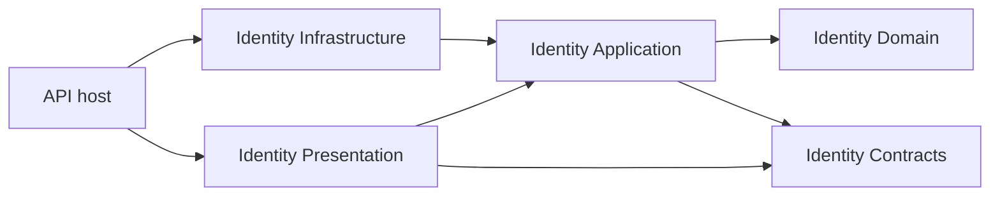

# Identity and Authentication Implementation Plan

> **For agentic workers:** Use `superpowers:executing-plans` to implement this plan task by task after implementation is requested. Use `superpowers:subagent-driven-development` only if delegation is explicitly selected. Track progress with the checkboxes below. Repository instructions take precedence: do not create automated tests, test projects, fixtures, or testing dependencies without an explicit request.

**Goal:** Implement the complete Phase 01 sandbox identity contract in dependency order, with evidence for account entry, session lifecycle, authorization, operator recovery, and bounded operation.

**Architecture:** Keep the existing modular monolith, module-owned Clean Architecture projects, and feature-based vertical slices. Use command handlers and read projections against one PostgreSQL primary, without MediatR or separate CQRS infrastructure. Use manual FluentValidation in Application and startup-validated Options in Infrastructure/host configuration; Domain remains independent of these libraries.

**Tech Stack:** .NET SDK 10.0.401; ASP.NET Core/EF Core 10.0.12; Npgsql EF provider/driver 10.0.3; Microsoft.IdentityModel.JsonWebTokens/Tokens 8.23.0; FluentValidation 12.1.1; PostgreSQL 18. These are planned, verified version selections as of 2026-10-02. The installation section identifies their project ownership and execution steps; no packages are installed by editing this document.

**Spec:** All twelve existing documents in this folder, listed in the source map below. This plan proposes implementation work; it does not approve unresolved specification decisions or authorize application implementation.

**Status:** Phase 0 contract review and owner decisions completed on 2026-10-03; artifact acquisition and live SQL/grant verification remain explicit setup gates in [Phase 0 readiness](phase-0-readiness.md). Identity runtime implementation has not started. Checked execution items below record completed review work only.

## 1. Scope and current repository state

This plan was the original planning deliverable. The current request executes Phase 0 only, with review evidence in [Phase 0 readiness](phase-0-readiness.md). Later execution implements the Identity behavior specified by `docs/01-identity-and-auth` inside the existing source projects, with necessary host/build/operating changes. Read the project overview for shared constraints; do not implement Catalog, Inventory, Cart, Orders, Checkout, or Payments.

The repository already has:

- Root `src/`, `ecommerce.slnx`, and `Directory.Build.props` targeting `net10.0` with nullable reference types enabled.
- Five Identity projects: Contracts, Domain, Application, Infrastructure, and Presentation. They contain project references and an MVC assembly-registration extension, without identity business operations.
- A single `src/Ecommerce.Api/Program.cs` composition root registering all seven module controller assemblies.
- Negotiate authentication with a default-deny fallback policy. JSON Bearer authentication is not implemented.
- Root Docker and Compose files. Compose currently starts only the backend and publishes loopback HTTP port 8080; it does not provide PostgreSQL or the required HTTPS credential transport.
- An empty `projectSchema.dbml`. The Identity SQL specification, rather than that empty file, defines the target schema.

Preserve unrelated workspace changes. Do not repeat the scaffold restructuring, introduce a nested `backend/` directory, add documentation to the solution, or upgrade unrelated packages.

### Source map

| Source | Implementation responsibility |
| --- | --- |
| [Phase overview](README.md) | Scope, epics E-01–E-05, fixed lifetimes, phase completion |
| [System design prerequisites](system-design-prerequisites.md) | Understand and trace the security/concurrency mechanisms before coding |
| [Architecture decisions](architecture-decisions.md) | ADR-ID-01–06, stack, stateful Bearer validation, rotation, locks, operator boundary, hashing |
| [Identity workflows](functional-requirements/identity-workflows.md) | ID-FR-01–07, validation, transitions, repeated-call behavior |
| [API contracts](functional-requirements/api-contracts.md) | Six routes, exact JSON schemas, headers, error strings and precedence |
| [Schema and transactions](database/schema-and-transactions.md) | Five tables, constraints, indexes, locking, transaction boundaries, retention |
| [Threat model and controls](security/threat-model-and-controls.md) | Passwords, JWTs, network trust, privacy, privileged access |
| [Quality targets](non-functional-requirements/quality-targets.md) | ID-NFR-01–12, benchmark conditions, recovery targets |
| [Capacity and rate limiting](performance-and-scalability/capacity-and-rate-limiting.md) | Shared admission, resource budgets, query plans |
| [Recovery and concurrency](reliability-and-failure-scenarios/recovery-and-concurrency.md) | Failure outcomes, retry restrictions, commit ambiguity, in-flight semantics |
| [Verification scenarios](testing-strategy/verification-scenarios.md) | V-01–V-17 and evidence format |
| [Configuration and operations](deployment-and-devops/configuration-and-operations.md) | Options, database roles, CLI, health, shutdown, signals, CI, restore |

The [actor model](../00-project-overview/system-actors-and-roles.md), [global architecture](../00-project-overview/global-architecture-and-evolution.md), and [global Definition of Done](../00-project-overview/global-definition-of-done.md) apply throughout.

## 2. Architecture and pattern decisions

These recommendations come from the current source layout and the broader requirements. They refine the implementation approach without changing the specified APIs, security policies, or module ownership.

### 2.1 What the wider requirements imply

| Requirements reviewed | Consequence for the implementation |
| --- | --- |
| [Global architecture, including the CQRS decision table](../00-project-overview/global-architecture-and-evolution.md) | Keep one deployable host and module ownership. Separate CQRS infrastructure needs a demonstrated query problem and defined lag/rebuild behavior. |
| [Catalog architecture](../02-catalog-and-products/architecture-decisions.md) | Reads need bounded DTO projections; versioned Admin commands need validation, current authority, guarded persistence and atomic audit. |
| [Inventory architecture](../03-inventory-and-stock/architecture-decisions.md) | Conservation is enforced through owner operations, database constraints and locks. Its movement ledger does not justify making Identity event-sourced. |
| [Cart architecture](../04-shopping-cart/architecture-decisions.md) and [Orders architecture](../05-orders/architecture-decisions.md) | Domain-specific versions, snapshots and lifecycle rules belong to each module. Do not replace their specified concurrency rules with a universal CRUD service. |
| [Checkout architecture](../06-checkout/architecture-decisions.md) | Later owner operations must support a caller-owned local connection/transaction. Independent commits by every module would break atomic acceptance. Design that collaboration when Checkout requires it. |
| [Payments architecture](../07-payments-and-refunds/architecture-decisions.md) | Financial truth, outbound I/O and recovery remain Payments responsibilities. Identity must not introduce provider retries or a general workflow engine. |
| [Phase 08 decisions](../08-production-ready-monolith/architecture-decisions.md), [Phase 09 decisions](../09-event-driven-architecture/architecture-decisions.md), [Phase 10 decisions](../10-microservices/architecture-decisions.md) | Observability, durable messaging and Payments extraction have their own later gates. Keep Identity in the monolith; do not preinstall or implement those systems here. |

### 2.2 Decision summary

| Pattern or library | Decision for Identity | Reason and boundary |
| --- | --- | --- |
| Modular monolith + Clean Architecture | Use the existing five-project module | Already established; maintains dependency direction and owner boundaries. |
| Vertical slices | Use feature folders in Application and Presentation | Keep each operation's request, validation, handler and outcome together. |
| CQRS | Use logical command/query separation and distinct read DTOs on one database | Commands coordinate security mutations; reads project minimal data. No separate read database, materialized-view subsystem or event-sourcing store. |
| MediatR / mediator bus | Do not add for this phase | Direct DI invocation is sufficient; the Identity operations specification rejects a mediator added merely to create layers. |
| FluentValidation | Use its core package with explicit Application validation | Provides reusable, readable input rules for API and operator entry points while preserving custom transport/security rules. |
| Options pattern | Use typed nested Options with startup validation | Configuration is an explicit boundary; business logic must not read environment variables. |
| Generic repository / custom universal unit of work | Do not add | EF Core plus focused owner persistence operations already supply the required persistence boundary. |
| Explicit transactions and row locks | Use for the documented security operations | Necessary for rotation, revocation, cap checks, audit and reset races; CQRS does not replace them. |
| Typed outcomes / centralized HTTP mapping | Use feature-specific outcomes | Expected denials stay distinct from failures and committed replay revocation; HTTP details remain in Presentation/host. |
| Dependency injection | Use platform DI with explicit registration | No assembly-scanning framework, service locator or request-dispatch reflection is needed. |
| Mapping | Use explicit DTO/projection mapping | The contracts are small and security-sensitive; no AutoMapper dependency is needed. |
| Workers | Use hosted services with bounded scoped work | Cleanup needs durable retention predicates and shutdown/cancellation, not a scheduling platform. |
| Domain events/outbox/inbox/sagas | Do not introduce in Identity | Later specifications own these mechanisms. Identity audit is required history, not an event store. |
| Cache/read replicas | Do not use for Identity authority | Stale authorization would violate immediate cross-replica revocation. |

### 2.3 CQRS: how much to use

Use separate application request types and handlers for commands and queries. Command handlers return typed receipts or outcomes; query handlers return minimal projections. Both use the same module-owned PostgreSQL schema and authoritative primary. This fits the single-store CQRS approach described by [Microsoft](https://learn.microsoft.com/en-us/azure/architecture/patterns/cqrs); adopting a separate store is unnecessary for these requirements.

| Operation | Application request and handler | Required persistence behavior |
| --- | --- | --- |
| Register | `RegisterCommand` → `RegisterHandler` | Insert Customer/audit or known duplicate no-op. |
| Login | `LoginCommand` → `LoginHandler` | Verify, recheck under lock, create session/token/audit. |
| Refresh | `RefreshCommand` → `RefreshHandler` | Rotate once or commit originating-session replay revocation. |
| Logout | `LogoutCommand` → `LogoutHandler` | Revoke originating session once or known no-op. |
| Current user | `GetCurrentUserQuery` → `GetCurrentUserHandler` | Project the authenticated user's permitted fields. |
| Admin lookup | `GetAdminUserQuery` → `GetAdminUserHandler` | Authorize, project target, and commit the mandatory read-audit. |
| Local operator | `OperatorAccountCommand` → `OperatorAccountHandler` | Explicit privileged account transition with atomic audit. |

Inject the concrete handler into its controller/command runner and call `HandleAsync(request, cancellationToken)`. Do not create `ICommand<T>`, `IQuery<T>`, a dispatcher, generic handler base classes or a pipeline framework solely for naming CQRS.

Query separation must preserve authorization and the specified side effects. Admin lookup is an audited read workflow: it cannot use a universally read-only connection or skip its audit transaction. Admission counters and diagnostics also remain explicit supporting effects. Query handlers do not mutate account/session business state or extend inactivity. Read DTOs are projections, not a separately synchronized source of identity truth.

### 2.4 FluentValidation: use manual validation at the application boundary

Install `FluentValidation` in Identity Application. Put `RegisterCommandValidator`, `LoginCommandValidator`, `RefreshCommandValidator`, `LogoutCommandValidator`, `GetAdminUserQueryValidator`, and `OperatorAccountCommandValidator` beside their requests. Do not invent an empty validator for the current-user query.

Each handler with input rules explicitly calls `IValidator<T>.ValidateAsync` before admission/expensive work; the current-user query needs only its transport/authority checks, and Admin target validation runs only after requester authorization, as the API contract requires. Register/operator validators reuse the same new-password rules; login uses its distinct existing-password policy. Register validators explicitly through DI in `IdentityApplicationModule.cs` rather than adding a registration-scanning dependency.

Do not install `FluentValidation.AspNetCore` or enable MVC automatic validation. FluentValidation's [official ASP.NET guidance](https://docs.fluentvalidation.net/en/latest/aspnet.html) recommends manual validation for new integrations and explains the automatic MVC pipeline's asynchronous limitation.

Keep responsibility boundaries explicit:

- **Presentation:** size/media restrictions, strict JSON shape/duplicate keys, query/body restrictions, canonical path/token representation and HTTP error precedence. FluentValidation cannot recover duplicate keys already lost during binding.
- **Domain policies:** deterministic email/password normalization, Unicode counts, lifetime calculations and state guards. Do not substitute FluentValidation's generic email/length helpers for the narrower documented contract.
- **Application validators:** input policy through those shared functions and the in-memory blocklist port; map failures to the contract's permitted field/code pairs. Normalize once through explicit shared policy code; validators must not silently mutate a request.
- **Locked persistence operation:** uniqueness, eligibility, security version, session count, token consumption and audit atomicity. Never use an `AnyAsync` validation precheck as the final uniqueness/concurrency guarantee.

Keep password/blocklist artifacts behind `A/Abstractions/Security/IPasswordBlocklist.cs` and the Infrastructure implementation. Return stable error codes; never expose validator attempted values, arbitrary default messages or internal property names. Preserve refresh's malformed-secret `401` versus logout's malformed-secret `400` rule; structural errors remain `400`.

### 2.5 Options, dependency lifetimes and registration

Use `AddOptions<T>().Bind(...).ValidateOnStart()` with focused `IValidateOptions<T>` implementations for cross-property/artifact checks. Inject `IOptions<T>` into the owning configuration/infrastructure adapter, then pass immutable policy values to Application/Domain. Use the [platform Options facilities](https://learn.microsoft.com/en-us/aspnet/core/fundamentals/configuration/options?view=aspnetcore-10.0) for configuration; FluentValidation handles operation input.

| Owner and class | Bound section | Responsibility |
| --- | --- | --- |
| `I/Configuration/IdentityConnectionOptions.cs` | `ConnectionStrings` | Identity API/cleanup and the proposed separate migration/operator credentials. Validate only the connection required by the execution mode. |
| `I/Configuration/JwtOptions.cs` | `Identity:Jwt` | Issuer/audience, key artifacts/ID, lifetime and skew. |
| `I/Configuration/SessionOptions.cs` | `Identity:Sessions` | Role lifetimes and active-session cap. |
| `I/Configuration/PasswordHashingOptions.cs` | `Identity:PasswordHashing` | Platform hasher mode/work factor. |
| `I/Configuration/PasswordOptions.cs` | `Identity:Passwords` | Local blocklist path and its startup validation. |
| `I/Configuration/AdminAccessOptions.cs` | `Identity:AdminAccess` | Explicit allowed source CIDRs. |
| `I/Configuration/IdentityRateLimitingOptions.cs` | `Identity:RateLimiting` | Bucket HMAC artifact and exact route policies. |
| `I/Configuration/IdentityCapacityOptions.cs` | `Identity:Capacity` | Executing/hash slots and their bounded admission. |
| `I/Configuration/IdentityDatabaseOptions.cs` | `Identity:Database` | API/cleanup pool budgets and pool/lock/statement/transaction deadlines from the capacity contract. |
| `I/Configuration/IdentityCleanupOptions.cs` | `Identity:Cleanup` | Enablement, interval, retention and batch budgets. |
| `H/Configuration/CorsOptions.cs` | `Cors` | Exact origins and permitted phase-specific negotiation. |
| `H/Configuration/ReverseProxyOptions.cs` | `ReverseProxy` | Trusted proxies and forwarding depth. |
| `H/Configuration/IdentityHostOptions.cs` | `Identity:Host` | Ten-second request deadline, restricted management binding, one-second readiness probe, 15-second shutdown, and drift-check interval. |

The new database/host sections and `ConnectionStrings:IdentityMigration` / `ConnectionStrings:IdentityOperator`, including file-path companions, were accepted in Phase 0 on 2026-10-03. Their exact keys/defaults/validation are recorded in the owning [operations document](deployment-and-devops/configuration-and-operations.md#21-phase-0-configuration-seams). Existing named keys and fixed policy values remain unchanged.

Use startup-frozen policy and explicit controlled key/artifact rotation. Do not introduce `IOptionsSnapshot`/`IOptionsMonitor` hot reload that can change security policy inconsistently across requests/replicas. Missing artifacts fail setup; invalidating a required runtime dependency fails closed.

| Lifetime | Services | Required care |
| --- | --- | --- |
| Scoped | Feature handlers/validators, IdentityDbContext, persistence stores, current actor | One request/operation scope; never capture in singleton workers. |
| Singleton | Immutable blocklist/policy/key metadata providers, per-credential Npgsql data sources, request/hash limiters, diagnostics | Bounded owned resources; thread-safe use and disposal. Never share a DbContext or mutable actor. |
| Hosted service | Cleanup worker | Create a fresh scope/connection per bounded batch; use the cleanup credential/pool and respect cancellation. |

Application exposes `AddIdentityApplication(IServiceCollection)` through `A/IdentityApplicationModule.cs`; Infrastructure exposes `AddIdentityInfrastructure(IServiceCollection, IConfiguration)`; existing Presentation keeps `AddIdentityPresentation(IMvcBuilder)` and adds a focused `AddIdentityAuthentication(IServiceCollection)` for Bearer/policies. The host composes all four explicitly. Presentation consumes Application/Contracts ports for current-state checks and key metadata; it does not reference Infrastructure to load keys or access its stores.

### 2.6 EF Core, PostgreSQL and JWT implementation rules

Use one `IdentityDbContext` for Identity tables and configure it in Infrastructure with `UseNpgsql`. Keep it scoped; do not run concurrent operations through the same context. EF Core documents its [unit-of-work lifetime and concurrency restrictions](https://learn.microsoft.com/en-us/ef/core/dbcontext-configuration/). Connection pooling is bounded independently of DbContext lifetime; DbContext pooling is unnecessary initially.

Use `IEntityTypeConfiguration<T>` classes for mappings, module-owned migrations, and `MigrationsHistoryTable("__EFMigrationsHistory", "identity")` to isolate Identity migration metadata from future modules. There remain five specified business tables; the history table is infrastructure metadata with reviewed grants. Project read DTOs directly, using no-tracking queries where applicable. Do not return EF entities or load refresh history to validate one token.

Keep operation-specific Application persistence ports implemented by the module's security store. Use EF for mappings/ordinary persistence and parameterized EF/Npgsql SQL for conflict-do-nothing insertion, post-lock wall-clock time, explicit row locks and atomic counters. All commands in one operation share its connection/transaction; EF tracking is not a lock protocol. Never add SQL Server/InMemory providers or a generic repository to hide these requirements.

`JsonWebTokenHandler` from `Microsoft.IdentityModel.JsonWebTokens` issues access JWTs in Infrastructure. `Microsoft.IdentityModel.Tokens` supplies signing/validation types. `Microsoft.AspNetCore.Authentication.JwtBearer` belongs to Presentation, which configures host Bearer authentication and delegates authoritative state validation through Application ports. JWT Bearer middleware does not implement refresh rotation or database revocation by itself.

Use local protected keys through a narrow Application key-metadata/verification port implemented in Infrastructure; do not enable remote discovery or move key loading into Domain. No direct `System.IdentityModel.Tokens.Jwt` dependency is needed for the selected issuance API, though framework dependencies may include it transitively. Use `Microsoft.Extensions.Identity.Core` only for the platform password hasher; do not adopt its full user store/UI/schema as a replacement for the specified model.

## 3. Recommended folder structure

Keep the existing root layout and all seven modules. Expand only Identity and required host pieces during this implementation. The tree shows planned responsibilities and representative files; create them in their consuming tasks, not as empty speculative scaffolding.

```text
ecommerce.slnx
Directory.Build.props
global.json                         # planned SDK pin
.config/dotnet-tools.json            # planned local EF CLI pin
docs/                               # kept outside solution entries
src/
  Ecommerce.Api/
    Program.cs                      # composition + early operator-mode selection
    Configuration/                  # host/CORS/proxy Options
    Middleware/                     # correlation, capacity, protocol, exception mapping
    Health/                         # restricted management endpoints/readiness
    Operator/                       # local CLI adapter and protected password input
  Modules/
    Identity/
      Ecommerce.Modules.Identity.Contracts/
        AuthenticatedActor.cs
        ICurrentActor.cs
      Ecommerce.Modules.Identity.Domain/
        Users/                      # User, UserRole, UserStatus
        Sessions/                   # IdentitySession, RefreshToken
        Policies/                   # EmailPolicy, PasswordPolicy, SessionPolicy
      Ecommerce.Modules.Identity.Application/
        IdentityApplicationModule.cs
        Abstractions/
          Persistence/              # operation-specific owner ports; no generic CRUD
          Security/                 # hashing, blocklist, issuance, verification-key ports
          Admission/                # admission port
          Audit/                    # typed permitted audit records
        Features/
          Register/
            RegisterCommand.cs
            RegisterCommandValidator.cs
            RegisterHandler.cs
            RegisterOutcome.cs
          Login/                    # command, validator, handler, outcome
          Refresh/                  # command, validator, handler, outcome
          Logout/                   # command, validator, handler, outcome
          GetCurrentUser/           # query, handler, minimal projection/outcome
          GetAdminUser/             # query, validator, audited handler/outcome
          OperatorAccounts/         # command, validator, handler, outcome
      Ecommerce.Modules.Identity.Infrastructure/
        IdentityModule.cs
        Configuration/              # Identity Options and validators
        Persistence/
          IdentityDbContext.cs
          IdentityDbContextFactory.cs
          IdentitySecurityStore.cs
          IdentityTransactionPolicy.cs
          Configurations/           # one mapping per table
          Migrations/               # reviewed Identity migrations/snapshot
          Scripts/                  # role/grant setup; never embedded credentials
        Security/                   # platform hashing, blocklist, JWTs, key providers
        Admission/                  # shared counters and local hash capacity
        Operator/                   # privileged store/authority adapter
        Cleanup/                    # bounded worker and cleanup store
        Diagnostics/                # bounded redacted operational signals
      Ecommerce.Modules.Identity.Presentation/
        IdentityModule.cs
        Features/                   # matching HTTP slices and wire DTOs
        Http/                       # strict JSON, Problems, response headers/shared DTOs
        Security/                   # Bearer configuration, network/current-state adapters
    Catalog/                        # existing five-project module; no work here
    Inventory/
    Cart/
    Orders/
    Checkout/
    Payments/
```

Keep files that change together in their feature folder. Do not add top-level `Commands/`, `Queries/`, `Validators/`, and `Handlers/` directories that scatter one use case across the module. Do not create a shared business project/`Common` dumping ground or duplicate a global EF model. The API coordinates registration; each module owns its data, policies, DTOs and implementations.

The existing project-reference direction remains:



## 4. Libraries, versions and installation plan

### 4.1 Exact package ownership

The versions below were checked against NuGet's official package metadata on 2026-10-02. The installed SDK reports `10.0.401`. Before execution, check for security advisories and any approved version change; never replace these pins with floating versions or previews. Keep the repository's existing per-project `PackageReference` convention rather than introducing central package management in this task.

`H`, `A`, `I`, and `P` expand to the exact project roots in the file-ownership table below.

| Package | Version | Project | Purpose / first consuming phase |
| --- | --- | --- | --- |
| [Microsoft.EntityFrameworkCore](https://www.nuget.org/packages/Microsoft.EntityFrameworkCore/10.0.12) | 10.0.12 | I | Context, mappings, tracked writes and query projections; Phase 2. |
| [Npgsql.EntityFrameworkCore.PostgreSQL](https://www.nuget.org/packages/Npgsql.EntityFrameworkCore.PostgreSQL/10.0.3) | 10.0.3 | I | PostgreSQL EF provider / `UseNpgsql`; Phase 2. |
| [Npgsql](https://www.nuget.org/packages/Npgsql/10.0.3) | 10.0.3 | I | Explicit driver/data-source/connection/transaction APIs used by admission and cleanup; Phase 2 onward. |
| [Microsoft.EntityFrameworkCore.Design](https://www.nuget.org/packages/Microsoft.EntityFrameworkCore.Design/10.0.12) | 10.0.12 | I and H | Design-time tooling in migration and startup projects; `PrivateAssets=all`; Phase 2. |
| [Microsoft.IdentityModel.JsonWebTokens](https://www.nuget.org/packages/Microsoft.IdentityModel.JsonWebTokens/8.23.0) | 8.23.0 | I and P | Token creation in Infrastructure (Phase 3) and inspection of the validated JsonWebToken in Presentation (Phase 6). |
| [Microsoft.IdentityModel.Tokens](https://www.nuget.org/packages/Microsoft.IdentityModel.Tokens/8.23.0) | 8.23.0 | I and P | Direct signing/validation/security-key/descriptor APIs; Phases 3/6. |
| [Microsoft.AspNetCore.Authentication.JwtBearer](https://www.nuget.org/packages/Microsoft.AspNetCore.Authentication.JwtBearer/10.0.12) | 10.0.12 | P | Bearer middleware configuration and validation events; Phase 6. |
| [Microsoft.Extensions.Identity.Core](https://www.nuget.org/packages/Microsoft.Extensions.Identity.Core/10.0.12) | 10.0.12 | I | `PasswordHasher<TUser>` without adding the ASP.NET shared framework; Phase 3. |
| [FluentValidation](https://www.nuget.org/packages/FluentValidation/12.1.1) | 12.1.1 | A | Explicit command/query/operator input validation; Phase 3 onward. |
| [Microsoft.Extensions.DependencyInjection.Abstractions](https://www.nuget.org/packages/Microsoft.Extensions.DependencyInjection.Abstractions/10.0.12) | 10.0.12 | A | Explicit handler/validator registration; Phase 1. |
| [Microsoft.Extensions.Options.ConfigurationExtensions](https://www.nuget.org/packages/Microsoft.Extensions.Options.ConfigurationExtensions/10.0.12) | 10.0.12 | I | Typed configuration binding; Phase 1. |
| [Microsoft.Extensions.Logging.Abstractions](https://www.nuget.org/packages/Microsoft.Extensions.Logging.Abstractions/10.0.12) | 10.0.12 | I | Direct redacted adapter/worker logging APIs; Phase 1 onward. |
| [Microsoft.Extensions.Hosting.Abstractions](https://www.nuget.org/packages/Microsoft.Extensions.Hosting.Abstractions/10.0.12) | 10.0.12 | I | `BackgroundService` / hosted cleanup lifecycle; Phase 8. |
| [dotnet-ef](https://www.nuget.org/packages/dotnet-ef/10.0.12) | 10.0.12 | Local tool manifest | Migration generation/script/database tooling; Phase 2. |

The provider's metadata requires EF Core/Relational `>=10.0.4` and `<11.0.0`, plus Npgsql `>=10.0.3`; selected EF `10.0.12` and Npgsql `10.0.3` fit those declared ranges. JsonWebTokens `8.23.0` requires Tokens `>=8.23.0`; both selected direct pins are `8.23.0`. This is metadata evidence, not a completed restore/runtime compatibility claim. Inspect the restored transitive IdentityModel graph as well as the direct pins. [Provider dependency metadata](https://www.nuget.org/packages/Npgsql.EntityFrameworkCore.PostgreSQL/10.0.3), [IdentityModel package](https://www.nuget.org/packages/Microsoft.IdentityModel.JsonWebTokens/8.23.0).

Do not install EF, Npgsql, JWT or FluentValidation in Domain/Contracts; do not put EF/JWT in Application. Shared-framework APIs remain in the API host/Presentation. Extensions packages supply the narrow capabilities needed by class libraries. No `FluentValidation.AspNetCore`, `FluentValidation.DependencyInjectionExtensions`, MediatR, Scrutor, AutoMapper, Dapper, Polly, EF InMemory/SQL Server provider, or full Identity EF store is selected. Existing OpenAPI/container tooling stays unchanged; remove Negotiate only when Bearer replaces it in Phase 6.

### 4.2 Installation commands for execution

Run from the repository root when implementing the corresponding phases. This planning update does not execute them. Use `dotnet` instead of `dotnet.exe` in a native Linux SDK environment.

```bash
identity_application_project='src/Modules/Identity/Ecommerce.Modules.Identity.Application/Ecommerce.Modules.Identity.Application.csproj'
identity_infrastructure_project='src/Modules/Identity/Ecommerce.Modules.Identity.Infrastructure/Ecommerce.Modules.Identity.Infrastructure.csproj'
identity_presentation_project='src/Modules/Identity/Ecommerce.Modules.Identity.Presentation/Ecommerce.Modules.Identity.Presentation.csproj'
identity_api_project='src/Ecommerce.Api/Ecommerce.Api.csproj'

# Phase 1: application registration and configuration/diagnostics
dotnet.exe add "$identity_application_project" package Microsoft.Extensions.DependencyInjection.Abstractions --version 10.0.12
dotnet.exe add "$identity_infrastructure_project" package Microsoft.Extensions.Options.ConfigurationExtensions --version 10.0.12
dotnet.exe add "$identity_infrastructure_project" package Microsoft.Extensions.Logging.Abstractions --version 10.0.12

# Phase 2: EF/PostgreSQL runtime and migration tooling
dotnet.exe add "$identity_infrastructure_project" package Microsoft.EntityFrameworkCore --version 10.0.12
dotnet.exe add "$identity_infrastructure_project" package Npgsql.EntityFrameworkCore.PostgreSQL --version 10.0.3
dotnet.exe add "$identity_infrastructure_project" package Npgsql --version 10.0.3
dotnet.exe add "$identity_infrastructure_project" package Microsoft.EntityFrameworkCore.Design --version 10.0.12
dotnet.exe add "$identity_api_project" package Microsoft.EntityFrameworkCore.Design --version 10.0.12

# Phase 3: validators, platform hashing and access-token issuance
dotnet.exe add "$identity_application_project" package FluentValidation --version 12.1.1
dotnet.exe add "$identity_infrastructure_project" package Microsoft.Extensions.Identity.Core --version 10.0.12
dotnet.exe add "$identity_infrastructure_project" package Microsoft.IdentityModel.JsonWebTokens --version 8.23.0
dotnet.exe add "$identity_infrastructure_project" package Microsoft.IdentityModel.Tokens --version 8.23.0

# Phase 6: incoming Bearer authentication
dotnet.exe add "$identity_presentation_project" package Microsoft.AspNetCore.Authentication.JwtBearer --version 10.0.12
dotnet.exe add "$identity_presentation_project" package Microsoft.IdentityModel.JsonWebTokens --version 8.23.0
dotnet.exe add "$identity_presentation_project" package Microsoft.IdentityModel.Tokens --version 8.23.0

# Phase 8: cleanup hosted service
dotnet.exe add "$identity_infrastructure_project" package Microsoft.Extensions.Hosting.Abstractions --version 10.0.12
```

After the Design additions, verify **both** references include `<PrivateAssets>all</PrivateAssets>` and retain appropriate tooling assets. CLI addition alone does not establish that metadata. Check published artifacts so development tooling is not unintentionally shipped. Do not add `Microsoft.EntityFrameworkCore.Tools` merely for CLI migrations.

Before Phase 2, create a local tool manifest only if absent and install `dotnet-ef` `10.0.12`; if already present, review/update that specific tool rather than overwriting the manifest. [EF CLI setup](https://learn.microsoft.com/en-us/ef/core/cli/dotnet) defines the tool/design-package requirements.

```bash
# Run the first line only when .config/dotnet-tools.json does not exist.
dotnet.exe new tool-manifest
dotnet.exe tool install dotnet-ef --version 10.0.12
dotnet.exe tool restore
dotnet.exe ef --version
```

Add the planned `global.json` SDK pin to `10.0.401`, disallow prereleases and use `rollForward: disable` for this recorded baseline. A supported SDK update is a reviewed pin change, not an unrelated upgrade performed during a feature.

At every consuming phase, restore/build, inspect direct/transitive package versions and vulnerabilities, and check the project diff. Do not require a successful runtime result from adding references. Keep all new references confined to the owning Identity/host projects.

## 5. Global constraints

- Use synthetic accounts in a private development/sandbox environment. Email is an unverified login identifier.
- Customer and Admin are mutually exclusive roles; public registration creates only Customer. The operator is local infrastructure authority.
- No email verification, public password reset, MFA, email change, role editor, social login, impersonation, account deletion, or session-management UI.
- No browser token-storage implementation, cookies, Redis, broker, identity events, service extraction, Kubernetes, generic repository, or mediator framework.
- Keep the API as the only executable and composition root. Preserve existing inward project references and module ownership.
- Among class libraries, only Presentation has the ASP.NET Core shared-framework reference; the API uses the Web SDK. Add narrowly required package references where necessary; do not add that framework to Domain or Infrastructure to obtain one utility.
- Bind nested Options at startup. Keep secrets, protected artifacts, and deployment-specific addresses outside committed configuration.
- Wire essential redacted logs, duration/capacity metrics, and failure diagnostics as each operation is introduced. Phase 9 completes operational integration rather than postponing visibility until the end.
- All six public identity routes use HTTPS and the exact schemas, statuses, messages, and headers in the API contract. Credentials never appear in a URL, cookie, log, or committed evidence.
- JWTs: RS256, RSA ≥3,072 bits, `typ=at+jwt`, configured `kid`, exact issuer/audience, lifetime ≤300 seconds, clock skew ≤30 seconds, explicit required claims and no implicit claim remapping.
- Customer session: absolute 1,209,600 seconds; inactivity 604,800 seconds. Admin session: absolute 28,800 seconds; inactivity 1,800 seconds. Maximum active sessions per user: 5.
- Only successful refresh extends inactivity. No API activity extends it; no rotation extends the original absolute deadline.
- Database eligibility uses `clock_timestamp()` after lock acquisition, with no expiry grace. A protected check starting after revocation commit must fail on every replica.
- Security mutations use `READ COMMITTED`, one connection/transaction, and user → sessions by ID → refresh tokens by ID locking. Hash work occurs outside those transactions.
- Commit required audit with successful mutations. Commit refresh-replay revocation before returning its denial. Return Admin lookup data only after its audit commits.
- Retain sessions and all refresh digests through original absolute expiry +24 hours; audit for 30 days; counters through window end +1 hour. Do not delete users automatically.
- Use `PasswordHasher<TUser>` IdentityV3 with at least 220,000 PBKDF2-HMAC-SHA512 iterations and the configured local password digest blocklist.
- No new automated tests or test infrastructure. Use manual scenarios and non-test checks; preserve and run any related tests that exist when execution begins.
- No commits, deployment, or work in later domains are part of creating this plan.

## 6. Review focus

These risks must be checked in their owning phases, in addition to the ordinary success paths:

1. **Normalization boundaries:** NFC passwords, invalid Unicode, scalar versus byte counts, canonical Base64url, normalized-equivalent emails, and duplicate JSON keys must follow the exact contract without truncation. Owners: Phases 1, 3, 5; V-01/V-02.
2. **Lost responses and denial commits:** a refresh may commit without reaching its client; replay revocation must survive a `401`; unknown commit must never trigger blind issuance retry. Owners: Phases 2, 6, 7; V-06/V-09/V-11.
3. **Account races:** reset/disable after password verification, simultaneous fifth-session logins, and refresh versus revocation must serialize through the same user row. Owners: Phases 2, 5–7; V-03/V-08/V-17.
4. **Network trust and disclosure:** IPv4-mapped IPv6, forged forwarding headers, authorization before target lookup, CORS preflight, and actual-request authorization must preserve the Admin boundary. Owners: Phases 1, 6, 7; V-04/V-10.
5. **History and restored authority:** expired consumed tokens can still prove replay; cleanup must remain bounded; a restored snapshot must not reopen old sessions. Owners: Phases 7–10; V-14/V-16.

## 7. Sequence and completion rules

The numbered phases below are increments within project Phase 01. Phase 10 here is final Identity verification; it is unrelated to the project's later microservices phase.

| Phase | Deliverable | Dependency | Completion boundary |
| --- | --- | --- | --- |
| 0 | Reviewed contracts and implementation decisions | Existing specification | Blocking decisions resolved for the next task |
| 1 | Configuration and strict HTTP foundation | 0 | Safe parsing/errors/network identity; no credential issuance |
| 2 | Schema, transactions, audit, least-privilege roles | 0–1 | Fresh PostgreSQL migration and real lock/grant evidence |
| 3 | Password, token, signing, and lifetime primitives | 0–2 | Policy and crypto behavior measured; no exposed issuance |
| 4 | Shared admission and bounded resource use | 1–3 | Counters coordinate replicas; overload is bounded |
| 5 | Registration and local operator lifecycle | 1–4 | Accounts can be created/recovered without public privilege escalation |
| 6 | Login and authoritative protected reads | 1–5 | Issuance/access checks work in isolated development verification |
| 7 | Refresh, logout, replay, complete session lifecycle | 2–6 | First complete client-facing identity increment |
| 8 | Bounded cleanup and retention | 2, 4, 7 | Retention and backlog behavior demonstrated |
| 9 | Operational integration, CI, keys, restore | 1–8 | Runnable private sandbox and recovery procedures |
| 10 | Full acceptance, capacity evidence, handoff | 0–9 | Applicable V/NFR gates have recorded outcomes |

Do not make intermediate login-only work available as a usable client increment before Phase 7. Registration requires audit and admission from its first exposed version. Earlier phases can be checked in an isolated development environment without claiming complete identity support.

Each task follows the same cycle: inspect its sources and current files; implement only its deliverable; run build/static checks and the named manual scenario; inspect the diff; record actual results. A failed or unavailable required check remains **Failed** or **Not run**. Do not lower security policy to close a gate.

### Planned file ownership

The aliases below expand to exact repository-relative roots; paths under them are proposed files, not claims that those files already exist.

| Alias | Root | Responsibility |
| --- | --- | --- |
| `H` | `src/Ecommerce.Api` | Host composition, middleware, local command dispatch, management listener |
| `C` | `src/Modules/Identity/Ecommerce.Modules.Identity.Contracts` | Minimal actor context available to later modules |
| `D` | `src/Modules/Identity/Ecommerce.Modules.Identity.Domain` | Account/session types and deterministic policy |
| `A` | `src/Modules/Identity/Ecommerce.Modules.Identity.Application` | Feature handlers, outcomes, required I/O ports |
| `I` | `src/Modules/Identity/Ecommerce.Modules.Identity.Infrastructure` | PostgreSQL, hashing/signing, counters, cleanup, adapters |
| `P` | `src/Modules/Identity/Ecommerce.Modules.Identity.Presentation` | HTTP DTOs, controller slices, Bearer validation, response mapping |

Presentation calls Application; Infrastructure implements narrow Application ports; Application uses Domain/Contracts. Domain/Contracts remain independent. Do not expose `DbContext`, password hashes, refresh digests, HTTP objects, or signing keys through `C`.

## 8. Phase 0 — Contract readiness and implementation decisions

**Objective:** prevent implementation from silently resolving security, infrastructure, or compatibility questions.

### Task 0.1 — Confirm the source baseline and outstanding decisions

**Files:** the twelve source documents above; existing Identity `.csproj` files; `H/Program.cs`; root build/container files.

- [x] Trace registration, login, refresh, logout, Admin lookup, and operator reset from request/input through committed state and public outcome. For each, name its authoritative rows, locks, audit, deadlines, and safe recovery action. See [review traces](phase-0-readiness.md#2-request-to-commit-traces).
- [x] Confirm acceptance of the draft numerical/security policies before implementing them. Use the architecture/package selections in sections 2–4; verify the recorded pins/advisories and select the PostgreSQL 18 image patch. Reuse the existing .NET 10 scaffold; do not invent versions or upgrade unrelated tooling. Owner explicitly accepted the policies/proposals on 2026-10-03; retain the existing pins and the verified PostgreSQL 18.6-bookworm image digest in [readiness evidence](phase-0-readiness.md#3-version-and-advisory-evidence).
- [ ] Obtain the local password-blocklist artifact/source/date/checksum; protected RSA/public-key and HMAC artifacts; deployment network/proxy/TLS topology; and separate database credentials. Missing artifacts remain setup blockers, rather than triggering embedded fallbacks.

### Task 0.2 — Resolve the concrete integration seams

**Files:** owning specification documents if an approved clarification is necessary; planned Options and persistence registration.

- [x] Specify API, cleanup, migration, and operator connection configuration and role provisioning. Adopt the proposed `IdentityMigration`/`IdentityOperator` connection keys and `Identity:Database`/`Identity:Host` Options sections only after updating their exact contract in the operations document. Confirm the operator subject source and secret-input mechanism for the actual Windows/WSL/container execution environment; do not trust a caller-supplied application role. The owner accepted the Docker configuration, mount/provisioning and operator-subject definitions in the [operations contract](deployment-and-devops/configuration-and-operations.md#21-phase-0-configuration-seams).
- [ ] Review PostgreSQL lock privileges against the role matrix. Row locks need suitable UPDATE privileges; choose minimal column grants and verify real generated SQL while keeping API role/status/version administration and cleanup verifier changes prohibited.
- [x] Make admission ordering explicit: validate bounded input, apply global/source limits, resolve the session needed for a session bucket, and perform the route's credential/state checks. Protected session buckets require an eligible Bearer session. Never retain counter transaction locks across user/session locking. See [route-specific ordering](performance-and-scalability/capacity-and-rate-limiting.md#21-route-specific-ordering).
- [x] Specify safe operator inspection for an uncertain request ID and a maintenance procedure for revoking **every** restored session, including disabled users and retained unrevoked sessions. Do not invent a public endpoint or infer rollback from an absent audit row while the operation is in flight. See [inspection](deployment-and-devops/configuration-and-operations.md#41-inspecting-an-uncertain-operation) and [restore maintenance](deployment-and-devops/configuration-and-operations.md#71-restored-session-maintenance).

**2026-10-03 execution record:** source review, SDK/direct-pin metadata and vulnerability-feed review, and PostgreSQL image manifest inspection were performed. The owner selected a containerized API/PostgreSQL Compose sandbox with protected external file mounts and HTTPS, then explicitly accepted the numerical/security policies and concrete seam proposals. Configuration names/defaults, minimal lock-grant columns, provisioning and maintenance procedures are recorded in the owning documents. Artifact acquisition remains a setup prerequisite as instructed by the owner; real generated-SQL/grant verification remains required in Phase 2 once mappings/migrations exist. Those two items and all later implementation checkboxes remain unchecked. No secrets, packages or runtime code were created. See [readiness evidence and prerequisites](phase-0-readiness.md).

**Exit gate:** every decision needed by the next phase is resolved with its owner; remaining environment prerequisites are visible. Specification conflicts require an explicit resolution in their owning documents, not an implementation shortcut. Review the plan again if that resolution changes behavior or contracts.

## 9. Phase 1 — Configuration and HTTP foundation

### Task 1.1 — Bind validated configuration and compose Identity

**Files:** modify `H/Program.cs`, relevant Identity project files, `H/appsettings.json`, `H/appsettings.Development.json`; create `A/IdentityApplicationModule.cs`, `I/IdentityModule.cs`, `I/Configuration/*Options.cs`, focused `I/Configuration/*OptionsValidator.cs`, and `I/Diagnostics/IdentityDiagnostics.cs`; add the planned SDK pin in `global.json`.

**Produces:** explicit Application/Infrastructure registration and the Options/DI boundaries in section 2.5. Host Options own CORS/proxy/listener settings; security/persistence configuration stays in Infrastructure.

- [ ] Install the Phase 1 DI/Options/logging packages using section 4.2, pin the SDK, and verify restore/build and project ownership. Register only implemented services; do not generate an unused generic CQRS pipeline.
- [ ] Bind the exact keys/defaults in the operations contract once, including resource/deadline values from capacity/schema. Validate RSA size, key IDs, blocklist format, CIDRs, positive bounded limits, pool budgets, and artifact access. Commit only non-secret defaults.
- [ ] Separate HTTP startup from operator mode before constructing/running the web host. Operator commands validate their own database/password/audit dependencies without requiring unrelated JWT/HTTP settings or starting workers.
- [ ] Run startup with missing/malformed artifacts, weak hashing parameters, unlimited/empty Admin ranges, invalid lifetimes, and missing required connections. Record rejection and sanitized diagnostics; a valid configuration proceeds to its dependency checks. Cover V-15.

### Task 1.2 — Implement the exact protocol boundary

**Files:** create `H/Middleware/RequestIdMiddleware.cs`, `H/Middleware/IdentityProtocolMiddleware.cs`, `H/Middleware/ApiExceptionMiddleware.cs`; create `P/Http/IdentityProblemFactory.cs`, `P/Http/StrictIdentityJsonReader.cs`, and `P/Http/IdentityResponseHeaders.cs`.

**Produces:** server UUID correlation; strict Identity request parsing; API-contract Problem bodies and headers. Keep duplicate-key detection in the actual request path, before ordinary binding can discard evidence.

- [ ] Enforce uncompressed JSON POST bodies ≤4,096 decoded bytes; GET without a body; no query parameters; case-sensitive member names/types; required members; rejection of unknown members, duplicate keys, malformed JSON, and invalid Unicode. Share DTO field names with the contract rather than framework defaults. Require exactly one Bearer Authorization header on protected routes and reject access credentials over 8,192 bytes through their generic credential error.
- [ ] Implement exact fixed Problem strings/codes, field-error sorting/limit, route-template `instance`, `/api/v1/unknown` fallback, `401` Bearer challenge, `405` Allow, `413`/`415`, sanitized `500`/`503`, and Retry-After. Apply no-store/no-cache/request ID/nosniff to successes and errors, including routing/authentication failures.
- [ ] Configure success/error serializers for exact allowlisted fields, UTC RFC 3339 timestamps ending in `Z`, lowercase canonical UUIDs, case-sensitive role/status values, declared media types, and no extra framework Problem members. Keep host health responses outside the Identity JSON/route contract.
- [ ] Manually inspect malformed/empty/oversized/compressed bodies, duplicate keys, privilege fields, query strings, unsupported routes/methods, and returned JSON against the schemas. Do not rely on default MVC validation, Problem Details extensions, or route misses producing the specified shape.

### Task 1.3 — Establish network trust, CORS, and HTTPS

**Files:** modify `H/Program.cs`; create `P/Security/EffectiveClientAddress.cs` and `P/Security/AdminNetworkPolicy.cs`; modify `H/Properties/launchSettings.json` or deployment settings only as needed for the approved TLS topology.

- [ ] Normalize IPv4-mapped IPv6 addresses; use socket peer addresses unless the proxy is explicitly trusted; enforce the configured forwarding-hop limit and edge header overwrite policy. Reject universal Admin CIDRs.
- [ ] Use no CORS origins by default. With explicit HTTPS origins, negotiate OPTIONS before Bearer/business routing, with Identity's declared request headers and exposed response headers. Do not enable cookies or wildcard origins/headers. Actual requests retain all checks.
- [ ] Demonstrate HTTPS credential handling with a trusted development certificate or approved private edge; forged forwarded addresses cannot gain Admin network access. Check permitted/denied CORS negotiation and actual calls separately. Cover the host portion of V-10.

**Exit gate:** protocol/configuration behavior is checkable without issuing credentials; private TLS and address trust are explicit. Preserve default denial until complete Bearer authorization is wired in Phase 6.

## 10. Phase 2 — Persistence, transactions, audit, and grants

### Task 2.1 — Create the Identity model and reviewed initial migration

**Files:** create `D/Users/User.cs`, `D/Users/UserRole.cs`, `D/Users/UserStatus.cs`, `D/Sessions/IdentitySession.cs`, `D/Sessions/RefreshToken.cs`; create `I/Persistence/IdentityDbContext.cs`, `I/Persistence/IdentityDbContextFactory.cs`, `I/Persistence/Configurations/*.cs`, `I/Persistence/Migrations/*`, and `I/Persistence/Scripts/identity-roles.sql`; update I/H project files and the local EF tool manifest; extend root Compose with the approved local PostgreSQL service if that startup mechanism is selected.

- [ ] Install the Phase 2 EF Core/Npgsql/Design packages and pinned local EF tool from section 4.2. Verify Design is private in both migration/startup projects and inspect direct/transitive dependency ranges after restore.
- [ ] Start the approved PostgreSQL 18 development instance with pinned image/version, persistent storage, private access, and protected credentials. This prerequisite belongs before migration/transaction work; do not wait until Phase 9 to obtain a real database.
- [ ] Map exactly `identity.users`, `sessions`, `refresh_tokens`, `audit_events`, and `rate_limit_windows`. Include constrained text roles/status/reasons, UTC timestamps, normalized email with C collation, digest lengths, all specified indexes/uniqueness, restrict/cascade behavior, and historical audit session IDs without a session FK.
- [ ] Configure Identity's schema/history table and entity mappings as specified in section 2.6. Implement `IDesignTimeDbContextFactory<IdentityDbContext>` with the approved migration connection/configuration only; generating migrations must not start HTTP/workers, provision an Admin, or require JWT/password artifacts.
- [ ] Configure public Customer insertion to omit server-owned role/status/version columns and rely on database defaults. Ensure EF does not explicitly write those columns through defaults, tracking, or generated SQL. Operator insertion remains separately privileged.
- [ ] Generate/review migration SQL, apply it to an empty PostgreSQL 18 database with the migration role, and inspect resulting constraints/indexes. Attempt duplicate normalized emails and duplicate unconsumed session tokens. This does not authorize re-baselining existing data.

### Task 2.2 — Implement the security transaction protocol

**Files:** create `A/Abstractions/Persistence/*` for the feature-required persistence ports; create `I/Persistence/IdentitySecurityStore.cs` and `I/Persistence/IdentityTransactionPolicy.cs`.

**Produces:** one operation-level transaction with user-first locks, post-lock database time, cancellation/deadlines, and known-rollback versus unknown-commit classification. Keep transaction ownership in Infrastructure; no generic repository or cross-module transaction framework.

- [ ] Implement parameterized discovery/lock/state queries using `READ COMMITTED`. All affected sessions/tokens are locked in ascending ID order after the user. Recheck rows/state after discovery; a cleanup-disappeared row becomes an invalid credential.
- [ ] Apply pool wait ≤1 second, lock wait 250 ms, statement time 2 seconds, transaction wall time 3 seconds, and the original 10-second request deadline. Permit one whole-transaction retry only for `40P01`, `40001`, or `55P03` after known rollback, with 25–75 ms jitter and fresh state/connection. Do not enable additional EF/driver automatic issuance retries.
- [ ] Exercise two real connections for lock ordering, waits, rollback, and retry. Verify no retry after timeout/network commit uncertainty; discard unpublished token material on rollback. Set up repeatable manual pause points using debugger/database coordination, not committed test hooks.

### Task 2.3 — Implement required audit and enforce database capabilities

**Files:** create `A/Abstractions/Audit/IdentityAuditRecord.cs`; implement append/inspection paths in `I/Persistence/IdentitySecurityStore.cs` and the approved operator/cleanup stores; finalize `I/Persistence/Scripts/identity-roles.sql`.

- [ ] Support exactly the eleven documented audit actions, UUID request correlation, required operator subject/reason, and allowed user/session identifiers. No generic payload, email, password, token, verifier, or signing material.
- [ ] Use separate migration/API/cleanup/operator roles and pools. Verify actual API registration/rehash/locks/counters/audit append can succeed, while DDL, privilege/status/version changes, and audit updates/deletes fail. Check cleanup lock access and forbidden credential changes separately.
- [ ] Force audit failure within a security transaction: neither mutation nor success survives. Verify audit persists independently of future session deletion. Revisit V-11 after each feature and Admin read exists.

**Exit gate:** reviewed fresh-database SQL, constraints, lock behavior, timeout/retry classification, and real role permissions have evidence. Application-enforced cross-row invariants are explicitly distinguished from SQL CHECK guarantees.

## 11. Phase 3 — Validation, passwords, credentials, and lifetimes

### Task 3.1 — Implement deterministic input and session policy

**Files:** create `D/Policies/EmailPolicy.cs`, `D/Policies/PasswordPolicy.cs`, `D/Policies/SessionPolicy.cs`; create feature-local `A/Features/*/*Validator.cs` with their consuming request types and `A/Abstractions/Security/IPasswordBlocklist.cs`; create `P/Http/CanonicalIdentityIdentifiers.cs`.

- [ ] Install Phase 3 FluentValidation and security packages from section 4.2. Implement the manual validation/error-code boundary in section 2.4 and register feature validators as their request types/handlers are introduced. No MVC auto-validation or validation-time database authority decisions.
- [ ] Implement email ASCII-space trimming, exact local/domain rules, invariant lowercase uniqueness, and preservation of dots/plus suffixes. Reject unsupported internationalized/quoted forms. Enforce wire limits before semantic work.
- [ ] Normalize passwords to NFC, count Unicode scalars and UTF-8 bytes, preserve case/whitespace, reject NUL/invalid Unicode, and enforce the different new-password/login policies. New passwords: 15–128 scalars and ≤512 bytes plus blocklist; login: encoding/maximum bounds without applying the new minimum or blocklist.
- [ ] Implement canonical UUID/Base64url checks and pure lifetime calculations. Use captured database time as input; cap refresh/JWT expiry at session deadlines; floor JWT claim times and refuse issuance with less than one whole second of eligibility. Manually check exact boundaries, including combining Unicode. Cover V-02/V-05.

### Task 3.2 — Implement platform hashing and local blocklist

**Files:** create `A/Abstractions/Security/IPasswordVerifier.cs`; create `I/Security/PlatformPasswordVerifier.cs` and `I/Security/PasswordBlocklist.cs`.

- [ ] Use the framework's IdentityV3 verifier at ≥220,000 iterations. Load and validate the versioned normalized-password SHA-256 digest artifact; reject empty/malformed/unreadable lists. Keep metadata/checksum in setup evidence.
- [ ] Prepare an equivalent-cost dummy verifier once for absent accounts; verify it after admission without a second per-request hash. Support safe successful-verification rehash preparation outside locks and corrupted-hash denial with redacted diagnostics.
- [ ] Measure configured hashing/verification duration and demonstrate equivalent failure contracts for missing/incorrect/disabled/disallowed-Admin accounts once login is wired. Never reduce cost to meet latency goals. Cover V-02 and the hashing portion of V-13.

### Task 3.3 — Implement opaque refresh generation and JWT issuance

**Files:** create `A/Abstractions/Security/IAccessTokenIssuer.cs`, `A/Abstractions/Security/IRefreshTokenGenerator.cs`; create `I/Security/AccessTokenIssuer.cs`, `I/Security/RefreshTokenGenerator.cs`, and `I/Security/SigningKeyProvider.cs`.

**Produces:** a raw 32-byte random refresh secret encoded as 43 canonical Base64url characters, its 32-byte SHA-256 digest, and a signed access JWT based on explicit user/session/version/role/time input. Raw credentials stay transient until response delivery.

- [ ] Load protected ≥3,072-bit RSA keys and bounded configured key IDs; use only RS256 and `at+jwt`. Populate `sub`, `sid`, integer `ver`, `role`, `jti`, and integer `iat`/`nbf`/`exp`; use exact issuer/audience and `nbf=iat`.
- [ ] Produce response expiry values from the same captured state as claims; `expiresIn=exp-iat` in 1–300, successor refresh expiry, and original `sessionExpiresAt`. Generate/sign before commit; publish only after known commit.
- [ ] Inspect claims and canonical token behavior manually; force signing failure and confirm issuance can roll back. No fallback key, remote key URL, recoverable successor-secret storage, or secret telemetry.

**Exit gate:** policy boundaries, blocklist setup, measured hashing, key handling, and token representation are established. These primitives do not constitute working registration/login by themselves.

## 12. Phase 4 — Shared admission and resource budgets

### Task 4.1 — Implement PostgreSQL fixed-window limits

**Files:** create `A/Abstractions/Admission/IIdentityAdmission.cs`; create `I/Admission/PostgresIdentityAdmission.cs`, `I/Admission/RateLimitBucketHasher.cs`, and `I/Admission/IdentityRateLimitPolicies.cs`.

| Route class | Global | Source | Identifier/session |
| --- | --- | --- | --- |
| Register | 60/hour | 5/hour | 3/hour per normalized email |
| Login | 300/minute | 30/minute | 5/minute per normalized email |
| Refresh | 600/minute | 120/minute | 2/minute per discovered session |
| Logout | 600/minute | 120/minute | None |
| Protected identity reads | None | 600/minute | 120/minute per eligible session |

- [ ] Compute UTC minute/hour windows from database wall-clock time. Derive bucket hashes with shared-secret HMAC-SHA256 over unambiguous scope/canonical identity; IPv4 uses the full address and IPv6 the /64 prefix. Store no raw identifiers/addresses.
- [ ] Parameterize atomic insert/increment with attempts clamped at limit+1. Commit global → source → identifier/session stages independently; preserve earlier consumed allowance on later rejection. Unknown refresh consumes global/source allowance; failed credentials still count admitted attempts.
- [ ] Return `429` with the rejecting window's rounded-up remaining seconds, minimum 1; use the longest delay if multiple rejected windows are evaluated. Database admission failure returns `503`, with no unlimited local fallback. Check window boundaries, bucket separation, and shared totals on two replicas. Cover V-12.

### Task 4.2 — Bound request, hash, connection, and cancellation work

**Files:** create `H/Middleware/IdentityCapacityMiddleware.cs`; create `I/Admission/PasswordWorkLimiter.cs`; configure pools/deadlines through Phase 1 Options and Phase 2 persistence.

- [ ] Limit executing requests to 100 per replica and hash operations to 2, with no queued hash waiters or unbounded application queue. Excess work returns sanitized `503` with `Retry-After: 1`.
- [ ] Keep hash slots occupied until cryptographic work actually finishes, even if its request cancels. Dispose slots, transactions, connections, and signing resources on every path. Budget API pools ≤20 per replica and cleanup pools ≤2; include other database clients/recovery reserve in the total connection budget.
- [ ] Saturate hash slots while checking protected reads; exercise pool/lock/request deadlines and cancellation. Record active work, rejections, memory and waits. Cover V-13 without changing hashing policy or silently excluding 429/503 responses.

**Exit gate:** no exposed account-entry operation can bypass shared admission or bounded expensive work. Two replicas enforce one shared allowance, while local capacity remains per process.

## 13. Phase 5 — Registration and local operator lifecycle

### Task 5.1 — Implement Customer registration

**Files:** create `A/Features/Register/RegisterHandler.cs`, `RegisterCommand.cs`, `RegisterCommandValidator.cs`, `RegisterOutcome.cs`; create `P/Features/Register/RegisterController.cs` and `RegisterRequest.cs`; implement registration persistence in `I/Persistence/IdentitySecurityStore.cs`.

**Interface:** `RegisterHandler.HandleAsync(RegisterCommand, CancellationToken)` returns a typed `RegisterOutcome`: accepted or declared validation/admission/dependency failure. `RegisterCommand` contains only email/password.

- [ ] After strict validation/admission, hash every valid candidate, including duplicate addresses, outside the transaction. Insert Active Customer using normalized uniqueness and `ON CONFLICT DO NOTHING`; append `account.registered` only when insertion succeeds.
- [ ] Return `202 {"message":"Registration request accepted. You may try to log in."}` after known commit/no-op. Return no identifier/credentials; do not overwrite any existing verifier/role/status, including Admin/Disabled accounts.
- [ ] Execute V-01/V-02 with simultaneous equivalent emails and different passwords, duplicate Admin/Disabled addresses, supplied privilege fields, weak passwords, and audit/database failures. Inspect one persisted account and unchanged losing credentials, not just matching response codes.

### Task 5.2 — Implement explicit operator commands

**Files:** create `H/Operator/IdentityCommandRunner.cs` and `H/Operator/ProtectedPasswordInput.cs`; create `A/Features/OperatorAccounts/OperatorAccountHandler.cs`, `OperatorAccountCommand.cs`, `OperatorAccountCommandValidator.cs`, `OperatorAccountOutcome.cs`; create `I/Operator/OperatorIdentityStore.cs` and approved operator configuration.

**Interface:** `OperatorAccountHandler.HandleAsync(OperatorAccountCommand, CancellationToken)` receives the command, target identifier/email, trusted operator subject, reason, request ID, and optional protected password input. Its typed outcome distinguishes committed success/no-op from validation, target, conflict, dependency, and uncertain results.

- [ ] Support exactly `identity create-admin --email --reason`, `reset-password --user-id --reason`, `disable-user --user-id --reason`, `enable-user --user-id --reason`, and `revoke-sessions --user-id --reason`. Use local controlled execution/operator DB credentials; no HTTP server or workers start in this mode.
- [ ] Read passwords through a hidden prompt/protected stream, never command arguments. Validate new-password policy; sanitize reason controls and enforce subject/reason lengths. Print a generated request ID before mutation, without secret output.
- [ ] Implement atomic user-first operations/audit: create-admin fails for every existing normalized email; reset increments version/revokes all sessions without enabling Disabled; first disable sets Disabled, increments version and revokes all sessions; first enable sets Active/increments version without clearing revocation; repeated disable/enable is a no-op; revoke-sessions increments version, revokes all currently unrevoked sessions and records each deliberate action. No command changes an existing role. Fail closed on version overflow.
- [ ] Return exit 0 only after known commit/documented no-op. Manually inspect missing targets, conflicts, no-op repeats, audit failures, protected password input, and uncertain-request audit reconciliation. Re-run V-08 with issued sessions in Phases 6–7.

**Exit gate:** public signup cannot create or acquire Admin authority; local recovery uses explicit privileged execution and atomic audit. No automatic startup Admin seeding or public recovery route exists.

## 14. Phase 6 — Login and authoritative protected access

### Task 6.1 — Implement login and bounded per-device sessions

**Files:** create `A/Features/Login/LoginHandler.cs`, `LoginCommand.cs`, `LoginCommandValidator.cs`, `LoginOutcome.cs`; create `P/Features/Login/LoginController.cs`, `LoginRequest.cs`, and shared `P/Http/TokenResponse.cs`/`UserResponse.cs`; extend the security store.

**Interface:** `LoginHandler.HandleAsync(LoginCommand, CancellationToken)` consumes normalized credentials and trusted effective source, returning a typed `LoginOutcome` with the committed token pair/current user or the documented failure. Define its credential payload in Application; Presentation maps it to the exact wire DTO.

- [ ] Locate/verify outside the transaction after admission, with the dummy path for absent users. Prepare a needed parameter rehash outside locks. Unknown email, wrong password, Disabled user, disallowed Admin network, or stale verified credentials all produce the same `401` contract.
- [ ] Lock/re-read user verifier, version, status and role; reject changed verification state. Count sessions with matching version, no revocation, and both future deadlines. At five return `409`; below five create one session/refresh digest and `session.created` audit. Apply safe rehash only to the verified locked value, without incrementing version.
- [ ] Sign and commit before returning the exact TokenResponse. Execute V-03/V-08: four sessions plus two simultaneous logins; pause after old-password verification and reset/disable; inspect audit and final eligibility. Confirm rehash cannot overwrite a concurrent reset and signing/audit failure creates no usable session.

### Task 6.2 — Replace Negotiate with fully checked Bearer authorization

**Files:** modify `H/Program.cs`, `H/Ecommerce.Api.csproj` and `P/Ecommerce.Modules.Identity.Presentation.csproj`; create `P/Security/IdentityBearerConfiguration.cs`, `P/Security/IdentityAccessValidator.cs`, Application current-state/neutral verification-key ports and their Infrastructure adapters; create `C/AuthenticatedActor.cs`, `C/ICurrentActor.cs`; add the bounded state lookup to the security store.

**Contracts:** `AuthenticatedActor(Guid UserId, Guid SessionId, string Role, int SecurityVersion)` and scoped read-only `ICurrentActor.Actor`. Populate them exclusively after cryptographic and authoritative database validation; reject unrecognized roles. No identity secrets cross this module contract.

- [ ] Install Phase 6 JWT Bearer/IdentityModel packages in Presentation from section 4.2 and wire `AddIdentityAuthentication`. Key ports expose local public key metadata through BCL/application types, never IdentityModel types that would add JWT dependencies to Application. Remove obsolete Negotiate registration/package within this affected scope once Bearer is wired. Maintain default-deny authorization; explicitly allow the four public credential routes and configured host preflight/management behavior only.
- [ ] Disable implicit claim mapping and validate signature, RS256/type/key, issuer/audience, all required claim formats, `nbf=iat`, `exp-iat≤300`, future iat ≤30 seconds, and clock tolerance ≤30 seconds. Reject refresh-as-access, unknown keys and attacker-controlled remote key references.
- [ ] Use one bounded primary-database user/session query for subject ownership, current role, matching JWT/session/user versions, Active status, revocation and database deadlines. No authorization cache, replica reads, last-seen writes, or stateless fallback. Check Admin network on every protected Admin use.
- [ ] Map invalid/revoked access to `401`, valid Admin network/role denial to `403`, and database dependency failure to `503`. Demonstrate V-04/V-10 with forged, malformed, expired and misbound credentials. Public-route Authorization headers must not change their declared authority.

### Task 6.3 — Implement current-user and restricted Admin lookup

**Files:** create `A/Features/GetCurrentUser/GetCurrentUserQuery.cs`, `GetCurrentUserHandler.cs` and minimal projection/outcome; create `A/Features/GetAdminUser/GetAdminUserQuery.cs`, `GetAdminUserQueryValidator.cs`, `GetAdminUserHandler.cs` and outcome; create corresponding `P/Features/GetCurrentUser/*` and `P/Features/GetAdminUser/*` controllers/DTOs.

- [ ] Apply the CQRS approach in section 2.3: inject concrete query handlers, materialize minimal projections without unnecessary tracking, and preserve Admin lookup's required audit transaction. No mediator, separate read store or cached authority.
- [ ] `GET /api/v1/users/me` returns only authenticated actor's `id`, normalized `email`, `role`, `createdAt`. Accept no alternate user ID/query/body. Use authoritative state from this request rather than a second independent authority source.
- [ ] `GET /api/v1/admin/users/{userId}` checks eligible Admin/source before target UUID validation/existence. Authorized malformed UUID gives `400`; absent canonical UUID gives `404`; Customer gives `403` independently of target existence. Return only user fields plus status, after committing `admin.user_read` without email.
- [ ] Execute V-04/V-10/V-11 with two customers, allowed/disallowed Admin sources, missing/malformed targets and failed read-audit. Demonstrate the read snapshot rule in V-17: a read authorized before revocation may finish; a later check cannot.

**Exit gate:** login and protected reads match their contracts in isolated verification. A usable client-facing release still waits for Phase 7's complete renewal/revocation behavior.

## 15. Phase 7 — Refresh, logout, replay, and race correctness

### Task 7.1 — Implement strict refresh rotation and replay revocation

**Files:** create `A/Features/Refresh/RefreshHandler.cs`, `RefreshCommand.cs`, `RefreshCommandValidator.cs`, `RefreshOutcome.cs`; create `P/Features/Refresh/RefreshController.cs` and shared `P/Http/RefreshRequest.cs`; extend the security store.

**Interface:** `RefreshHandler.HandleAsync(RefreshCommand, CancellationToken)` consumes the raw secret/trusted effective source and returns committed issuance, invalid credential, or declared admission/dependency failure. A replay outcome represents a **committed revocation**, not an exception that rolls it back.

- [ ] Apply the malformed-token exception to ordinary validation: refresh token syntax/noncanonical encoding yields generic `401 Auth.InvalidRefreshToken`; structural body errors remain `400`. No access JWT is required.
- [ ] Discover digest, apply applicable admission, then lock user/session/token and reload state. Evaluate in order: Active/version binding; unrevoked unexpired parent; Admin source; consumed replay; token expiry; rotation. Consumed-token replay remains actionable after that token's own expiry while its parent is eligible.
- [ ] Rotation consumes predecessor, inserts exactly one successor, advances idle deadline within original absolute expiry, appends audit and signs in the same transaction. Commit before returning; retain predecessor. Replay revokes only this session, appends `session.replay_detected`, commits, then returns `401` without a user version increment.
- [ ] Execute V-05/V-06/V-09 using two connections/replicas: same-token concurrency; replay versus successor; retained expired predecessor; reset/disable/logout races; exact expiry; crash before/after commit. Inspect final state; both concurrent refresh outcomes settling must leave the replayed session unusable.

### Task 7.2 — Implement idempotent current-session logout

**Files:** create `A/Features/Logout/LogoutHandler.cs`, `LogoutCommand.cs`, `LogoutCommandValidator.cs`, `LogoutOutcome.cs`; create `P/Features/Logout/LogoutController.cs`; reuse RefreshRequest and the security store.

- [ ] Accept any canonical retained refresh secret, including consumed ones, with no JWT/Admin source restriction. Under user-first locks, revoke only its originating session and append `session.logged_out` once for that transition.
- [ ] Return bodyless `204` for committed revocation, unknown secret, or already revoked session; malformed token syntax is `400`; unavailable database is `503`. A retry never duplicates an already completed logout audit or grants access.
- [ ] Execute V-07/V-09 across replicas and two sessions: post-commit JWT/refresh denial, other session continuity, repeated logout, logout from outside an Admin network, unknown valid secret, cancellation, and lost response. Distinguish local credential clearing from confirmed server revocation.

### Task 7.3 — Complete transaction and client-recovery evidence

**Files:** update delivered-behavior sections in the existing workflow/recovery/API documents if needed; record sanitized verification evidence in this folder when execution occurs.

- [ ] Record every issuance/revocation interruption around commit with request ID, both race outcomes, persisted rows/audit and permitted next action. Verify retry only after known rollback, never as an HTTP automatic login/refresh retry.
- [ ] Document client serialization of refresh, fresh login after uncertain refresh, deliberate new login after a lost login response, repeatable logout/register, and audit inspection before an uncertain operator reset is repeated. Do not add grace windows, response-secret recovery, or browser storage.
- [ ] Re-run operator reset/disable/enable/revoke checks against real sessions/JWTs. Demonstrate V-17's shared user/session lock ordering with PostgreSQL for future sensitive mutations without creating a later-domain endpoint or unused integration framework.

**Exit gate:** all six routes and all five local commands have their security/lifecycle behavior. The first complete identity increment can now be evaluated for private sandbox operation, subject to remaining operational/acceptance gates.

## 16. Phase 8 — Cleanup and retention

### Task 8.1 — Implement bounded multi-replica cleanup

**Files:** create `I/Cleanup/IdentityCleanupWorker.cs` and `I/Cleanup/IdentityCleanupStore.cs`; register through `I/IdentityModule.cs`; use cleanup-specific Options/credential/pool.

- [ ] Install the Phase 8 Hosting.Abstractions package from section 4.2. Register the hosted worker without capturing a scoped DbContext/store; create/dispose scopes or dedicated cleanup connections per bounded batch.
- [ ] Run every 900 seconds. Give each record class a separate maximum ten-transaction budget. Discover eligible session users without child locks, lock one user `FOR UPDATE SKIP LOCKED`, then ≤100 eligible sessions in ID order. Preserve user-first locking.
- [ ] Per session-cleanup transaction, delete ≤500 token rows and ≤100 already-empty session parents past original absolute expiry+24 hours. Delete a parent only once all children are gone; prevent an unbounded cascade. Recheck retention in each batch and resume partially cleared sessions on later runs.
- [ ] Delete audit/counters in stable primary-key order with `SKIP LOCKED`, ≤500 rows per transaction, using 30-day audit and window-end+1-hour counter retention. Do not let token backlog starve either class. Keep normal deadlines and stop/cancel cleanly.
- [ ] Execute V-14 with two workers, large token chains, retained expired consumed tokens, interrupted batches and concurrent credential discovery. Measure per-transaction deletion counts and verify audit remains after parent deletion. Disabled cleanup is visible as an operational exception.

**Exit gate:** credential eligibility works with cleanup stopped; retention remains correct; batch limits, lag and remaining eligible work are observable. Check ID-NFR-09's small-arrival workload separately from larger visible backlog.

## 17. Phase 9 — Operational integration, CI, rotation, and recovery

### Task 9.1 — Finish local deployment, migration, health, and shutdown

**Files:** modify root `docker-compose.yml`, `Dockerfile`, and host settings only within Identity needs; create `H/Health/IdentityReadinessCheck.cs` and `H/Health/ManagementEndpoints.cs`; use the reviewed migration/grant artifacts.

- [ ] Complete the API/PostgreSQL Compose topology using Phase 2's pinned database setup, secret/artifact mounts, and the approved HTTPS arrangement. Keep database/Admin/management access restricted. API replicas use API-role credentials; a separate one-shot migration step applies reviewed DDL before they start.
- [ ] Provide `/health/live` and `/health/ready` on the restricted management listener, outside `/api/v1`, with only `{"status":"ok"}` or `{"status":"unavailable"}` and 200/503. Liveness excludes PostgreSQL; readiness probes compatible schema, required artifacts/configuration and database with a one-second deadline.
- [ ] Measure app/database clock drift at readiness and periodically. Difference >30 seconds makes issuance readiness false and raises an alert. Stop admission on shutdown, allow ≤15 seconds of in-flight work, then cancel; workers cannot hold shutdown indefinitely.
- [ ] Demonstrate invalid schema, database outage/recovery, key unavailability, startup/shutdown and two replicas. Preserve known commit effects during cancellation. Cover operational portions of V-09/V-15.

### Task 9.2 — Expose essential signals and baseline CI

**Files:** complete `I/Diagnostics/IdentityDiagnostics.cs` and feature/host/cleanup diagnostics introduced in earlier phases; create `.github/workflows/backend-ci.yml` only if GitHub Actions is the confirmed CI platform, otherwise use the agreed platform equivalent.

- [ ] Provide inspectable local request/hash/replay/database/cleanup/signing/clock signals from the first operations that need them. Central handling logs unexpected failures once; suppress credential body/header logging at API and edge. Use bounded labels, never email/user/session/IP/token-digest labels.
- [ ] Apply operations thresholds: unexpected 5xx ≥5% for five minutes with ≥100 requests; hash saturation/rejections two minutes; any replay diagnostic and ≥5/five minutes alert; dependency readiness false 30 seconds; cleanup last success or eligible age >30 minutes; any signing failure or drift >30 seconds. Identify the operator action for each; no full telemetry platform is required.
- [ ] Add pinned restore/build, formatting/static checks, migration artifact review, secret/dependency scanning, and container/Compose validation supported by the selected tooling. Run existing related tests if present; do not create test jobs/projects/fixtures or a CD/publishing flow.
- [ ] Capture sanitized logs/metrics/traces/audit/errors and inspect V-11 privacy, including failures and operator input. Pipeline compilation alone cannot satisfy runtime concurrency/performance gates.

### Task 9.3 — Demonstrate key rotation and restore

**Files:** update [operations](deployment-and-devops/configuration-and-operations.md) with actual setup/command procedures and recorded artifact choices; use protected keys/database backups outside version control.

- [ ] For routine key rotation, distribute the new verification key to every replica before issuance switches; retain the old verification key ≥330 seconds after last issuance. Separately exercise compromise withdrawal, affected-session revocation and fresh login. HMAC-key rotation is controlled because it resets admission history.
- [ ] Close ingress; restore into an isolated database; verify schema/data; revoke every restored session with controlled maintenance authority; reconcile audit/key configuration; prove old JWTs/refresh tokens fail and fresh login works; then reopen the private sandbox.
- [ ] Record actual RPO/RTO against ≤24 hours/≤2 hours, including session invalidation and checks, not just database restore duration. Cover V-15/V-16. Do not claim 99.9% availability without its future observation period.

**Exit gate:** startup, private topology, least privilege, key rotation, dependency failure, shutdown, monitoring and restore have reproducible procedures and visible evidence gaps. No production/public deployment claim follows from local success.

## 18. Phase 10 — Acceptance, capacity, and handoff

### Task 10.1 — Close the functional/security/failure scenario matrix

**Files:** this plan and sanitized execution evidence under `docs/01-identity-and-auth/`; update existing contracts only when necessary to describe delivered behavior.

- [ ] Execute every applicable V-01–V-17 scenario and each ID-FR-01–07 acceptance criterion. Record Passed, Failed, Not run, or Not applicable with reason, along with revision, environment, commands/requests, expected/actual outcomes, and database/audit observations.
- [ ] Inspect six-route metadata, DTO/schema compatibility, all success/error headers and strings, authorization precedence, unknown routes/methods, and the absence of public recovery/email/MFA/role routes. Inspect five-command behavior independently of HTTP authorization.
- [ ] Review final code/diff for resource disposal, cancellation, typed outcomes, secret exposure, stale state, obsolete Negotiate code, unused symbols, unnecessary dependencies and architecture violations. Record unavailable infrastructure as an open gate.

### Task 10.2 — Measure the specified workload and query behavior

**Files:** sanitized capacity/query evidence in this folder. Do not create test fixtures or load-test infrastructure; use approved external/manual tooling and isolated synthetic data.

- [ ] Prepare the declared measurement data through controlled sandbox setup: PostgreSQL 18; 10,000 synthetic users, 20,000 sessions, 100,000 consumed tokens including eligible/revoked/expired states. Record data setup/reset and resource limits: app 2 vCPU/2 GiB, database 2 vCPU/4 GiB, generator outside both.
- [ ] Warm up two minutes, measure ten minutes, repeat three times, with ≥1,000 samples per reported operation class in every run; extend measurement where needed. Keep total app resources fixed for one-versus-two-replica efficiency comparisons; separately report added resources.
- [ ] Use 50 protected-read clients, one in-flight request and one-second think time, with 90% current-user/10% allowed Admin lookup; real refresh before expiry. Separately measure three login attempts/second across ≥1,000 identities with 80% correct/10% wrong/10% nonexistent, logging out scenario sessions. Measure refresh/logout at two operations/second and registration separately within its strict limits.
- [ ] Evaluate every NFR threshold below. Registration may need hours for enough admitted samples; insufficient samples leave its percentile gate Not run. Report unexpected 429/503/timeouts in normal workload rather than excluding them; record overload/rejection experiments separately.
- [ ] Inspect `EXPLAIN (ANALYZE, BUFFERS)` for primary authorization lookup, normalized-email lookup, active-session count, digest lookup and cleanup. Record buffers/rows examined, pool/lock waits and limiting resources; do not load whole token history or add caching/Redis to hide a failed gate.

### Task 10.3 — Record completion and the later-module boundary

- [ ] Review all source requirements against the traceability tables below, resolve uncovered work, and update checked tasks only with execution evidence. The plan's unchecked state is preserved until implementation occurs.
- [ ] Document actual dependency/artifact/configuration choices, safe startup/migration/operator procedures, credential client-recovery rules, and open limits. Keep current specifications accurate without adding unrelated guides.
- [ ] Handoff only the validated actor context and documented transaction authorization rule to later modules. No later module receives Identity secret state or writes its tables. Customer ownership checks and Admin business mutations remain the responsibility of the domain that introduces them.

**Final exit gate:** all applicable functional, security, PostgreSQL concurrency, two-replica, performance and operational requirements have evidence; the global Definition of Done is satisfied for the private sandbox increment. Failed/Not-run gates remain explicit; build success cannot close them.

## 19. Requirement traceability

### Functional requirements and verification scenarios

| Requirement/scenario | Primary phases | Required outcome |
| --- | --- | --- |
| ID-FR-01 / V-01 | 2, 3, 4, 5 | Unique Customer registration; no overwrite/elevation/enumeration response |
| Password policy / V-02 | 1, 3, 5, 6 | Exact normalization/encoding/length/blocklist behavior across entry points |
| ID-FR-02 / V-03 | 2, 3, 4, 6 | Independent login sessions; serialized five-session cap |
| JWT and ID-FR-05 / ID-FR-06 / V-04 | 3, 6 | Cryptographic and authoritative binding; output/role restrictions |
| ID-FR-03 / V-05 | 3, 7 | One successor; absolute deadline fixed; exact expiry denial |
| Replay / V-06 | 2, 7 | Committed originating-session revocation, including expired predecessor replay |
| ID-FR-04 / V-07 | 7 | Cross-replica logout visibility; other session preserved |
| ID-FR-07 / V-08 | 5, 6, 7 | Operator recovery/provisioning cannot race old authority back into use |
| Commit/recovery / V-09 | 2, 6, 7, 9 | Atomic before/after-commit behavior; no blind uncertain retry |
| Admin/proxy/CORS / V-10 | 1, 6, 7 | Network/role denial, trusted source, harmless negotiation |
| Audit/privacy / V-11 | 2, 5, 6, 7, 9 | Required audit blocks success; no credential/email leakage |
| Shared admission / V-12 | 4 | Limits/windows/buckets consistent across replicas |
| Resource/performance / V-13 | 3, 4, 10 | Bounded work, measured cost/latency, honest rejection accounting |
| Retention / V-14 | 8 | Replay evidence retained; bounded cleanup and independent audit retention |
| Setup/migration/keys / V-15 | 0, 1, 2, 9 | Valid setup only; reviewed SQL and interoperable key rotation |
| Restore/scope / V-16 | 5, 9, 10 | Old restored authority revoked; deferred public routes absent |
| In-flight authority / V-17 | 2, 6, 7 | Snapshot reads and user-first shared-lock mutation ordering |

### Non-functional gates

Targets use the exact workloads and sampling rules in the quality document, not arbitrary convenient runs.

| ID | Target | Evidence owner |
| --- | --- | --- |
| ID-NFR-01 | Protected reads p50 ≤50 ms, p95 ≤150 ms, p99 ≤350 ms; ≥30 completed requests/second | 10 |
| ID-NFR-02 | Login p50 ≤400 ms, p95 ≤800 ms, p99 ≤1,500 ms at three attempts/second; hashing measured separately | 3, 10 |
| ID-NFR-03 | Refresh/logout p50 ≤75 ms, p95 ≤200 ms, p99 ≤500 ms at two operations/second | 7, 10 |
| ID-NFR-04 | Registration p95 ≤1,000 ms at recorded admitted rate with adequate samples | 5, 10 |
| ID-NFR-05 | Unexpected normal-load failures <0.5%, including unexpected 429/503/timeouts | 4, 10 |
| ID-NFR-06 | Zero account duplication, settled double refresh success, stale issuance, unauthorized access or cross-session revocation errors | 2, 5–7, 10 |
| ID-NFR-07 | Checks starting after revocation commit fail on every replica without cache delay | 6, 7, 10 |
| ID-NFR-08 | Dependency failures deny access/issuance within ten seconds; unknown commit is not success | 2, 4, 7, 9 |
| ID-NFR-09 | From no backlog, arrivals ≤5 users/100 sessions/2,500 tokens per 15 minutes are selected within 30 minutes; larger backlog visible | 8, 10 |
| ID-NFR-10 | No secret/verifier/signing material/raw email in telemetry/audit/errors; explicitly allowed response email only | 1–3, 5–7, 9 |
| ID-NFR-11 | Validated settings, compatible pinned tooling, schemas and migration SQL | 0–3, 9, 10 |
| ID-NFR-12 | ≥1,000 wrong-password and ≥1,000 nonexistent-account attempts; investigate p50/p95 relative difference >20% | 3, 6, 10 |
| Recovery | Demonstrated RPO ≤24 hours, RTO ≤2 hours, restored sessions revoked before reopening | 9 |

### Architecture and operational coverage

| Contract | Phases |
| --- | --- |
| ADR-ID-01 stack/persistence and ADR-ID-04 locking | 0, 2 |
| ADR-ID-02 authoritative Bearer and ADR-ID-03 strict rotation | 3, 6, 7 |
| ADR-ID-05 operator/private Admin and ADR-ID-06 bounded hashing | 1, 3–6 |
| Configuration/secrets/least-privilege roles | 0–3, 9 |
| Exact HTTP schemas/errors/header precedence | 1, 5–7, 10 |
| Fixed-window admission, resource/connection budgets | 2, 4, 10 |
| Retention, cleanup, lag and worker shutdown | 8, 9 |
| Key lifecycle, liveness/readiness, drift, diagnostics, CI, restore | 3, 9 |
| Deferred features and later-module authorization boundary | All phases; final review in 10 |

## 20. Verification commands and evidence discipline

At execution, use available repository tooling. In this WSL workspace, Windows executables are available as `dotnet.exe`/`docker.exe`; use native `dotnet`/`docker` equivalents where installed. These are future verification commands, not results claimed by this plan.

```bash
dotnet.exe restore ecommerce.slnx
dotnet.exe build ecommerce.slnx --configuration Release --no-restore
dotnet.exe format ecommerce.slnx --verify-no-changes --no-restore
docker.exe compose config --quiet
docker.exe build --target final -t ecommerce-identity:local .
git -c core.whitespace=cr-at-eol diff --check
```

After package installation, also inspect dependencies:

```bash
dotnet.exe list ecommerce.slnx package --include-transitive
dotnet.exe list ecommerce.slnx package --include-transitive --vulnerable
```

Once Phase 2's factory/tool/configuration exists, generate and review SQL using the Identity Infrastructure migration project and API startup project, with `IdentityDbContext` selected explicitly. The following uses section 4.2's project variables; supply the migration secret through the protected configuration mechanism, never a CLI connection-string argument.

```bash
dotnet.exe ef migrations add InitialIdentity --project "$identity_infrastructure_project" --startup-project "$identity_api_project" --context IdentityDbContext --output-dir Persistence/Migrations
dotnet.exe ef migrations script --project "$identity_infrastructure_project" --startup-project "$identity_api_project" --context IdentityDbContext --output identity-migration-review.sql
```

Review the temporary SQL artifact, apply through the separate migration identity, and remove/store it deliberately after review. Inspect role grants and rows through authorized PostgreSQL access, never by logging connection secrets. Do not blindly rerun `migrations add` if that migration already exists.

For manual HTTPS/API/operator/race checks, keep live passwords and tokens in process memory or protected input. Do not pass them in shell arguments, save them in checked-in request collections, or commit synthetic credential fixtures. Evidence records request IDs and sanitized outcomes rather than secrets.

If a tool, artifact, database, proxy, CI platform, benchmark environment, or second replica is unavailable, record precisely which gate is Not run. Formatting failures caused by pre-existing unrelated changes do not authorize a formatting sweep. No runtime/performance/restore result is inferred from static review.
