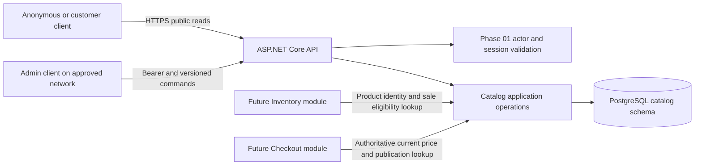

# Catalog Architecture and Decisions

**Status:** proposed Phase 02 design. The confirmed monetary policy is USD with two decimal places. This document defines decisions for later implementation; no catalog has been deployed.

## Module and data flow

Catalog owns categories, products, current prices, publication status, and catalog audit. Identity owns the Admin session. Inventory owns quantities and reservations. Future Orders own accepted historical line prices. Public requests are synchronous SQL reads; admin mutations are synchronous transactions. There is no broker, external search service, or cache in this phase.

**Failure boundaries:** a PostgreSQL outage makes current catalog unavailable. Identity failure denies Admin mutations; public reads can continue when the catalog database is available because they do not require identity. A future Inventory failure does not change what publication means. A failed catalog audit write rolls back its admin mutation.

## ADR-CAT-01 — Flat catalog and durable product identity

**Context and problem:** a product needs stable identity for future stock, carts and orders. A hierarchy, variants and seller records would add business rules before they teach a new boundary.

**Options:** flat categories with one simple SKU per product; a recursive category tree and variant catalog; no categories.

**Decision:** each product has an immutable UUID and SKU and exactly one category. Categories have immutable UUID and slug. Category and product names/descriptions can change; IDs are never reused. No delete API exists. Archived products remain as references for later domains.

**Rationale:** immutable identifiers permit downstream references even after rename or archive. Flat categories still exercise joins, publication visibility and indexing.

**Consequences:** one product cannot appear in two categories; a future variant or hierarchy feature requires explicit migration and new contracts. A renamed category slug is not supported in this phase.

**Experiment:** create a product, change its name/category, then archive it. Its UUID/SKU remain the same while public visibility and audit reflect each step.

## ADR-CAT-02 — USD cents and explicit currency

**Context and problem:** binary floating point and unspecified decimal rounding can corrupt prices. The project owner selected USD with two fractional digits throughout the project.

**Options:** floating point; decimal strings with a fixed scale; integer minor units with a currency code.

**Decision:** persist `price_minor` as a positive `bigint` count of USD cents and `currency_code` as the exact text `USD`. API fields are `amountMinor` and `currency`. Valid catalog unit price is 1 through 99,999,999 cents, inclusive. No decimal price input and no rounding occur in this phase.

**Rationale:** exact arithmetic, a bounded positive amount, and explicit currency support order snapshots later. In a future multi-currency phase, allowed currency/exponent and conversion rules would be explicit migrations; the current constraint prevents accidental mixed currency now.

**Consequences:** clients display cents as dollars with two digits; later checkout must use checked integer arithmetic for quantities/taxes and adopt a separately specified rounding rule for tax/shipping calculations. A currency field alone does not implement conversion.

**Experiment:** exercise 1 cent, 99,999,999 cents, fractional JSON numbers, negative values and wrong currency. Only exact in-range USD-cent values are accepted.

## ADR-CAT-03 — Guarded product lifecycle and per-row version

**Context and problem:** parallel Admin edits can silently overwrite prices or publication status, and an inactive category can hide a product without changing the product's own state.

**Options:** last write wins, a long-held edit lock, or an atomic version precondition.

**Decision:** product states are Draft, Published, Hidden and Archived. Category states are Active and Inactive. Every edit or state transition requires an exact strong `If-Match: "vN"` value; a changed row increments its version atomically. Creation starts at version 1, and a no-op edit preserves the current version. Publishing requires an Active category at the serialization point. Editing a Published product in an Inactive category is allowed but leaves it publicly hidden. Public visibility requires both Published product and Active category in the same SQL statement snapshot. Category deactivation hides associated Published products without mass-updating them; reactivation makes those products visible again.

**Rationale:** conflicts surface to the Admin client and avoid long human edit locks. Category status can change in one row rather than updating an unbounded product set.

**Consequences:** product/category writes have version conflicts. Category reactivation can republish products to the public even though product versions did not change; an Admin must review that effect before reactivation. Cursor pages during concurrent edits are not a snapshot of the whole catalog.

**Experiment:** race two price edits; exactly one commits. Race publish with category deactivation and verify the final public view respects category status. Repeat on two replicas.

## ADR-CAT-04 — PostgreSQL search and bounded cursor pages

**Context and problem:** public product listing must remain bounded as the catalog grows. The brief calls for practical PostgreSQL full-text/indexing learning without an unnecessary search service.

**Options:** unbounded/offset lists, PostgreSQL keyset pages with GIN search, or a separate search engine.

**Decision:** use a stable `(name COLLATE "C", id)` order and signed 15-minute cursor for public product pages. Filter on publication/category in SQL. Search only product name and description through a generated English `tsvector` and a GIN index. The result is an alphabetic list of lexical matches, not a relevance-ranked search. Public category listing uses a bounded cursor in `(name COLLATE "C", id)` order.

**Rationale:** keyset pages avoid deep offset scans. Search remains in the system-of-record database, so the same statement snapshot evaluates text and visibility. [PostgreSQL text search](https://www.postgresql.org/docs/current/textsearch-intro.html) and [GIN indexes](https://www.postgresql.org/docs/current/textsearch-indexes.html) support this scope.

**Consequences:** indexes add write/storage cost; stemming/stop words and bytewise sorting are visible product limitations. Changing names or publication between pages can change results. A high-match-rate query may still need sorting. Query plans, not assumptions, decide whether another index is useful.

**Experiment:** generate 10,000 products with realistic word frequencies. Compare list/search plan and latency against a sequential scan and a deep offset request. Check hidden products and all-stop-word queries.

## ADR-CAT-05 — No Phase 02 cache or independent search service

**Context and problem:** a cache can reduce repeated reads but introduces stale publication and price results, invalidation paths and another failure mode.

**Options:** primary-database reads, in-process cache, shared Redis cache, or a search index.

**Decision:** serve catalog reads from PostgreSQL without a response cache. Use explicit `Cache-Control: no-store` for current-price/publication responses. Revisit cache or search infrastructure only after the [quality workload](non-functional-requirements/quality-targets.md) shows a problem and the new design defines staleness and failure behavior.

**Rationale:** the first catalog increment supplies a correctness and performance baseline. Indexes, bounded pages and query tuning are lower-complexity first steps.

**Consequences:** every read reaches PostgreSQL; database outage makes the catalog unavailable. Later caching requires a new ADR and must not authorize checkout from cached values.

**Experiment:** measure read rate, CPU, buffers and connections at the declared workload; report the observed bottleneck before proposing additional infrastructure.

## Phase interface to later domains

The internal Catalog operation `GetCurrentSellableProduct(productId)` returns immutable ID/SKU, current name, USD cent price, category, product version and a Boolean calculated from Published status plus Active category. It does not return stock availability. The call uses primary database truth. Phase 03 may reference product ID and publication but must not write catalog tables. Phase 06 defines when and how a customer accepts a changed current price; this phase does not establish checkout price-lock duration.
