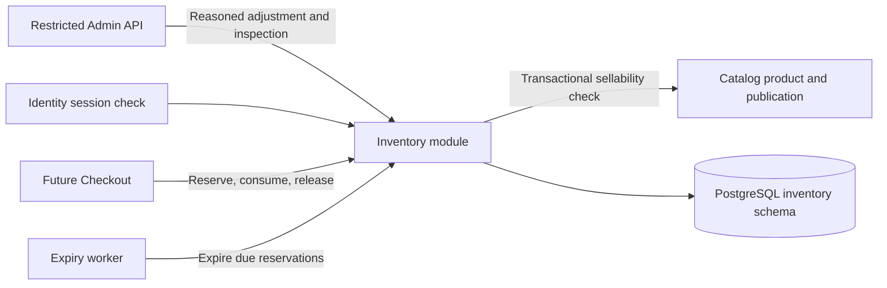

# Inventory Architecture and Decisions

**Status:** proposed Phase 03 design. The product owner confirmed one merchant, one stock location, whole-unit quantities, no backorders and a 15-minute reservation lifetime. This phase uses the Phase 01 ASP.NET Core/EF Core/Npgsql and PostgreSQL baseline; no separate Inventory service is introduced.

## Module and data flow

Inventory owns stock balances, reservation groups and lines, and movement history. It does not own product names, prices, category state, order status, or payment outcomes. The Admin API is the only Phase 03 external mutation surface. Reservation operations are internal module contracts so later Checkout can use the same database transaction as order/attempt creation. No browser, cart, or public product route can reserve stock.

## ADR-STK-01 — One product, one stock identity

**Problem:** Phase 02 provides one immutable SKU/product UUID and the project has one stock location. A warehouse/bin/lot model would add allocation rules unrelated to the first conservation exercise.

**Options:** stock keyed by product UUID; product-plus-location balances; variant/lot balances.

**Decision:** one Inventory stock item is keyed by one Catalog product UUID. Quantities are nonnegative whole units. Backorders and negative available stock are excluded. A Phase 03 migration creates zero-balance items for existing products; a product-create application flow then calls the Catalog owner and Inventory `EnsureItem` in one local transaction. Neither module writes the other's table, and Catalog does not depend on Inventory internally. Inventory cannot delete an item while the product exists.

**Trade-off:** adding locations later requires a new stock-allocation key and migration. That is a deliberate future design. The initial backfill and Catalog integration are reviewed together so no product silently lacks a stock item.

**Experiment:** create and archive a product; confirm its stock identity remains stable. Compare before/after migration counts of Catalog products and Inventory items.

## ADR-STK-02 — Materialized balances plus immutable movements

**Problem:** reservations and adjustments need a fast available count, while recovery needs evidence for where every unit went.

**Options:** event ledger with balance computed on every read; one mutable counter without history; mutable counters plus append-only movements.

**Decision:** each item stores `on_hand` and `reserved`; `available = on_hand - reserved`. Every successful balance change writes one movement per affected product in the same transaction. Reserve adds to reserved; consume subtracts from both; release/expiry subtracts from reserved; adjustment changes on-hand. Checks enforce `0 <= reserved <= on_hand`. A movement records source identity, signed deltas, resulting counters, and database time. No API can delete or rewrite movements.

**Trade-off:** each operation writes both balance and history, increasing write I/O. The benefit is a cheap guarded hot-row update and a durable conservation audit. Ledger reconciliation is an independent check, not an alternate live balance that clients may choose opportunistically.

**Experiment:** inject a movement-write failure after a balance update and show rollback. Sum committed deltas and compare with each stored balance.

## ADR-STK-03 — One atomic reservation group per checkout intent

**Problem:** a multi-product purchase must not reserve only some lines, and a retry after an unknown commit must not reserve twice.

**Options:** independent per-product reservations with compensating releases; one group and all-line transaction; a distributed reservation coordinator.

**Decision:** a reservation group has one server-issued UUID and a caller-issued stable intent UUID. It holds 1–20 distinct product lines, each 1–100 whole units, sorted by product UUID for locking. A canonical fingerprint of the sorted lines is stored with the unique intent UUID. Insert the uncommitted group before Catalog/stock locks to serialize concurrent use of the intent; failed allocation rolls it back. Same intent and same lines returns the same group and its current outcome even if sellability later changes; changed lines return conflict. A new group allocates every line or none in one PostgreSQL transaction. The group state is Active, Consumed, Released, or Expired; all lines transition together.

**Trade-off:** a larger group locks more stock rows and can wait on hot products. Bounded line count, stable lock order and no external call under locks control that cost. Phase 06 owns the checkout attempt and maps its identity to this intent; the UUID alone is not proof of customer authority.

**Experiment:** fail the last item of a multi-product reservation, retry the same intent, then retry with altered quantity. Inspect every stock row, group, line and movement.

## ADR-STK-04 — Durable expiry, database time, and terminal state

**Problem:** a process timer cannot guarantee stock release after a restart, and a late consume must not beat a deadline merely because a worker is delayed.

**Options:** in-memory timers; broker-delayed messages; indexed database polling with row locks.

**Decision:** PostgreSQL stores the group deadline as creation time plus 15 minutes. Consume checks `clock_timestamp()` under the group lock and cannot consume at or after expiry. The worker polls due Active groups in bounded batches with `FOR UPDATE SKIP LOCKED`, then performs the same terminal transition used by synchronous callers. A caller encountering an overdue Active group expires it in its own transaction before returning the terminal outcome. Each terminal transition updates all line balances and movements atomically. Phase 06 defines how an unresolved payment is handled at expiry; Inventory never labels money successful or failed.

**Trade-off:** polling consumes modest database capacity and may release a due reservation after its nominal deadline. Eligibility ends at the deadline even during worker lag, so the lag cannot extend purchasing rights. No broker is justified until an observed throughput or recovery need warrants it.

**Experiment:** stop all workers past a deadline, attempt consume, restart workers, and verify one Expired result and one reserved decrement per line. Repeat the consume/expiry race on separate replicas.

## ADR-STK-05 — Local transaction contract for Checkout

**Problem:** the roadmap requires a durable order snapshot and reservation together before payment work starts.

**Decision:** Inventory offers an in-process operation that participates in a caller-owned PostgreSQL transaction. It neither commits independently nor calls the payment provider. Phase 06 will put Checkout attempt, Order snapshot and Inventory reservation in the same local transaction after validating customer intent. Reserve calls a transactional Catalog operation that locks product/category rows for sellability; Checkout can read current price under those same held locks before committing its accepted snapshot. Checkout must acquire the unique intent group before any stronger Catalog product lock to preserve the shared lock order. Later extraction would require a new coordination and compensation design, not direct cross-service database writes.

**Trade-off:** the monolith shares one database and a short transaction across modules. The boundary remains explicit in code, but true independent deployment is deferred. Inventory returns terminal stock outcomes to Checkout; Orders determines fulfillment eligibility using both stock and payment evidence.

**Experiment:** interrupt the local transaction after Inventory writes but before Order insert/commit; show that no stock reservation remains. Commit it, then interrupt before payment work and show the attempt can resume from durable local state.
