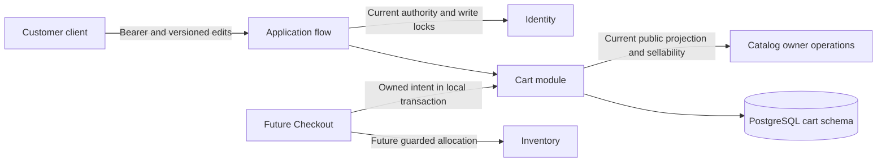

# Cart Architecture and Decisions

**Status:** proposed Phase 04 implementation design. The owner confirmed durable customer carts, 20 lines/100 units, no expiry, current-price presentation, retained unavailable lines and JSON `expectedVersion` conflict rejection. The runtime remains the Phase 01 .NET/ASP.NET Core 10, EF Core/Npgsql 10 and PostgreSQL 18 baseline.

## Module and data flow

The application flow establishes authority through Identity, then calls Cart with the verified owner. Cart writes only its own tables. Catalog owner operations supply visibility and price rules on the same database connection where a snapshot/transaction is required. Cart does not call Inventory. Checkout will coordinate Cart, Catalog, Inventory and Orders through their owners. PostgreSQL failure blocks durable cart reads/writes; no external network call occurs under a cart lock.

## ADR-CRT-01 — Durable relational cart with a retained parent

**Problem:** a customer expects choices to survive logout, restart and another device. First additions can race, and a clear followed by recreation can reuse a version seen by an old client.

**Options:** session/process memory; Redis as primary store; a JSON document; a PostgreSQL parent with product-keyed child lines.

**Decision:** use one `cart.carts` parent keyed by Customer UUID and `cart.items` keyed by `(customer_id, product_id)`. Create the parent lazily on the first effective addition. A customer with no parent reads an empty virtual cart at version 0. The first effective mutation commits version 1; every subsequent effective mutation increments once. Retain an empty parent after removal/clear. No automatic expiry, physical parent deletion, public cart ID or Admin cart access is included.

**Rationale and cost:** PostgreSQL already supplies durability, transactions and ordinary references. Relational lines support quantity checks and unique products. The parent is a serialization point; retaining it prevents version reuse but retains small empty rows. Identity/Catalog foreign keys are allowed in the shared monolith and require redesign on extraction.

**Experiment:** race two first additions, clear the winner, refill it, and retry an old version. Verify one parent, unique lines and monotonic committed versions across replicas and restarts.

## ADR-CRT-02 — Whole-cart optimistic preconditions and absolute quantities

**Problem:** independent tabs can overwrite quantities or clear newer lines. Checking a line cap without serializing child changes can admit too many products.

**Options:** last write wins; per-line versions and a separate clear policy; one cart version; a human-duration edit lock.

**Decision:** every mutation carries required integer `expectedVersion`; compare it after locking the parent `FOR UPDATE`. Reject mismatch with `409 Cart.VersionMismatch` before product/capacity checks. Set an absolute quantity, remove one product, or clear the cart through explicit JSON commands. Successful no-ops preserve version/time. A stale command conflicts even if its desired final quantity happens to match current state. The client reloads and decides whether to resubmit; the server never merges or refreshes the precondition automatically.

**Rationale and cost:** a single version protects cart-wide intent and bounded item count. Brief database locks make the comparison and edit atomic across replicas. Unrelated line edits can conflict; the accepted lean policy favors an understandable resolution over a merge engine. Versions are integers from 0 through 9,007,199,254,740,991 so common JSON clients can represent them exactly; exhaustion fails closed and requires reviewed evolution.

**Experiment:** race two edits at one version, including different products and a clear. At most one effective change can commit. Separately race no-ops: both may succeed while preserving the same version.

## ADR-CRT-03 — Current Catalog projection and generic blocked lines

**Problem:** a saved product can be repriced, hidden, archived, or hidden by category deactivation. A price stored in Cart can become misleading, and exposing newly hidden fields violates Catalog visibility.

**Options:** persist a price/name snapshot; silently drop unavailable products; hydrate current data and retain an opaque blocked line.

**Decision:** persist only product ID and desired quantity. On each GET, load intent and hydrate all products in one short `REPEATABLE READ READ ONLY` transaction. Catalog supplies a batch of current public SKU/name/unit price for Published products in Active categories. A successfully evaluated nonvisible product is `Unavailable` with null product and line subtotal. Keep its ID/quantity for removal, omit its hidden fields/reason, and return a null cart subtotal when any line is unavailable. An empty cart has a zero USD subtotal. Catalog failure returns `503` for the whole read.

**Rationale and cost:** a shared snapshot avoids combining a parent/version and price data from different moments. It adds a short transaction and retains a snapshot until response data is materialized. Reads can finish with data from before a later hide/price commit, and customers must accept final price policy in Checkout. Price is display evidence, not a locked quote; category visibility can change without a product version change.

**Experiment:** pause between intent read and Catalog hydration, reprice/deactivate from another connection, and verify one snapshot. On the next read the new state appears without a Cart version increment. Confirm hidden SKU/name/price never appears in blocked lines.

## ADR-CRT-04 — Intent version separate from HTTP validators

**Problem:** GET includes current Catalog fields that change independently of Cart. A strong ETag based only on the Cart version would fail to identify every representation change.

**Decision:** use the confirmed JSON `expectedVersion` for application conflicts and omit ETag/Last-Modified on Cart responses. Return `Cache-Control: no-store`. Do not reuse Catalog's Admin `If-Match` convention for this changing projection. Set quantity uses PUT with JSON; remove and clear use POST commands so all mutations carry the same JSON precondition without a DELETE request body.

**Rationale and cost:** this small API makes the version's domain explicit. It does not use HTTP conditional mutation status `412`; missing/invalid `expectedVersion` is `400`, and a valid stale value is `409`. A future cache design would need a validator covering the complete projection or separate intent and presentation resources. See [HTTP validator semantics](https://www.rfc-editor.org/rfc/rfc9110.html#section-8.8.1).

**Experiment:** read, reprice a product, and read again. The Cart version stays unchanged while the price changes; no representation validator falsely asserts equivalence.

## ADR-CRT-05 — Mutation acknowledgement and timeout reconciliation

**Problem:** returning a fresh repriced cart after committing an edit introduces a second read that can fail after the edit succeeded. Blind retries can erase newer edits.

**Options:** full projection on every write; durable per-command receipt; compact version acknowledgement followed by explicit GET.

**Decision:** writes return a compact `MutationReceipt` with committed version, last intent-update time and `changed`. Materialize it before commit and send only after commit; there is no postcommit Catalog query. Keep no command-idempotency ledger. A duplicate with the original stale version conflicts after a change. Following an ambiguous result, read current state and reconcile; do not infer original request success from a matching quantity alone, or retry automatically with a new version.

**Rationale and cost:** absolute setters and a monotonic version prevent duplicate increments without a receipt table. Clients may need a GET to render current prices. They can observe current intent but cannot retrieve a historical per-command receipt. A durable idempotency contract is justified later only if a consumer needs that historical result.

**Experiment:** interrupt before commit and after commit/before response. Reload and repeat with the original precondition, observing rollback or conflict without duplicate effects.

## ADR-CRT-06 — Local Checkout input and deliberate evolution

**Problem:** Checkout needs a stable owned set of desired lines while preparing a purchase; Cart has no authority to promise money or stock.

**Decision:** expose an internal owned-intent operation participating in a caller-owned transaction. It takes the Cart parent lock before Inventory intent/Catalog/stock locks and returns version plus 1–20 product/quantity lines. It neither commits nor reserves, sets an order state, or clears the cart. Checkout in Phase 06 defines price acceptance, idempotency and post-purchase cleanup while preserving newer edits.

**Cost and future trigger:** shared local transactions are appropriate for the initial monolith. Extracting Cart requires an authenticated versioned intent snapshot and a revised Checkout coordination policy; copying this locking contract across services is impossible. Introduce a cache, broker or service only after recorded workload evidence identifies a concrete bottleneck and a new ADR defines staleness, recovery and ownership.

**Experiment:** hold the internal intent lock while another client edits the cart, then release it. Verify blocking/conflict and the documented deadline. Review any future Checkout path for Cart → reservation group → Catalog → stock lock order and absence of provider calls under locks.
