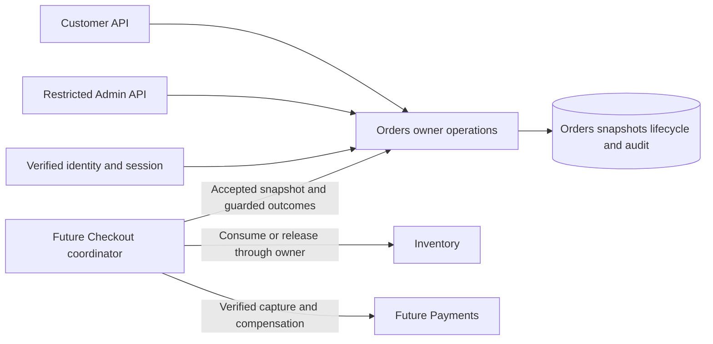

# Orders Architecture and Decisions

**Status:** proposed Phase 05 design using the confirmed lifecycle, pre-Processing cancellation and immutable-address/manual-fulfillment scope. The runtime remains .NET/ASP.NET Core 10, EF Core/Npgsql 10 and PostgreSQL 18.

## Ownership and flow

Orders owns historical lines/address/totals, business lifecycle and durable cancellation intent. It writes only Orders tables. Checkout obtains current Catalog/Cart inputs and coordinates Inventory/Payments before asking Orders to make guarded transitions. Customer/Admin routes never call the provider or write Inventory counters. A failed local Orders audit insert rolls back its mutation; an unresolved provider outcome remains a separate recovery boundary.

## ADR-ORD-01 — Immutable bounded purchase snapshots

**Problem:** current Catalog prices/names and mutable addresses cannot explain what was accepted when a purchase was submitted.

**Options:** live joins to current data; copy all source records; bounded historical line/address/component snapshots.

**Decision:** one order has 1–20 distinct product lines with 1–100 whole units each, accepted SKU/name/USD unit price and computed line subtotal. It stores one shipping address and accepted items/shipping/tax/grand-total amounts. These facts and the owner, Checkout intent and reservation mapping are immutable after creation. Only lifecycle, cancellation and transition-evidence fields change. No edit/reprice/address-change/delete API exists.

**Rationale and cost:** this preserves accepted meaning with ordinary relational storage. Address data needs protected reads, backups and a later real-user retention policy. Source IDs remain references inside the monolith, but historical payloads do not depend on current visibility. Shipping/tax amounts are explicit inputs from future trusted Checkout; zero is not assumed or defaulted.

**Experiment:** rename/reprice/archive a product and change the source address after creation. Every saved line, total and destination remains identical. Fail the last line insert and verify complete rollback.

## ADR-ORD-02 — Business lifecycle separate from money/refunds

**Problem:** one enum cannot describe fulfillment and partial/refunded financial outcomes without ambiguous or impossible combinations.

**Options:** combine every payment/refund/shipment state; independent owner facts with a small business lifecycle; a generic workflow engine.

**Decision:** Orders uses PendingPayment, Confirmed, Processing, Shipped, Delivered, Cancelled and Failed. There are no separate Created/Paid/PaymentProcessing/Refunded/PartiallyRefunded order states. Initial local acceptance is PendingPayment; Confirmed means the exact accepted amount/currency was verified captured and the mapped reservation was consumed. Payments owns capture/refund states; Checkout owns uncertainty/recovery. A failed or cancelled order can still have financial compensation pending.

**Rationale and cost:** the lifecycle remains small while late capture/refund truth remains observable at its owner. The order API omits financial fields until Phase 07 defines their owner projection. Phase 05 simulations must be labeled, restricted and unavailable to public/Admin mutation input.

**Experiment:** simulate capture with consumable stock and with expired stock. Only the former can confirm. Then simulate a refund for a Delivered order without rewinding its shipment history.

## ADR-ORD-03 — Durable cancellation request with fulfillment block

**Problem:** cancellation can race Admin processing or unresolved payment, and a crash can lose a transient request.

**Options:** cancel only unpaid orders; immediately write Cancelled; persist a request and complete after owner resolution.

**Decision:** the confirmed cutoff permits requests from PendingPayment or Confirmed. Store cancellation state None → Requested → Completed separately from order status. Requested leaves the current business status visible but blocks confirmation, processing and shipment. It is irreversible through public APIs. Completion writes Cancelled only after trusted Checkout establishes a terminal stock disposition and safe financial resolution, including durable compensation intent for any capture. Cancelled does not mean refund settled. A newly late capture still requires Payments compensation and never reopens fulfillment.

**Rationale and cost:** the request and processing guard share one locked order row. It creates durable work for later Checkout recovery rather than hiding uncertainty. Active reservations must become Released/Expired; already Consumed stock is not automatically restored. The existing authorized Inventory adjustment is the only lean restock path. Recovery scheduling/refund execution are Phase 06/07 work.

**Experiment:** race cancellation with StartProcessing and payment confirmation. A committed request prevents the incompatible next transition. Interrupt after request commit and show the indexed pending request is recoverable.

## ADR-ORD-04 — Explicit versioned human commands and atomic audit

**Problem:** a stale Admin/client can act on a newer order state, and a generic status update can bypass guards or leave a privileged action unaudited.

**Options:** unrestricted status PATCH; HTTP ETag transitions; explicit JSON commands with expectedVersion and an order row lock.

**Decision:** follow Cart's JSON precondition style: each human command has required positive `expectedVersion`, compared after authorization/ownership and the order lock. A stale version returns `409 Orders.VersionMismatch`. Every effective change increments once; admitted cancellation-request repeats at the current version are no-ops. Admin reasons are required and audit commits with state. Fulfillment transition repeats with the current version are InvalidTransition; there is no generic status endpoint. Internal outcomes replay by their durable evidence/source and exact payload, with incompatible facts rejected.

**Rationale and cost:** one version orders competing edits and matches the newest client command convention. Independent edits can conflict; the client reloads deliberately. There is no durable receipt per human request; a lost acknowledgement is reconciled through current detail/audit. Versions fit lossless JSON integers and never wrap.

**Experiment:** race cancellation and processing at one version, inject audit failure, then repeat a command after response loss. Inspect version, request state and audit together.

## ADR-ORD-05 — Indexed summaries and owner-bound keyset cursors

**Problem:** customer history grows while full line/address hydration and deep OFFSET scans increase cost and privacy exposure.

**Decision:** summaries omit lines, addresses and owner identifiers. Customer pages scope by verified owner and sort `(created_at DESC, id DESC)` with default 20/max 50 and a signed 15-minute cursor. Admin queue pages require Confirmed, Processing or Shipped status and exclude cancellation-blocked rows. Cursor signing follows Catalog's mechanism with a dedicated Orders key and binds actor, route, limit and status. Every detail read uses one short snapshot for parent/lines.

**Alternatives and cost:** offset is easy but deep history is expensive; unsigned cursors may be bounded but do not preserve declared query binding. Signed cursors add a shared key/rotation obligation and are readable, not encrypted. Pages are independent snapshots; Admin queue membership can change while paging. No global count/search/cache is introduced.

**Experiment:** page deep customer history, reuse a cursor under another actor/route/status and race an Admin queue status change. Capture query plans, row bounds and privacy fields. Study [PostgreSQL multicolumn indexes](https://www.postgresql.org/docs/18/indexes-multicolumn.html).

## ADR-ORD-06 — Local owner contracts and acyclic ordering

**Problem:** order/reservation changes must agree, while cross-module lock inversion can deadlock cancellation and payment completion.

**Decision:** Orders internal mutations participate in a caller-owned primary transaction and never commit it. For existing orders, lock the Order before Inventory group/stock. Creation follows Cart → reservation group → Catalog → stock, then inserts a new Order without acquiring any existing Order lock. Creation replay reads an existing immutable snapshot without locking/updating that order after Inventory locks. Checkout must observe these two paths and extend the ordering for its own records in Phase 06.

**Rationale and cost:** new-row insertion can finish an atomic local purchase without reversing existing aggregate locks. Inventory expiry never calls Orders while holding stock/group locks. Provider work stays outside transactions. A later service extraction requires new durable coordination and foreign-key migration; the local transaction is not an external network contract.

**Experiment:** draw the resource graph for creation replay, confirmation, cancellation and expiry, then run both concurrent orders with controlled waits. Verify bounded rollback and that no path holds group/stock while acquiring an existing Order lock.
