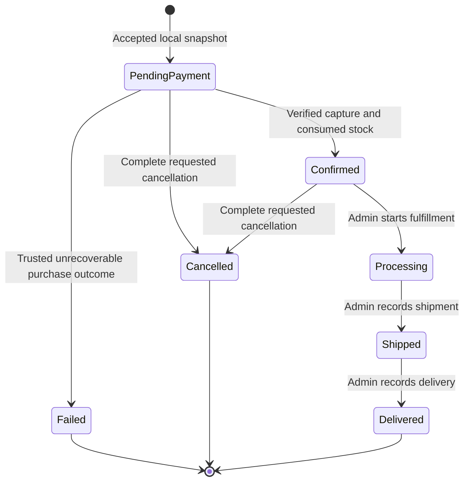

# Order Business Workflows

**Status:** proposed Phase 05 requirements. MUST/MUST NOT define obligations; SHOULD requires a documented exception. The confirmed business lifecycle and cancellation cutoff are specified below. [API contracts](api-and-module-contracts.md) and [transactions](../database/schema-and-transactions.md) supply wire and persistence details.

## Invariants and accepted snapshot

| ID | Invariant | Enforcement/owner |
| --- | --- | --- |
| ORD-INV-01 | Customer operations constrain the persisted owner to the verified subject; Admin rights remain restricted and audited | Identity and Orders scoped operations |
| ORD-INV-02 | One Checkout intent and one reservation map to at most one order | Unique immutable keys and creation replay checks |
| ORD-INV-03 | Every order has 1–20 distinct product lines, each 1–100 whole units | Creation transaction, keys and quantity checks |
| ORD-INV-04 | Owner, intent/reservation mapping, accepted lines/address/currency/component totals and creation time are immutable | Owner API, column grants and snapshot fingerprint |
| ORD-INV-05 | Unit price and all calculations use exact checked USD cents; total = items subtotal + shipping + tax | Creation validation and database checks |
| ORD-INV-06 | Confirmed and fulfillment progression require persisted verified capture and consumed mapped stock; public/Admin input cannot supply either fact | Trusted coordinator and owner evidence |
| ORD-INV-07 | Requested cancellation blocks confirmation and fulfillment; cancellation/processing cannot both win | One order row lock and atomic guards |
| ORD-INV-08 | Effective changes increment once and commit one append-only audit event with state; rejected/no-op changes leave both unchanged | Guarded transaction and unique order/version audit |
| ORD-INV-09 | Terminal business outcomes never reopen; refunds never rewind fulfillment | Explicit transition machine |
| ORD-INV-10 | Orders does not call providers, mutate Cart/Catalog/Inventory/Payments tables or automatically restock consumed units | Module boundary and transaction coordinator |

Unit price is 1–99,999,999 cents. Each line subtotal is quantity × unit price, at most 9,999,999,900 cents. Items subtotal sums all lines and is at most 199,999,998,000 cents. Shipping/tax are required, nonnegative accepted values; grand total is positive and at most 9,007,199,254,740,991 cents, with checked arithmetic. This is a representation bound, not a pricing policy. Phase 06 decides shipping, taxes, destination rules and customer acceptance; Orders never fills omitted amounts with zero.

One address snapshot contains required recipientName, addressLine1, city and countryCode, plus explicit nullable addressLine2, region and postalCode. NFC-normalize and Unicode-trim text, reject controls/line breaks, and retain canonical values. Recipient/city/region permit 1–100 scalars/400 UTF-8 bytes; address lines 1–200/800; postalCode 1–32/128; nullable strings are either null or nonempty. countryCode is two uppercase ASCII letters. These structural bounds do not validate a deliverable address or establish a supported selling region; trusted Checkout must apply Phase 06 destination policy before acceptance. No phone/email/address book/geocoding is included.

## Lifecycle and cancellation machine

PendingPayment is the initial locally accepted order awaiting successful purchase completion. Confirmed has verified full payment and consumed stock. Processing means the Admin has started fulfillment; Shipped/Delivered record manual whole-order progression. Failed is an unfulfillable purchase outcome before confirmation. A financial failure/timeout cannot be inferred merely from that status. Delivered, Cancelled and Failed are terminal business states.

| Command | Source/guard | Effect | Repeat/forbidden behavior |
| --- | --- | --- | --- |
| CreateAcceptedOrder | Trusted Checkout, valid accepted snapshot and matching reservation | PendingPayment, version 1, create audit | Exact intent/snapshot replay returns existing identity; altered snapshot conflicts |
| ConfirmPurchase | PendingPayment, cancellation None, full verified capture, mapped reservation consumed in same transaction | Confirmed; persist confirmation evidence/time | Exact previously applied proof is no-op even after later progression; cancellation/terminal state suppresses new confirmation |
| FailPurchase | PendingPayment, cancellation None, trusted definitive rejection/expiry/unfulfillable evidence | Failed, controlled failure code/time | Same stored failure evidence is no-op; changed/incompatible outcome conflicts |
| RequestCancellation | PendingPayment or Confirmed, expected version current | Cancellation Requested; status unchanged; blocks fulfillment | Current-version Requested/Completed repeat is no-op; stale version conflicts; Processing/Shipped/Delivered/Failed reject |
| CompleteCancellation | Requested in PendingPayment/Confirmed, terminal stock disposition and safe money resolution | Cancelled and cancellation Completed | Same resolution proof is no-op; no public completion or request withdrawal |
| StartProcessing | Confirmed, cancellation None, current expected version and persisted confirmation proof | Processing | Repeat or another source state is InvalidTransition |
| Ship | Processing, cancellation None, current version and Admin reason | Shipped | Whole order only; no direct Confirmed→Shipped |
| Deliver | Shipped, cancellation None, current version and Admin reason | Delivered | No delivery before shipment or reopening afterward |

Every other transition is forbidden. Cancellation state is None → Requested → Completed; Completed requires business status Cancelled. Requested can accompany only PendingPayment or Confirmed. Confirmed/Processing/Shipped/Delivered and cancellation after confirmation retain their historical confirmation evidence. No generic order state edits exist.

## ORD-FR-01 — Create an accepted historical order

**Actor/preconditions:** trusted future Checkout flow after Customer authority, Cart version validation, current Catalog/price acceptance and Inventory reservation. Supplies accepted snapshot, verified owner, stable intent UUID and matching reservation in a caller-owned transaction. Public customers cannot POST an arbitrary order.

**Flow:** validate complete canonical snapshot, required totals, distinct bounds and exact equations. Require the reservation's intent/product quantities to match; a newly created order requires an eligible Active reservation. Insert server UUID, parent/address/lines and create audit atomically at version 1/PendingPayment. Do not independently commit. Phase 06 commits attempt/reservation/order before provider work.

**Replay/errors:** unique Checkout intent is the creation identity. Under the caller's already-held group lock, an ordinary read of an existing immutable snapshot checks owner/reservation/fingerprint and returns its existing order identity; no existing Order lock or update is acquired after Inventory locks. Changed payload/owner/reservation returns IntentConflict and rolls back caller work. Creation failure returns typed InvalidSnapshot/ReservationMismatch/Unavailable; no partial order/reservation/attempt can commit. Replay ignores later Catalog changes and returns historical facts; it does not create another order or reallocate stock.

**Acceptance:** 1/20 lines and exact cents/address boundaries are accepted. Failure on the last line/audit rolls back everything. Same intent and accepted snapshot returns the same identity even after fulfillment; a changed total/address conflicts.

## ORD-FR-02 — Read my order and history

**Actor/preconditions:** eligible Customer. Owner comes from verified subject; guessed IDs are not authority.

**Flow:** detail constrains owner and ID and reads parent/lines in one short shared snapshot, sorted by product UUID. Missing or other-owner ID returns identical `404 Orders.NotFound`. History returns bounded summaries in immutable creation-time/UUID descending order with the owner-bound cursor. No live Catalog/address hydration occurs.

**Rules/errors:** summaries include order ID, status/version, times, grand total and cancellation state/time; no address, lines, customer ID or provider details. Detail includes immutable lines/components/address and business timestamps/failure code. Identity/DB outage fails closed. A new page has a new snapshot; customer orders do not change position because creation keys are immutable. Newer orders inserted ahead of a cursor appear on a refreshed first page.

**Acceptance:** Customer A cannot distinguish B's order from absence or reuse B's cursor. Rename/reprice/archive leaves history unchanged. Null optional address fields remain null, and the full saved address appears only in authorized detail.

## ORD-FR-03 — Restricted Admin reads and fulfillment queues

**Actor/preconditions:** eligible Admin from an allowed Phase 01 source network. Admin access is for fulfillment/refunds, with no customer impersonation.

**Flow:** detail returns the same business snapshot through the Admin route after authority; include no credentials/provider secrets. Admin queue requires status Confirmed, Processing or Shipped, excludes Requested/Completed cancellation, and returns summaries with a route/actor/status-bound cursor. Detailed addresses are fetched only for a selected order.

**Rules:** append a restricted Admin-read audit with actor/order/request ID and database time before returning detail; failure to persist it fails the read. Queue access records a bounded operational event without order/address lists; it does not insert one audit per result. Queue membership may change between pages. An empty queue is valid; a dependency outage cannot fabricate one.

**Acceptance:** disallowed-source Admin/Customer cannot use Admin routes. Admin list has no addresses/owner identifiers. Reading a known order is attributed without changing its business version.

## ORD-FR-04 — Apply trusted purchase confirmation or failure

**Actor/preconditions:** trusted Checkout/resolution coordinator using durable owner evidence; isolated Phase 05 verification may substitute explicitly tagged simulations. No public/Admin mark-paid or failure endpoint exists.

**Flow:** lock the existing Order before group/stock. Confirmation checks cancellation/state, owner/intent mapping and capture evidence for this order and its exact total/USD, then calls Inventory.Consume in the same transaction. Only Consumed, including exact stored replay, permits Confirmed. Persist stable payment-evidence ID and confirmation time with transition audit. If expiry/release wins, do not confirm. The caller must commit any Inventory Expired outcome with a permitted order failure or cancellation/recovery outcome rather than returning false success; captured money requires durable compensation work in Phase 06/07.

**Failure rules:** only PendingPayment with cancellation None can become Failed, for PaymentRejected, ReservationExpired or Unfulfillable. Stock must be terminal/released by Inventory before terminal business failure, and money must have a known no-capture disposition or durable full remaining-capture compensation intent. An unknown payment stays pending recovery even when stock expiry proves the purchase unfulfillable; Checkout records that recovery fact separately. A timeout alone does not authorize Failed. If cancellation Requested, resolve through cancellation completion instead. Financial truth remains in Payments; later capture on Failed/Cancelled is compensated and never confirms.

**Acceptance:** exact capture plus successful consumed reservation confirms once. A mismatched amount/currency/order or active-but-overdue reservation cannot confirm. Duplicate proof never consumes again. Audit failure rolls back Orders/Inventory local changes; actual owner integration remains a Phase 06/07 gate.

## ORD-FR-05 — Request cancellation

**Actor/preconditions:** owning Customer or eligible restricted Admin; JSON expectedVersion is required. Admin additionally supplies a normalized reason (1–256 scalars, ≤1,024 UTF-8 bytes, no controls/line breaks).

**Flow:** take Identity shared locks, owner-scoped Order FOR UPDATE, recheck authority/time, compare version, evaluate cutoff. For a first valid request, write Requested/time, advance once and append audit with actor/reason. Return `202` only after commit. Leave status PendingPayment/Confirmed and do no external work. The persisted request is the fulfillment block and discoverable recovery input.

**Repeat/errors:** stale version → VersionMismatch before cutoff checks. At current version, already Requested returns `202` unchanged; already Completed/Cancelled returns `200` unchanged. Processing/Shipped/Delivered/Failed with no prior accepted request → CancellationNotAllowed. Another owner's order → uniform NotFound. Request cannot be withdrawn. A crash/timeout after commit requires reload; a newer version must never be substituted automatically.

**Acceptance:** cancellation and StartProcessing at one version cannot both succeed. If processing wins, cutoff blocks cancellation; if request wins, processing blocks even after rereading the new version. Admin audit failure rolls back the request. No provider call/Inventory write occurs on this public request.

## ORD-FR-06 — Complete cancellation through trusted resolution

**Actor/preconditions:** future Checkout resolver with durable cancellation and stock/money evidence in a caller-owned transaction.

**Flow:** lock Order before Inventory. For Active mapped stock, release with CustomerCancellation or materialize expiry; Consumed remains consumed and requires no reverse transition. Require terminal Released/Expired/Consumed disposition and exact mapped lines. Require a known no-capture disposition, or durable full remaining-capture compensation intent covering this order. Persist stable cancellation resolution ID/time, status Cancelled and cancellation Completed, increment once and audit. Requested blocks any parallel fulfillment throughout resolution.

**Rules:** unknown money without safe recorded resolution leaves Requested. A scheduled refund may settle later or fail visibly; Completed cancellation does not mean refund completed. Late success after an earlier no-capture resolution creates compensation at Payments/Checkout and cannot reopen the order. No physical restock follows this transition; an Admin may separately verify and adjust consumed stock through Inventory's existing reasoned/idempotent API. Phase 06/07 defines concrete evidence records, compensation identity, recovery scheduling and refund execution.

**Acceptance:** release/expiry occurs at most once; consumed stock does not automatically increase. Killing the resolver before commit leaves both local owners unchanged; after commit the same resolution is a no-op. Refund failure preserves Cancelled and visible financial recovery work.

## ORD-FR-07 — Manual whole-order fulfillment

**Actor/preconditions:** eligible restricted Admin, current expectedVersion and required normalized reason. StartProcessing requires Confirmed with persisted purchase confirmation and cancellation None; Ship requires Processing; Deliver requires Shipped.

**Flow:** authorize/revalidate, lock Order, compare version, apply exact source/guard, set database transition time, increment once and append audit atomically. Return compact receipt after commit. No address/line edits, shipment quantities, tracking URL or direct financial/stock writes occur.

**Acceptance:** start/ship/deliver reaches the linear lifecycle with immutable snapshots. Skipping a state, repeating a transition at current version, attempting Customer fulfillment or racing an accepted cancellation changes nothing. Required audit failure rolls back the status/timestamp/version.

## System Design Prerequisites & Concepts to Learn

Study the [prerequisites](../system-design-prerequisites.md) before each epic. For every command identify the actor, immutable facts, version/serialization point, cross-owner proof, local commit and unresolved external outcome. Use the [verification scenarios](../testing-strategy/verification-scenarios.md) to distinguish simulated proof from real provider and PostgreSQL evidence.
