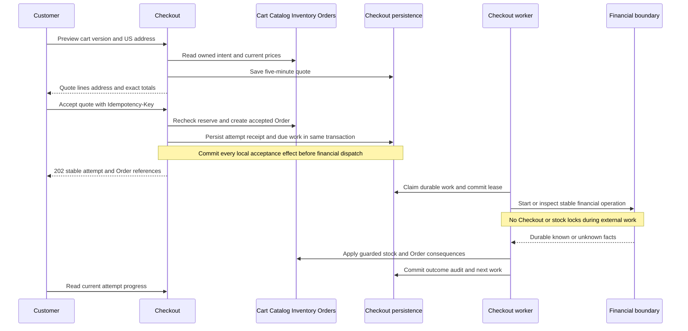

# Checkout Architecture and Decisions

**Status:** proposed Phase 06 design using the confirmed sandbox policy. Reuse .NET/ASP.NET Core 10, EF Core/Npgsql 10 and PostgreSQL 18; pin supported stable patches at implementation.

## Ownership and purchase flow

Customer calls are synchronous through durable preview/acceptance. Recovery is asynchronous in the same deployable monolith. The worker owns coordination and uses owner operations on a shared connection/transaction for compatible local writes. The financial boundary owns dispatch and evidence; Phase 06 substitutes a restricted durable simulator, and Phase 07 introduces the provider adapter. The database, financial dispatch and acknowledgement boundaries can each fail independently. Quote/attempt state never replaces Inventory balances or Orders/Payments truth.

## ADR-CHK-01 — Preview followed by explicit revalidated acceptance

**Problem:** Cart prices are current display values, and a browser total cannot authorize payment. Customer acceptance must survive a race with product/policy changes.

**Options:** trust submitted amounts; compare client-supplied accepted lines; persist a bounded preview quote and revalidate at submission.

**Decision:** persist five-minute quotes for an owned cart version/address. Submission contains only quoteId plus a Customer-scoped idempotency header. Reserve through Inventory and compare current locked prices/quantities and the policy fingerprint before creating Orders. Expiry or changed amounts requires a new quote. Preview is not a reservation or price guarantee.

**Consequences:** server calculation is authoritative and acceptance is explicit. Quotes add short-lived address storage and cleanup. A name-only Catalog edit does not change the accepted amount; Orders preserves the quoted name the customer accepted. SKU is immutable. Publication/category eligibility is rechecked by Inventory regardless of unchanged price.

**Experiment:** edit price, cart and publication between preview/submission; force expiry during a stock wait. No silent amount replacement or partial reserve/order may commit.

## ADR-CHK-02 — Fixed sandbox pricing policy

**Problem:** accepted Orders needs required shipping/tax/destination values; omitted policy cannot silently become zero or an arbitrary region.

**Decision:** policy `sandbox-us-v1` accepts only US, adds 500 USD cents once per order and sets simulated tax to exactly zero. Quotes identify simulated tax. Policy fingerprint covers currency/minor units, destination allowlist, shipping and tax mode/rate. Submission must match the active policy fingerprint. No tax engine, geographic lookup or carrier call is introduced.

**Alternatives and costs:** a real tax/delivery policy requires business/legal inputs and integrations outside this learning baseline. Fixed simulation is deterministic and lean but does not validate deliverability or real tax obligations. Changing these fixed values requires a reviewed policy version and quote/rollout contract, not an unnoticed environment override.

**Experiment:** prove items + 500 + 0 equals the accepted total and reject non-US destinations/changed policy without committed purchase work.

## ADR-CHK-03 — Retained identity and immutable acceptance receipt

**Problem:** response loss and concurrent replicas make an in-memory deduplication check insufficient.

**Decision:** bind `(customer_id, idempotency_key)` to canonical submitted quoteId using a database unique constraint. Keep accepted bindings for the retained purchase lifetime. A quote has at most one accepted attempt. Exact replay returns the original 202 receipt before current quote/cart/stock checks; current progress is a separate GET. Changed input conflicts. Rejected, rolled-back submissions do not create a durable binding.

**Consequences:** a retry after expiry or fulfillment stays safe, and current progress cannot disguise an original acceptance receipt. Keys consume durable storage; cleanup cannot casually erase accepted bindings. Different accepted quotes/keys intentionally identify different purchases. A lost database commit is resolved by the original key, never a new purchase identity.

**Experiment:** concurrent exact/different-body replays, second key for the same quote, and response loss after commit. Inspect one accepted attempt, reservation, Order and create audit.

## ADR-CHK-04 — Atomic local acceptance and durable work rows

**Problem:** a crash between reservation/order creation and payment dispatch can strand stock or create undiscoverable financial work.

**Decision:** one primary READ COMMITTED transaction commits attempt, reservation, immutable Order, quote acceptance, audit and Purchase work together. A bounded database worker discovers due rows with SKIP LOCKED. Claim leases commit before external work; fenced local application rechecks the lease. Financial operations retain stable owner identities across takeovers.

**Alternatives and costs:** controllers with best-effort continuation lose restart recovery; long database locks around network I/O block capacity; a broker/general workflow engine adds runtime and contract scope. Database work adds poll/index/vacuum cost and delivers execution at least once. Lease fencing does not replace financial idempotency.

**Experiment:** interrupt every durable boundary, reclaim a stale lease and verify a stale worker cannot apply local results or invent a new financial key. Study [PostgreSQL queue locking](https://www.postgresql.org/docs/18/sql-select.html#SQL-FOR-UPDATE-SHARE).

## ADR-CHK-05 — Fixed stock deadline and compensation

**Problem:** unknown payment cannot justify perpetual stock reservation or prove that money never moved.

**Decision:** the existing 15-minute reservation deadline never extends. Expiry prevents confirmation. Unknown finance leaves pending recovery/requested cancellation; verified late capture gets durable full remaining-capture compensation. Terminal Order failure/cancellation requires safe owner evidence and terminal stock. Consumed stock is never automatically restocked.

**Consequences:** stock ownership is bounded; late success can require a refund instead of fulfillment. Cancellation and refund settlement remain separate. Bounded retry escalates unknown/refund failure to observable manual review; later verified facts remain admissible. Actual provider no-capture proof, refund limits and retention are Phase 07 integration gates.

**Experiment:** delayed capture beyond expiry, cancellation during dispatch, failed compensation and duplicate late evidence. Preserve financial truth and never reopen a terminal Order.

## ADR-CHK-06 — Conditional cleanup after historical confirmation

**Problem:** a pending purchase can overlap newer cart edits; immediate or unconditional clear loses customer intent.

**Decision:** confirmation atomically creates CartCleanup work. In a later work/attempt/Cart transaction, clear only if version and lines still match the accepted intent. Mark Cleared or Skipped durably with audit. Never lock Cart after an existing Order. Attempts that never confirm do not create cleanup work; later cancellation does not rewind an already confirmed purchase or restore a cleared cart.

**Consequences:** cleanup survives restart and protects new edits. It is eventual; a short interval may show purchased items until cleanup. A skipped cleanup is a successful preservation decision, not a reason to retry with the new version.

**Experiment:** edit before/during cleanup, repeat after commit loss and cancel before versus after confirmation. Observe one clear/version increment or preserved newer intent.

## ADR-CHK-07 — Restricted durable simulator behind the financial boundary

**Problem:** Checkout recovery must be implemented before a provider exists, but a transient fake paid flag cannot exercise durable unknown/late outcomes.

**Decision:** define owner operations and a separate `checkout_simulator` schema for stable payment/refund intents and proofs. Operator-assigned deterministic scenarios are Development-only; no customer/Admin field selects a scenario or supplies proof. Default capture delay is 100 ms. Phase 07 supplies Payments ownership without treating simulated facts as provider evidence.

**Consequences:** crash/replay/compensation can be practiced with explicit synthetic facts. The simulator creates additional Development data and cannot authorize normal deployments. Real adapter replacement needs migration/quarantine of simulated attempts and verified provider contracts; no service extraction or generic plugin framework is required.

**Experiment:** restart across simulated dispatch, late success and refund failure; attempt forged HTTP proof and enabled simulation outside isolated Development. No real financial integration claim follows a simulator pass.
