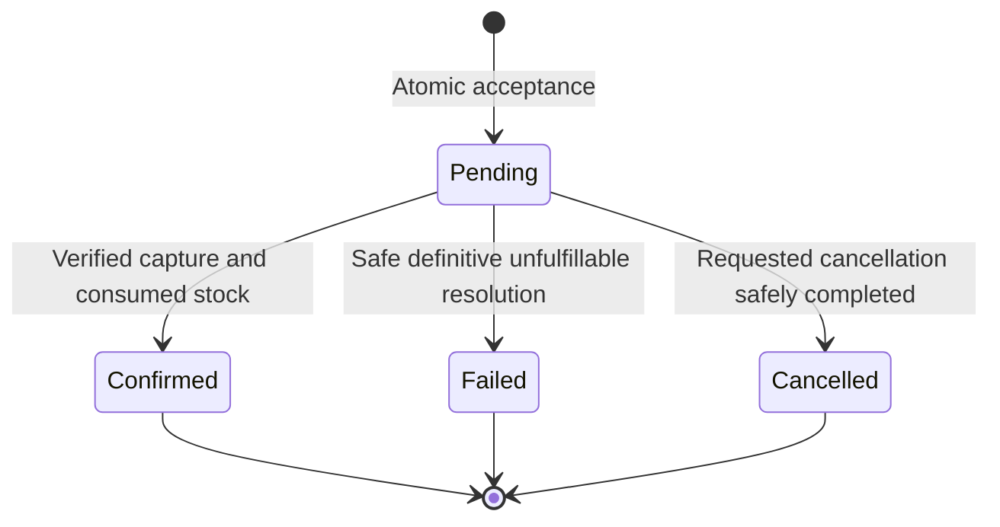

# Checkout Workflows and Invariants

**Status:** proposed Phase 06 requirements. MUST/MUST NOT are obligations; SHOULD requires a documented exception. The [API](api-and-module-contracts.md), [financial boundary](payment-boundary-and-simulator.md) and [transaction protocol](../database/schema-and-transactions.md) define the supporting contracts.

## Invariants

| ID | Requirement | Authoritative enforcement |
| --- | --- | --- |
| CHK-INV-01 | Owner comes from eligible Customer authority; Admin cannot submit/impersonate a Customer | Identity locks and owner-scoped lookups |
| CHK-INV-02 | One accepted Customer/key binding and one accepted attempt per quote | Database uniqueness and exact canonical replay comparison |
| CHK-INV-03 | Attempt, reservation, Order, accepted quote, audit and initial work commit together | One caller-owned primary transaction |
| CHK-INV-04 | Quote is explicit acceptance of bounded lines/address/totals; no client amount becomes authoritative | Server quote calculation and locked submission comparison |
| CHK-INV-05 | Every amount is exact USD cents; shipping is 500, simulated tax is zero, total = items + 500 | Checked arithmetic, fixed policy and Orders constraints |
| CHK-INV-06 | No financial dispatch occurs before acceptance/financial-intent commit or while holding Checkout/Order/stock locks | Worker and financial-owner boundaries |
| CHK-INV-07 | Financial timeout is unknown; reservations never extend; confirmation requires exact capture and actual mapped Consume | Financial evidence, Inventory database-time transition and Orders guard |
| CHK-INV-08 | Requested cancellation blocks new confirmation/fulfillment and resolves through terminal stock plus safe financial evidence | Orders lock/guards and financial dispatch gate |
| CHK-INV-09 | Stale leases cannot apply local results; takeovers retain original financial operation identities | Work-row token/deadline check and financial idempotency |
| CHK-INV-10 | Confirmed cleanup never overwrites newer cart intent; unsuccessful unconfirmed purchases do not clear | Separate Cart owner operation with version/line guard |
| CHK-INV-11 | Required audit failure rolls back the corresponding local effects | Append-only audit in the same transaction |
| CHK-INV-12 | Unknown/failed compensation is discoverable and bounded to explicit manual review; late verified facts remain admissible | Durable work, retry limits and trusted wake/resume |

## Vocabulary and state machines

An **accepted attempt** records the original purchase intent. `purchaseOutcome` starts Pending and changes once to Confirmed, Failed or Cancelled. Confirmed means the original purchase was confirmed; later Order cancellation/fulfillment does not rewrite that historical outcome. Current Order status/cancellation is returned separately. Attempts failing/cancelling before confirmation take the corresponding outcome. A database Preparing row exists only inside the acceptance transaction and MUST NOT commit or be publicly visible.

This diagram is Checkout's historical purchase outcome, not the Orders lifecycle or a payment state machine. The same attempt can still have compensation/cancellation/cleanup work after its outcome is fixed. Financial truth is retained at its owner, including late capture.

Every accepted attempt has exactly four work rows: Purchase, Cancellation, Compensation and CartCleanup, initially Purchase Scheduled and the others Idle. Each row has state Scheduled, Idle or ManualReview. Scheduled work may be leased; lease possession is metadata, not a new business state. Successful completion becomes Idle; a retry stays Scheduled with the same operation identity. Exhausted/unsafe work becomes ManualReview. Idle work may be scheduled for a new cancellation/verified financial fact; ManualReview resumes only for a new verified fact or audited operator action. Ordinary repeated pending observations do not reset the retry budget.

Every worker application, wake and operator resume locks all four rows in the fixed [database order](../database/schema-and-transactions.md#transactions-and-lock-order) before locking the attempt. A standalone claim locks only one work row and commits before further work. No path holds the attempt while acquiring another existing work row.

`recoveryStatus` is a projection over at most four work rows: ManualReview if any row has that state, otherwise Scheduled if any is Scheduled, otherwise Idle. `cartCleanupStatus` is NotEligible until confirmation, then Pending → Cleared or Skipped. These projections do not claim refund settlement. Every unlisted purchase/cleanup transition is forbidden.

## CHK-FR-01 — Preview the owned purchase

**Actor/preconditions:** eligible Customer with expectedCartVersion and a structurally valid US shipping address. Trigger: POST quote request; no Admin/guest route.

**Flow:** acquire Identity user/session shared locks and read the owned Cart intent under its parent lock. Validate version before empty-cart/product classification. Read all 1–20 current visible products in one Catalog batch, calculate quantity × current unit price and the summed items amount, add 500 shipping and zero simulated tax. Normalize the complete address using Orders rules. Save quote UUID, owner, positive cart version, sorted quantities/SKU/name/prices, address, totals and policy fingerprint. Recheck fresh authority time; createdAt comes from database time and expiresAt = createdAt + 300 seconds. Commit and return QuoteView.

**Rules/errors:** no stock reservation or financial intent is created. This preview is not a five-minute price/stock guarantee. Empty cart → EmptyCart; stale version → CartChanged; any nonvisible product → ProductUnavailable. A missing required Catalog reference is integrity/unavailable, never an empty result. Non-US country or malformed address fails validation. Quote creation has no idempotency guarantee; a lost preview response may be replaced by a new preview.

**Acceptance:** Given a two-line eligible cart, When preview commits, Then returned lines/address match the saved canonical quote, shipping is 500, tax is 0, expiry is exactly five minutes, and Inventory/Orders remain unchanged.

## CHK-FR-02 — Accept a quote exactly once

**Actor/preconditions:** eligible owning Customer, one canonical UUID Idempotency-Key header and body quoteId. Trigger: explicit POST submission. The quote carries the accepted cart version and prices; clients cannot supply replacement totals/owner/payment proof.

**Flow:** lock/recheck Identity. Insert/lock the Customer/key attempt identity before locking the quote or Cart. For an accepted binding, compare canonical quoteId/fingerprint and return its immutable receipt without current quote/cart/stock validation. For a new binding, lock the owner-scoped quote, reject prior acceptance/expiry/policy mismatch, then lock/read Cart at the quoted version. Reserve all quoted quantities through Inventory with attempt UUID as globally unique intent. Inventory acquires group → sorted Catalog products/categories → sorted stock. Read current price facts using the already-held Catalog locks; compare exact product quantities/unit prices and recomputed components with the quote. Recheck fresh database time/Identity/quote expiry and reservation eligibility after waits. Create the quoted immutable Order through its owner and atomically record accepted attempt/receipt, quote acceptance, Checkout audit and Scheduled Purchase work. Commit before returning 202.

**Rules/errors:** quoted names are preserved; name-only changes do not alter amount approval. Hidden/inactive/archived products still fail Inventory eligibility. Price/total/policy/cart change requires a new preview. Insufficient stock fails the entire acceptance transaction. No reservation/Preparing attempt/Order/audit can partially commit. A quote can be accepted only once, including under a different key. Different accepted keys/quotes are independent intentional purchases.

**Replay:** accepted keys stay bound for the retained purchase lifetime. Same key/quote returns the original 202 acceptance fields even after expiry, cleanup, fulfillment or cancellation. Changed quote under that key → IdempotencyConflict. Rejected/rolled-back acceptance leaves no binding; a client starting a new intended purchase uses a new quote/key. After uncertain commit, retry only the original key/body. Do not interpret a transient missing read as proof that the original transaction rolled back.

**Acceptance:** Given concurrent identical submissions or lost acknowledgement, When replayed from another replica, Then exactly one reservation/Order/accepted attempt exists and every known successful acceptance receipt has the original immutable values. A changed accepted key payload and a second key for the same quote add no purchase.

## CHK-FR-03 — Inspect current progress

**Actor/preconditions:** eligible owning Customer; attempt UUID. Trigger: GET attempt.

**Flow:** one bounded statement snapshot reads the owned accepted attempt, current Order projection and at most four work rows. Return historical purchase outcome, current Order status/version/cancellation, recovery/cleanup projections, accepted amount/time/deadline and recorded paymentMode. Missing or other-owner attempt → uniform AttemptNotFound. No address/lines, raw provider data or current Catalog hydration is included.

**Rules:** accepted authority permits system recovery after logout/session expiry; a new public read/write still needs current Identity authority. GET is observational and cannot dispatch/confirm/resume a purchase. Scheduled means work remains; ManualReview means an operator must inspect it. Neither a 202 nor Order Cancelled means a refund settled. Clients poll at most once per second and reuse the original submission after an uncertain acceptance.

**Acceptance:** Given a previously accepted purchase, When identity is revoked or Catalog is unavailable, Then unauthorized access fails closed and historical reads do not gain a Catalog dependency; recovery continues with system authority without impersonation.

## CHK-FR-04 — Dispatch and resolve the accepted purchase

**Actor/preconditions:** trusted Checkout worker with a valid Purchase lease and accepted intent. Trigger: due work, restart takeover or verified financial fact.

**Preparation:** in a fenced work → attempt → existing Order → Inventory group/stock → financial-owner transaction, inspect actual reservation state using exact Reserve replay. Materialize overdue expiry; never extend. Check Order cancellation before preparing dispatch. If the Order is eligible and stock Active, ensure the stable payment intent at its owner. If cancelled/expired before dispatch, atomically abort an undispatched intent instead. Commit before financial StartOrInspect; a cancellation racing dispatch is arbitrated by the financial owner's Prepared/Pending/Aborted gate.

**External step:** release every local lock/connection, invoke the original payment operation with a two-second call deadline, and preserve unknown outcomes. The financial owner commits its own intent/outcome independently. Lease loss may stop further local work, but does not erase a durable financial result.

**Resolution:** re-lock valid work/attempt and Order before Inventory, then validate exact financial source/order/intent/amount/USD. Apply the matrix below in one caller transaction, including required audits and follow-up work. Exact applied proof is classified before current-state guards/Inventory effects. Commit observed Inventory expiry even when finance remains unknown; retain Pending outcome and durable stock-loss observation/recovery.

| Order/stock/financial facts | Required local consequence |
| --- | --- |
| Cancellation Requested | Use FR-05; never newly confirm/consume |
| PendingPayment, actual consumable reservation, exact Captured | Inventory.Consume and Orders.ConfirmPurchase atomically; outcome Confirmed, CartCleanup Scheduled, Purchase Idle |
| PendingPayment, Expired/Released, Captured | Ensure durable full compensation, schedule Compensation, then Orders.FailPurchase; outcome Failed; never reacquire stock |
| PendingPayment, Rejected/Aborted, no capture | Release Active stock or retain its terminal result; Orders.FailPurchase; outcome Failed |
| PendingPayment, Active, Pending/unknown | Keep Pending; inspect original operation with bounded recovery |
| PendingPayment, Expired/Released, Pending/unknown | Keep Order/attempt pending and non-fulfillable stock-loss observation; no new dispatch/stock allocation; bounded reconciliation/manual review |
| Already Confirmed/Processing/Shipped/Delivered | Exact purchase proof is no-op; no new capture/consume; current business progression remains |
| Already Failed/Cancelled and later Captured | Preserve terminal business state/outcome; ensure full compensation and recovery |

For new failure choose ReservationExpired when actual stock is Expired; otherwise PaymentRejected for definitive Rejected; otherwise Unfulfillable for an Aborted/released purchase. Orders' safe-money and terminal-stock guards still apply. A timeout, overdue clock or simulator transport error is never a no-capture proof.

**Acceptance:** Given exact capture before eligible locked consumption, Then one confirmation/audit/consume commits. Given late capture after stock loss, Then compensation is durable before terminal failure, with no confirmation or stock allocation. Killing the process before local commit rolls back only those local effects, preserving independently committed financial truth.

## CHK-FR-05 — Resolve durable cancellation

**Actor/preconditions:** trusted worker; Orders already accepted a Customer/restricted-Admin cancellation before Processing. Trigger: bounded discovery of Requested cancellation or new money evidence. There is no second Checkout cancellation endpoint.

**Flow:** claim Cancellation work, then lock work/attempt/Order before Inventory. Release Active mapped stock using CustomerCancellation, or materialize expiry; Consumed remains terminal. Invoke AbortUndispatchedOrInspect through the financial owner. Prepared/missing intent can become a durable Aborted no-capture tombstone; Pending dispatch cannot. Known Rejected/Aborted plus terminal stock permits Orders.CompleteCancellation. Captured requires durable full remaining-capture compensation and Compensation work first. Unknown money leaves Requested and scheduled/manual-review recovery. Use one stable cancellation-resolution UUID per attempt, with validated owner evidence; completion/audit commits together.

**Rules:** confirmation/processing cannot bypass Requested while recovery waits. Completed cancellation may precede refund settlement; failed compensation stays visible. Late capture after a previously safe no-capture resolution schedules compensation and never reopens the Order. Cancellation after historical confirmation does not rewrite purchaseOutcome Confirmed or automatically restock/restore Cart. Attempts cancelled before confirmation take outcome Cancelled and create no cleanup job.

**Acceptance:** Given cancellation wins before dispatch, Then an Aborted financial gate prevents every later dispatcher from starting that operation. Given dispatch wins first and is unknown, Then stock releases/expiry commits, Requested remains, and the same financial operation is reconciled. Captured cancellation completes only with durable compensation coverage.

## CHK-FR-06 — Execute and observe compensation

**Actor/preconditions:** trusted worker with Compensation work and a durable financial-owner compensation intent. Trigger: unfulfillable capture or cancellation.

**Flow:** start/inspect the stable compensation operation outside local locks. The Phase 06 simulator supports one full-capture compensation; Phase 07 owns partial/refund reservation accounting and full remaining-capture coverage. Apply only verified source facts. On Succeeded, finish Compensation work; on pending/unknown, schedule bounded inspection; on definitive Failed or retry exhaustion, enter ManualReview with audit/alert. Keep the Order terminal/cancellation block and financial truth regardless of refund outcome.

**Acceptance:** Given duplicate execution or a lost refund response, Then the same financial compensation identity is inspected and no second refund is created. Given failed compensation, Then customer/operator recovery status is observable and shipment/restock do not occur.

## CHK-FR-07 — Clear only unchanged purchased intent

**Actor/preconditions:** trusted system worker, CartCleanup job created by historical confirmation. Trigger: due cleanup.

**Flow:** lock valid work, attempt and Cart in a separate transaction with no existing Order/Inventory locks. Call the Cart owner with verified accepted owner, exact cart version and sorted purchased lines. Equal version/lines permits one clear/version increment; a newer version returns Preserved without mutation. Store Cleared or Skipped, append Checkout audit and finish work atomically. Matching version with different lines is integrity failure, not permission to clear.

**Rules:** failed/cancelled-before-confirmation attempts never schedule their Idle cleanup row. Later Order cancellation does not undo historical confirmation/cleanup. Replay of finished work adds no version/audit. Cart-version exhaustion fails safely and alerts; never substitute a new version or remove matching product IDs from newer intent.

**Acceptance:** Given unchanged intent, Then one clear commits. Given an intervening add/remove/quantity edit—even if the resulting lines look identical—Then the higher version is preserved. Crash/response loss cannot clear twice.

## CHK-FR-08 — Recover, escalate and admit late facts

**Actor/preconditions:** trusted worker or restricted local operator, never public/Admin HTTP authority. Trigger: due work, expired lease, new cancellation/financial fact or audited operator resume.

**Flow:** claim due Scheduled work with a 30-second token lease. A work kind gets at most ten unsuccessful/unknown observations per recovery cycle; delays are 1, 2, 4, 8, 16, then 30 seconds, without a tight loop. A meaningful verified new fact or new cancellation may start a new cycle. Exhaustion/integrity/refund failure enters ManualReview, retains identities/evidence and raises an alert. An operator can inspect/resume the same work after correcting the cause; there is no status/paid override or key replacement.

**Rules:** expired leases permit takeover. A stale worker cannot commit local effects; repeated financial calls still use the same owner key. A due simulator settlement/new financial fact wakes work only after that owner's commit and outside its locks. ManualReview does not erase pending money or suppress later verified capture. Cancellation discovery and settlement observation remain bounded even for Idle/ManualReview purchases.

**Acceptance:** Given worker loss or unresolved money, Then the purchase is rediscovered, eventually resolves or visibly escalates, and every replay retains stable financial/Order/reservation identities. No callback/source lock is held while acquiring Checkout/Order locks.

## System Design Prerequisites & Concepts to Learn

Study the [prerequisites](../system-design-prerequisites.md) before each epic. Identify the accepted fact, serialization point, local commit, financial operation identity, unresolved outcome and admissible recovery path for every workflow. Use the [manual scenarios](../testing-strategy/verification-scenarios.md) to inspect persisted owner facts rather than relying on HTTP success alone.
