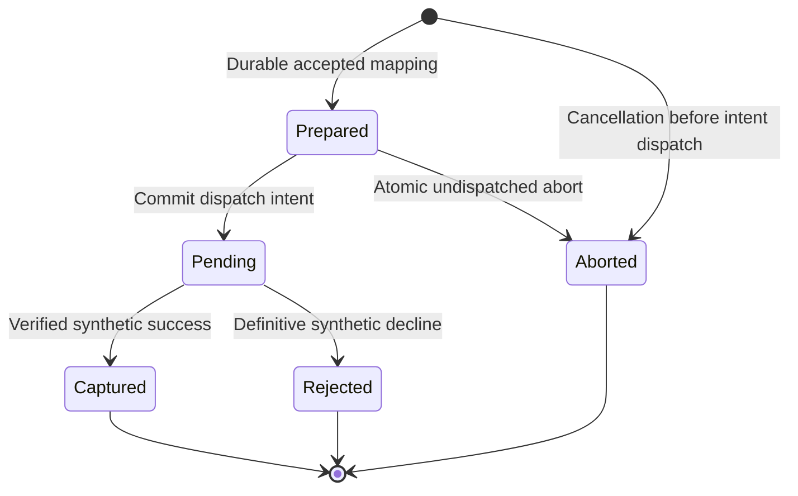

# Payment Boundary and Development Simulator

**Status:** Phase 06 in-process owner contract and deterministic simulator specification. No actual provider, payment-method API, callback route or executable simulator is delivered here. Phase 07 owns real sandbox integration and financial accounting.

## Ownership and admissible facts

Checkout owns stable purchase/payment/compensation identities and workflow work; it does not own captured/refunded balances. The financial boundary owns intent state, dispatch eligibility and durable evidence. Its Phase 06 implementation owns only `checkout_simulator` tables. These are explicitly synthetic financial records, separate from Checkout/Orders persistence and future Payments tables. Only the corresponding owner operations write them.

Every operation binds immutable operation UUID, Checkout attempt UUID, Order UUID, exact accepted positive USD amount and source. A unique Order payment mapping prevents a second charge identity. Financial proof contains source (`Simulator` now; verified provider owner in Phase 07), operation/attempt/order IDs, exact amount/currency, terminal state, stable evidence UUID and database outcome time. Revalidate the mapping; arbitrary caller Booleans/UUIDs are insufficient. Captured/Rejected/Aborted proof is terminal and immutable. Unknown transport has no terminal proof.

Phase 06 admits Simulator only in explicitly isolated Development with both Checkout simulator mode and Orders simulated-evidence permission enabled. Startup rejects simulation outside that mode. Public/Admin input cannot assign a scenario, activate simulation or inject proof. Phase 07 must reject/quarantine synthetic records for provider execution; a simulated capture never becomes a provider charge merely through a mode switch.

## Owner operations

| Operation | Input/transaction | Exact result and obligation |
| --- | --- | --- |
| `EnsurePaymentIntent` | Stable payment operation and accepted attempt/order/amount; caller transaction after Order/Inventory | Prepared or exact existing facts; mapping mismatch → IntentConflict; no dispatch |
| `AbortUndispatchedOrInspect` | Same stable mapping; caller transaction after Order/Inventory | Missing/Prepared → Aborted tombstone with no-capture proof; Pending/Captured/Rejected/Aborted → actual facts; never abort an unknown dispatched operation |
| `StartOrInspectPayment` | Stable operation; financial-owner transactions, two-second external-call deadline | Eligible Prepared commits Pending/dispatch identity before external work; overdue undispatched intent becomes Aborted; return terminal facts or Unknown; repeated Pending inspects original operation rather than inventing another |
| `ReadFinancialFacts` | Stable mapping; bounded owner read, optionally caller transaction | Current durable payment/refund evidence; no provider I/O; terminal capture proof remains immutable |
| `EnsureFullCompensation` | Captured proof, stable compensation operation, controlled reason; caller transaction after Inventory | Durable coverage of all remaining captured money or IntentConflict/Unavailable; financial owner enforces refund limits and reserves coverage |
| `StartOrInspectCompensation` | Stable compensation operation; financial-owner transactions and external deadline | Original refund Succeeded/Failed/Pending/Unknown; never create another refund because response was lost |
| `MaterializeDueSimulation` | Trusted isolated driver; one bounded financial-owner transaction | Apply due deterministic terminal facts once; return stable changed-fact identities for subsequent Checkout wake |

Caller-owned operations never independently commit. Standalone dispatch/settlement operations commit financial truth before notifying Checkout. They never acquire Checkout, Order, Cart or Inventory locks while holding financial locks. Coordinator composition takes work → attempt → Order → Inventory → financial payment → refund. Financial-only operations take payment before its refund, including FK/uniqueness interactions.

Phase 07 must implement equivalent safety with documented provider idempotency/retention, authoritative no-capture evidence, authenticated callbacks, cumulative successful plus reserved refund limits, and partial-refund coexistence. A provider timeout is Unknown. A new provider charge/refund key is never a recovery mechanism. A financial owner's adapter may change while stable Checkout operations and accepted USD snapshots remain.

## Payment dispatch gate

Financial state is owned here, not copied into Orders. Pending includes response loss/unknown. Prepared→Pending and Prepared→Aborted compete under the same payment row lock. Read fresh database time under that lock: a Prepared intent already at/past reservation expiry becomes Aborted without dispatch. A dispatch admitted before expiry may complete later and still requires Inventory eligibility/compensation. Pending cannot become Aborted merely to complete cancellation. Once Aborted wins, later dispatch returns that proof without starting payment. If Pending wins, cancellation must reconcile and possibly compensate. Captured, Rejected and Aborted never change to another terminal state in the simulator; a contradictory synthetic terminal fact is integrity/manual review. An aborted missing-intent tombstone uses the original accepted payment operation so later creation cannot bypass it.

The simulator persists the plan and Pending/due time before its response delay. Waiting occurs without a database connection or business locks. At due time a trusted owner transaction writes terminal state, one stable evidence UUID and outcome time. A lost response changes client knowledge, not the scheduled financial outcome. Restart reads the persisted plan; process memory is not financial truth.

## Full compensation in Phase 06

The simulator supports exactly one capture for the accepted total and at most one full refund intent per payment operation. `EnsureFullCompensation` locks payment then refund, validates actual Captured, and inserts/replays the original compensation UUID for exactly that amount. Stable reasons are Cancellation, StockLost or LateCapture; an existing valid coverage intent is reused even if another reason is later observed. This avoids a reason-only conflict creating another refund. A changed mapping/amount/operation identity conflicts.

Refund state is Prepared → Pending → Succeeded or Failed. Succeeded/Failed is terminal synthetic truth. All execution reuses the original intent. Failed retains durable coverage/recovery evidence and requires manual review; it does not claim money was returned. No customer/Admin partial refund or replacement operation is introduced here. The real financial owner in Phase 07 computes full remaining-capture coverage across existing successful/outstanding refunds and must not double-reserve refundable funds.

Orders may finish Failed/Cancelled after durable full compensation intent exists, while Checkout Compensation work remains Scheduled/ManualReview until settled. This is a business outcome distinct from financial settlement. Restocking remains Inventory's separate authorized adjustment policy.

## Deterministic operator scenarios

Default is Success. Before acceptance, an isolated operator may assign one plan to `(Customer UUID, Idempotency-Key)` through a protected local entry point. The assignment is consumed/read into the financial intent in the acceptance/preparation path and thereafter immutable. No HTTP field/header other than the normal key selects a plan. Unassigned keys use Success. The exact selected plan must survive restart; changing global defaults cannot rewrite an existing intent.

Assignment takes the target Customer Identity user FOR UPDATE before a trusted ordinary accepted-key lookup and assignment insert. Acceptance holds that user's FOR SHARE lock before source selection. A waiting assignment is rejected after committed acceptance; no scenario can be attached retroactively to an accepted default plan. The [database protocol](../database/schema-and-transactions.md#simulator-owned-persistence) owns the full lock rule.

| Scenario | Payment schedule/result | Expected Checkout consequence |
| --- | --- | --- |
| Success | Captured at dispatch database time +100 ms; normal response after that delay | Consume eligible stock and confirm; conditional cleanup |
| Decline | Rejected at dispatch +100 ms | Release/retain terminal stock and fail safely; no cleanup |
| TimeoutThenSuccess | Call returns Unknown after two seconds; Captured is due at dispatch +5 seconds | Reconcile same operation; confirm only if reservation/cancellation still permits |
| DelayedSuccessBeyondExpiry | Call returns Unknown after two seconds; Captured due at reservation expiresAt +60 seconds | No deadline extension; late capture compensation, never confirmation |
| NeverResolves | Pending with no due terminal outcome; call returns Unknown after two seconds | Bounded manual review; stock still expires; no invented no-capture/capture |
| RefundFails | Payment Captured at +100 ms; a required compensation ends Failed at refund dispatch +100 ms | Business cancellation/failure preserved; visible compensation manual review |

Ordinary compensation succeeds at refund dispatch +100 ms. These delays are persisted relative to database timestamps; each replay does not start another timer. Bounded response delays do not hold a connection. Operator scenarios use synthetic accounts/data and fixed plans; there is no random percentage failure or general callback injection endpoint.

The isolated settlement driver checks due Pending payment/refund records once per second, at most 100 discoveries of each class per pass, and applies one record per short transaction using financial row locks. Payment settlement locks its payment. Refund discovery is an ordinary bounded read; application locks the parent payment first, then refund, rechecking due/state after both. Skip a busy parent/refund without taking a child lock first. It shares the bounded Checkout worker pool. After financial commit, it invokes trusted Checkout wake outside those locks. It observes due late outcomes even when purchase work is Idle/ManualReview. At least-once observation cannot create a second terminal proof/refund effect.

## Verification and replacement gate

Verify dispatch/abort in both orders, lost response before/after terminal commit, restarted due plans, repeated compensation, stale Checkout leases and every scenario above. Report exact synthetic mapping, evidence, final Order/stock and unresolved work. Simulated successful capture/refund does not establish a gateway, card handling, callback authentication, PCI scope, real financial durability or tax compliance.

Before Phase 07 accepts provider-backed attempts, introduce Payments-owned persistence/adapter and confirm the caller-transaction and dispatch boundaries. Keep synthetic attempts readable with their original source, resolve/quarantine them using their synthetic owner, and prevent migration into real provider execution. Validate concrete financial proof/compensation semantics against the chosen provider before enabling that mode. Provider financial records must preserve newly verified capture even if it contradicts an earlier local no-capture classification, retaining prior evidence and compensating terminal Orders. This provider case cannot be fabricated by changing the simulator's immutable Aborted/Rejected proof.

## System Design Prerequisites & Concepts to Learn

Study durable intent before dispatch, an atomic no-dispatch gate, known terminal proof versus Unknown, and idempotency across response loss. Reproduce the [manual scenarios](../testing-strategy/verification-scenarios.md) with stable IDs; a transient fake return value cannot establish these properties.
