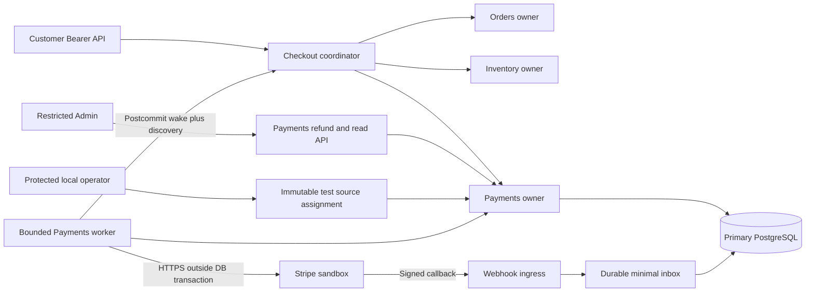

# Payments System Design

**Status:** implementation design for the confirmed sandbox scope. [Provider contract](functional-requirements/stripe-provider-contract.md) owns adapter semantics; [database protocol](database/schema-and-transactions.md) owns persistence/locks.

## Ownership and communication



Checkout performs synchronous in-process owner operations within explicit caller transactions; it never dispatches provider I/O under those locks. Payments' worker communicates with Stripe asynchronously relative to API acceptance. Webhook ingress verifies bytes and commits a hint; it never directly confirms an Order. The operator chooses a test source before acceptance. PostgreSQL stores all durable work; an in-memory notification only reduces latency. Failure points are database commit, network response loss, callback delivery and postcommit wake; independent discovery covers each durable gap.

| Owner | Owns | Receives through narrow contracts |
| --- | --- | --- |
| Checkout | Quote/accepted identity, reservation linkage, four coordination jobs, purchase outcome and cleanup | Verified capture/no-capture/full-compensation coverage; changed fact identity |
| Orders | Immutable purchase, cancellation request and fulfillment lifecycle | Verified financial proof and actual Inventory terminal state |
| Inventory | Stock, fifteen-minute reservation and movement conservation | Reserve/consume/release commands from Checkout |
| Payments | Frozen source binding, dispatch, provider mapping, facts, net balances, refunds, inbox and financial work | Trusted accepted snapshot; restricted Admin refund instruction; authenticated provider observations |

No financial enum is added to the existing Order or AttemptView. Dedicated financial routes avoid rewriting earlier strict schemas. No current Catalog price, cart display total or callback customer metadata supplies financial authority.

## Acceptance through capture

```mermaid
sequenceDiagram
    participant Client
    participant Checkout
    participant DB as Primary PostgreSQL
    participant Payments
    participant Stripe
    Client->>Checkout: Accept quote with original key
    Checkout->>DB: Identity / attempt / quote / Cart / Inventory locks
    Checkout->>Payments: FreezeAcceptedBinding in caller transaction
    Checkout->>DB: Commit accepted Order, reservation, receipt, work and binding
    Checkout-->>Client: 202 original acceptance receipt
    Checkout->>Payments: EnsurePaymentIntent after Order and Inventory locks
    Checkout->>DB: Commit local preparation
    Payments->>DB: Lock payment, admit dispatch, persist Pending and key
    Payments->>DB: Commit; release connection
    Payments->>Stripe: Create + confirm original PaymentIntent
    Stripe-->>Payments: Result or response loss
    Payments->>DB: Persist mapping and verified facts; commit
    Payments-->>Checkout: Wake original attempt after commit
    Checkout->>DB: Four work locks / attempt / Order / Inventory / Payments
    Checkout->>DB: Consume eligible stock and confirm, or reserve compensation
```

`FreezeAcceptedBinding` uses the new Order and already-held attempt in the acceptance transaction. Its parameters are frozen before slow acceptance waits; fresh admission/amount/time checks run before commit. A failure rolls back all local acceptance. Provider dispatch starts only after acceptance and separately committed intent admission. If callback arrives before response, verified retrieval can establish the same mapping. A later response compares it rather than replacing it.

Confirmation requires the exact accepted full USD capture proof, cancellation None, and actual matching Consumed stock. If stock is Expired/Released or cancellation was requested, Checkout establishes durable full-compensation coverage before failing/completing cancellation. Provider success does not extend the reservation or resurrect a terminal Order.

### Refund before confirmation

The owner confirmed this policy: an accepted Admin refund before historical confirmation makes the unconfirmed purchase unfulfillable. Payments sets an irreversible `refund_started` latch when accepting the instruction and wakes Checkout after commit. New confirmation checks that latch and the current hold/coverage state under the payment lock in the same transaction as confirmation; exact already-applied confirmation proof replay still precedes these new-application guards.

If a refund wins before confirmation, Checkout rolls back any provisional consume/confirmation transaction, then resolves in a new ordered transaction: release an eligible Active reservation (or retain Expired/Released), establish full remaining compensation using reason RefundBeforeConfirmation, and fail the purchase with Orders' existing Unfulfillable reason. A concurrent cancellation request completes Cancelled instead under its existing guards. Never commit a stock consumption merely because gross capture existed after a refund instruction had won. No extra Inventory locks may be taken after financial locks; any necessary branch restart releases all locks first.

If confirmation wins first, its transaction holds the financial lock through commit and the subsequent refund follows the confirmed-order policy: Order/stock remain unchanged. Payments never locks Orders to decide this race; Checkout's primary transactional guard and irreversible latch establish the result.

## Payment knowledge and financial evidence

```mermaid
stateDiagram-v2
    [*] --> Prepared
    [*] --> Aborted: Undispatched tombstone
    Prepared --> Pending: Durable dispatch gate
    Prepared --> Aborted: Cancel or deadline wins before gate
    Pending --> Captured: Exact verified capture
    Pending --> Rejected: Verified canceled intent and zero capture
    Aborted --> Captured: Contradictory verified evidence; hold
    Rejected --> Captured: Contradictory verified evidence; hold
```



Prepared/Pending are local knowledge. Pending includes transport Unknown, processing and unresolved cancellation. Aborted proves no local dispatch won; Rejected requires the adapter's definitive no-capture classification. The exceptional capture edges preserve actual evidence and set an integrity hold; they are never normal dispatch or confirmation permission. Prior proof remains immutable. Any transition absent from the diagram is forbidden for ordinary processing; capture never becomes uncaptured after refund.

## Refund accounting and compensation

Let **C** be verified captured USD cents, **S** current net successful refunds, and **R** funds reserved for accepted unfinished refunds or failed compensation holds. Ordinary admission MUST preserve `0 ≤ S`, `0 ≤ R`, and `S + R ≤ C`. Available refund amount is `C − S − R`. Expected Order total is immutable and is not reduced by refunds.

- Admin acceptance reserves the exact requested positive amount under the parent payment lock; it does not dispatch synchronously.
- Prepared/Pending/Unknown refunds retain R. Success moves the amount from R to S once. Verified Failed releases an Admin reservation. A compensation failure retains a failed hold in R and needs operator review.
- A reported successful refund can later fail. Append a linked reversal fact once, reduce S, and either reserve the reopened compensation gap or make the amount available for a deliberate new Admin request. An older success observation cannot undo the reversal.
- A full-compensation case has the stable Checkout compensation UUID and target C. It covers prior S and all outstanding R; it allocates only `C − S − R`. Once opened it keeps financial admission closed to new discretionary Admin refunds. If an outstanding Admin refund fails, reserve the newly uncovered gap for that case in the same transaction.
- Orders' durable coverage proof means the full remaining obligation has been recorded and reserved. It does not mean S equals C. Failed/pending settlement remains visible after Order cancellation/failure.

Refunds follow Prepared → Pending → Succeeded/Failed, with Prepared → Voided allowed only before dispatch. Succeeded → Failed is a verified reversal, preserving the success fact. Failed/Voided do not resume provider mutation. A legitimate replacement after authoritative failure is a separately audited operation under the same compensation case; Unknown never permits replacement.

Actual external activity may violate normal local assumptions. Persist verified financial evidence, set `integrity_hold`, stop further discretionary refunds/confirmation and reconcile. Do not reject/erase a real refund because a CHECK or stale local reservation would otherwise fail. Foreign currency, ambiguous mapping or duplicate provider objects enter durable quarantine and cannot become a purchase proof.

## Lock graph and transaction boundaries

1. Human Admin refund: **Identity user SHARE → session SHARE → payment UPDATE → compensation case if present → selected refund → financial work → audit**. Existing exact accepted-key replay precedes new version/balance/hold guards; authority is always current.
2. Checkout composition: **four work rows in CartCleanup/Cancellation/Compensation/Purchase order → attempt → existing Order → Inventory group → sorted stock → payment → compensation case → selected refund → financial work**. Identity locks precede this when the operation is human-authorized.
3. Financial application: **payment → compensation case → selected refund(s) in UUID order → financial work → selected inbox → facts/audit**. Never acquire Checkout, Orders, Cart or Inventory locks while holding financial locks.
4. Work/inbox claims lock only the claimed row and commit before parent application. Never keep a child/work claim lock while taking payment. Ordinary discovery obtains a payment ID before starting the ordered application transaction.

All semantic mutations use READ COMMITTED with these locks and unique constraints. DB time is authoritative after waits. No transaction/connection spans external I/O. Deadlock/lock/pool failures roll back and retain original identities. Schema FKs to other domains are inserted only in the already-authorized acceptance path; subsequent financial operations reference Payments-owned parents.

## Wake, leases and extraction boundary

One financial work row serializes observation scheduling per payment; it is a scheduling record, not financial truth. Claim a 30-second lease, persist observation count, commit, then call within two seconds. Application locks payment before work and rechecks the fence after waits. Stale results cannot mutate scheduling or a regressive projection; independently verifiable capture/success/reversal evidence is retained through the owner classifier or queued for a fresh observation.

New fact IDs wake Checkout only after Payments commits and releases locks. If the wake fails, Checkout's own work plus Payments' indexed `wake_pending` discovery repairs it; acknowledgement clears that marker in a later Payments-only transaction. Markers identify the highest financial version sent; a concurrent newer version cannot be cleared accidentally. Polling also covers ManualReview/Idle coordination after late facts.

This is local durable scheduling and an external saga boundary. No Redis, broker, distributed lock, two-phase commit or cache is required now. Later extraction must replace caller-owned transactions with versioned integration contracts and transactional outbox/inbox, preserving stable operation identity and compensation. Final microservices/deployment diagrams remain in the [global architecture](../00-project-overview/global-architecture-and-evolution.md); this phase documents the Payments boundary only.
