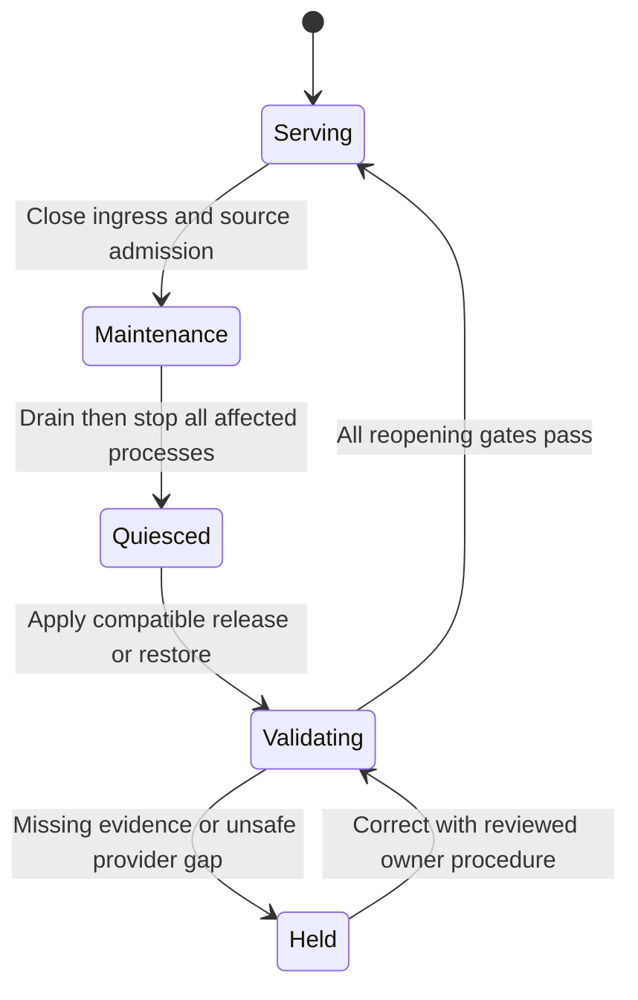

# Monolith Reliability and Failure Behavior

**Status:** required future observed behavior. Reuse [Checkout failure rules](../../06-checkout/reliability-and-failure-scenarios/failure-behavior.md) and [Payments rules](../../07-payments-and-refunds/reliability-and-failure-scenarios/failure-behavior.md). No new generic retry/resilience library or broker is mandated.

## Failure matrix

| Failure/trigger | Expected observable and durable outcome | Bounds/recovery | Forbidden behavior |
| --- | --- | --- | --- |
| Primary unavailable | 503 for affected authority/counter/business requests; ready unavailable, live responsive; no unproved receipt | Probe ≤1 sec; request ≤10 sec; investigate primary before bounded original work resumes | Cache/local-authority fail-open, invented capture, restart storm |
| API pool exhausted | Bounded rejection/503, safe Problem; no infinite waiter list | Pool wait ≤1 sec inside request deadline; preserve capacity for separate workers/operator reserve | One pool/module, unlimited queues, secret DSN in errors |
| Slow query/row lock | Command/transaction abort and visible wait cause; ambiguous postcommit response uses original replay | Lock 250 ms, command 2 sec, transaction 3 sec; owner-specific safe retries only | Removing protected locks or resetting outer deadline |
| Deadlock/serialization failure | Entire failed local transaction rolls back; committed earlier receipt remains original | Inspect lock graph and SQLSTATE in safe diagnostics; no blanket whole-handler retry | Continue aborted transaction or issue another financial key |
| Process dies before acceptance commit | No committed Preparing attempt/partial Order-reservation-binding | Caller retries original key; transaction rollback; normal owner revalidation | Return known accepted receipt without proof |
| Process dies after acceptance commit/before HTTP response | Original immutable 202 replay; durable work discovered | Fenced workers resume original attempt/source | New key as automatic retry or replay against current repricing |
| Worker dies after claim | Original durable work retained; lease permits takeover | 30-second Checkout/Payments lease, fresh fence after waits, bounded claim/action | Delete work or hold child claim while acquiring parent locks |
| Stale worker returns | It cannot apply a decision after lease/source/window/state changed | Recheck fresh DB clock/fence; record safe stale result and reconcile actual money | Treat its stale provider response as authority to fulfill |
| Provider call exceeds deadline | Unknown outcome preserved, original provider key/window retained | Full call ≤2 sec; existing backoff and ≤10 observations; subsequent retrieval/ManualReview | Declare decline from timeout/404 or extend 23-hour mutation window |
| Provider unavailable/auth-mode fault | Account gates close appropriate new financial admission/dispatch; primary-backed reads/replay remain useful | Existing threshold 5 transport/5xx in 60 sec, 30-sec cooldown; auth/mode faults manual hold | Eject/restart all read APIs merely for Stripe failure |
| Lost/duplicate/out-of-order callback | Verified minimal hints/facts deduplicated, current owner guards apply | Bounded signed ingress and retained scan; facts commit before wake | Full provider payload retention or older fact undoing a correction |
| Reservation expires during unknown payment | Exact 15-minute deadline wins; late success creates full compensation | Inventory authoritative clock/transition; no confirmation without eligible consumed stock | Extend reservation or fabricate stock because payment succeeded |
| Refund accepted before historical confirmation | Purchase blocked, eligible reservation released, remaining capture compensated, legitimate failure/cancellation | Fixed work/Order/Inventory/finance lock graph | Confirm a refunded unconfirmed purchase |
| Refund reversal/failed compensation | Financial truth/correction retained; debt/reservation/FailedHold visible, original-case repair controlled | Alert immediately; original approved repair rules and retained scans | Restock/rewind historically confirmed Order or release Unknown allocation |
| Cancellation/fulfillment race | Accepted cancellation before Processing prevents fulfillment; actor/version rules remain | Owner Order transaction serializes state; Checkout resolves money/stock | Treat refund alone as an Order transition |
| Cart edited after accepted purchase | Confirmation cleanup skips changed cart, preserves newer content | Separate version-guarded cleanup transaction | Clear all customer items unconditionally |
| Cleanup backlog | Old eligible security/unused-quote/counter rows visible, accepted records retained | Independent bounded cleanup turns; alert age/bloat | Delete unresolved financial keys or starve expiry/compensation |
| Collector/Tempo/Loki/Prometheus unavailable | Business operation uses primary normally; bounded exports retry/drop; gap/health alert | Finite queues/time/volume; reconnect without an unbounded historical replay | Block commits waiting for telemetry or use missing telemetry as success evidence |
| Telemetry disk full/high cardinality | Ingestion/drop alert, diagnostic capacity contained; business disk/primary isolated | Retention/volume caps, restrictive labels; operator inspection | Fill primary disk or promote request/Customer IDs to labels |
| Required immutable audit write fails | Domain operation requiring audit rolls back | Original audit/transaction deadlines and error | Downgrade audit to expendable log |
| Graceful shutdown | Stop admission/claims, drain/cancel, retain committed effects and ambiguous provider intent | ≤15 sec; old outbound executor quiesced before replacement | False no-capture on cancellation or overlapping senders |
| Migration/rollback incompatible | Closed admission/maintenance remains; retain current data and supported recovery owner | Review exact schema/artifact/SQL before restart | Drop histories, convert Stripe attempts to simulation |
| Corrupt/missing backup/decryption material | No usable recovery point claimed; alert and keep safety hold | Validate manifest/digest/key access and older viable point against RPO | Record backup job launch as backup success |
| Restored DB missing provider-linked records | Match full gap or quarantine orphan; purchase/financial mutation/fulfillment held | Complete [restore procedure](../deployment-and-devops/backup-and-restore.md); RTO includes it | Recreate a missing purchase from untrusted callback metadata |

## Recovery invariants and retry budgets

Use immutable intent and owner evidence as the recovery coordinate. An API outage after a commit cannot prove rollback. Callers replay the same accepted key and reload expected versions deliberately. New operator evidence may resume the original work cycle with attribution; repeated identical old observations do not indefinitely reset retry budgets.

No new generic API retry is introduced. Preserve original owner-specific database retries with full-unit rollback/revalidation and remaining outer time. SQLSTATE/cause can appear as a fixed safe code; exception text/SQL values cannot. Read-only telemetry export retries are bounded and may drop; a financial POST uses its frozen identity and earliest-send horizon, never the telemetry policy.

Provider account failure isolation is already Payments-owned. New API quotas bound arrivals; pools/actions bound executing work. Healthy retained financial scans cannot monopolize dispatch/observation/wake, nor can active dispatch permanently starve scan. Record cycle coverage and admitted dataset service capacity.

## Operational lifecycle

The following states describe a protected operator procedure/evidence record, not a new public or database state machine:

Closing ingress is immediate containment; quiescence is separately proven. A provider request already sent may succeed after local cancellation. Never move from Validating/Held to Serving because only liveness or database startup succeeds. A failed gate remains held; maintenance response/timeout is not a cancelled purchase. Planned downtime counts toward the API availability objective.

## Fault acceptance

For each injected failure record trigger/time, affected count, response/receipt, original key/source state, resource maxima, alerts and recovery outcome. At ≤100 affected attempts, ≥99% reach legitimate terminal or explicitly alerted ManualReview within five minutes after dependencies recover. Count held compensation and Unknown separately; a ManualReview flag without an actionable alert is not convergence. Zero invariant/privacy violations override timing passes. Real PostgreSQL/provider fault evidence is still required; a Markdown matrix does not establish it.
