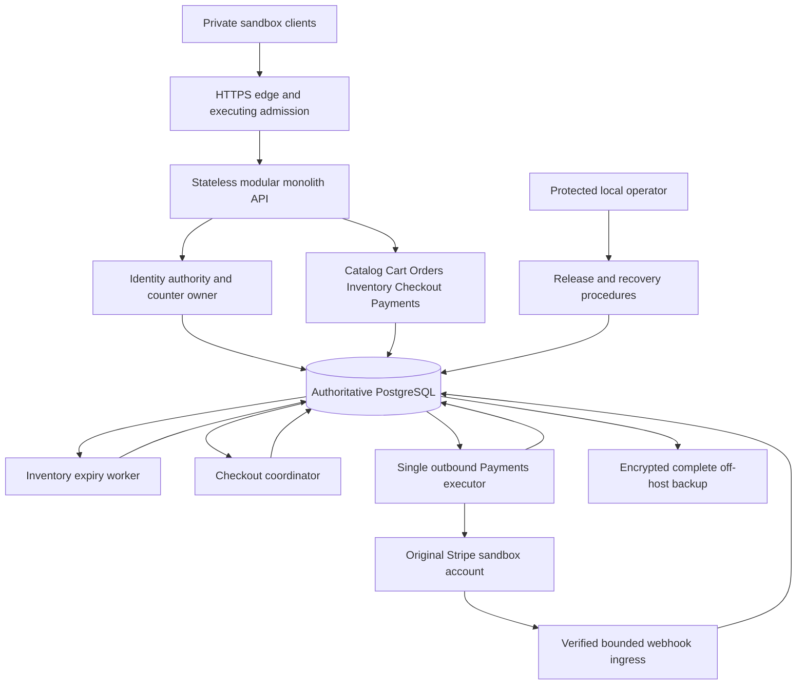
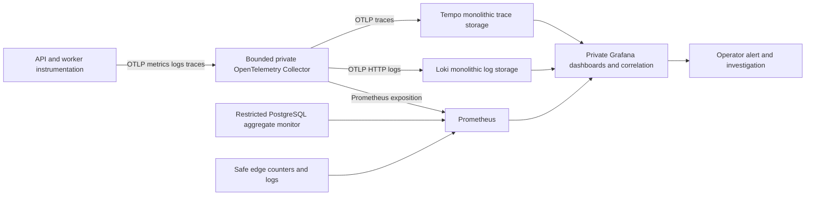

# Monolith System Design

**Status:** target architecture for Phase 08. Owner tables, APIs, financial source rules and [global invariants](../00-project-overview/global-architecture-and-evolution.md#32-global-invariants-and-consistency) remain in force.

## Problem and design

A complete purchase crosses several modules but shares process CPU, one primary and a finite number of connections. A fast acceptance endpoint can hide delayed expiry, refunds or compensation. Independent replicas can multiply pools and abuse allowances. Restoring only database files can erase keys while Stripe still retains their effects. This phase makes those resource and recovery boundaries observable and operable.

Use bounded local owner transactions and existing durable work. Add primary-backed commerce quotas, end-to-end measurements, diagnostic context, compatible migration controls and integrated restore. Preserve one deployment boundary and one database. There is no distributed transaction, broker, outbox, separate read model or cache in this phase.

Boxes for modules/workers describe responsibilities within the monolith deployment. They do not create independent microservices. Initially one application instance hosts the workers. An optional two-API-instance drill retains one outbound Payments executor and divides the same application resource envelope; count every worker actually enabled.

## Ownership and dependency direction

| Owner | Authoritative state | Phase 08 additions |
| --- | --- | --- |
| Identity | Users, roles, sessions, revocation, auth counters/audit | Additional bounded commerce counter scopes; no new account lifecycle |
| Catalog | Products/categories/prices/publication and versions | Measured query/index work only |
| Inventory | Stock, reservation groups, movements and expiry | Aggregate due/lock/resource diagnostics |
| Cart | Owned persistent cart/version | Batched-read and conflict measurements |
| Orders | Immutable purchase/address and lifecycle | Read/fulfillment diagnostics; no payment-state ownership |
| Checkout | Quotes, accepted attempts and fixed work rows | Nullable immutable origin diagnostic context on attempts |
| Payments | Source binding, financial facts/allocations/work/inbox/holds | Nullable diagnostic context on financial work and Admin refund records |
| Observability | Diagnostic signals and configuration | No authority to set domain state or supply missing proofs |
| Deployment/recovery operator | Release/backup manifests and recovery evidence | Protected artifacts outside restored application data |

Instrumentation reads operation results and safe state counts through owner projections. It must not create a cross-owner repository, general JSON event store or backdoor state writer. SQL diagnostic context is private and nullable; existing keys, facts and audits still prove outcomes. Loki/Tempo data loss affects investigation, not the purchase record.

## Request and worker execution

1. Edge enforces TLS, bounded connection/body/request handling and trusted forwarding. Host creates request UUID and a server trace; public trace headers never select authority or sampling.
2. Keep existing parsing/admission/authentication/role/target-validation precedence. Shared counters finish before business locks. Invalid actor input cannot create arbitrary durable actor buckets.
3. Human writes acquire Identity user/session SHARE locks before domain locks. After waits, recheck authority and fresh DB time through effect/no-op/error. Reads keep their documented snapshot semantics.
4. New Checkout acceptance follows quote/cart/reservation/Catalog/stock/new Order/binding/work atomicity. Commit the immutable receipt before provider scheduling. No provider I/O or exporter wait holds a connection.
5. Existing resolution retains four Checkout work locks in fixed order, attempt, Order, Inventory, then financial locks. Cart cleanup is its separate documented transaction. Finance commits before Checkout wake.
6. Claim transactions commit before application locks; action leases/deadlines/fences and provider earliest-send windows remain unchanged. A worker creates a new trace with diagnostic links, not a 15-minute open HTTP span.
7. Responses remain truthful: 202 proves acceptance, not capture; 503/timeouts may be ambiguous after a commit. Retry/reload uses original keys and versions.

The control plane is a protected **stop/start deployment procedure**, not a new global database lock or public maintenance API. During restore/migration requiring downtime, close ingress and drain/stop processes before operating on the primary. Closing admission cannot recall a provider request already sent; quiescence and later reconciliation cover that ambiguity.

## Observability topology

The user selected Tempo/Loki alongside OpenTelemetry/Prometheus/Grafana. Run compatible monolithic local versions; no telemetry deployment may require adding a broker in 08. Their local diagnostic storage is explicitly a sandbox learning baseline, not HA business durability. [Tempo local deployment](https://grafana.com/docs/tempo/latest/set-up-for-tracing/setup-tempo/deploy/locally/linux/) and [Loki deployment modes](https://grafana.com/docs/loki/latest/get-started/deployment-modes/) describe these options. Pin stable compatible versions during implementation.

Use distinct bounded pipelines/export queues. Logs go through the Collector's OTLP HTTP exporter to Loki, with structured metadata enabled and an explicit index-label allowlist; see [Loki OTLP ingestion](https://grafana.com/docs/loki/latest/send-data/otel/). Prometheus scrapes Collector exposition, not an additional public API endpoint. Collector failure creates an explicit telemetry gap and an external scrape-health alert; cumulative SDK instruments may recover counts after reconnection, but process loss/gaps are not reported as perfect availability.

Safe metrics support SLIs independently of trace sampling. Logs link server request UUID to trace ID; diagnostic context stored on accepted owner rows links new worker traces after restarts. Absence of a sampled parent or backend record never blocks work. Provider HTTP instrumentation is allowlisted by operation; full URLs, headers, response bodies and SQL parameters are disabled at source.

## Failure and recovery boundaries

- **Primary unavailable:** authority, counters and business effects fail closed. Readiness fails; no cache/replica/provider-source fallback. Keep liveness responsive.
- **Provider unavailable:** existing Payments account gates/ManualReview/reconciliation apply; primary-backed reads continue. It does not trigger monolith restart or unhealthy retail-read readiness merely due to remote latency.
- **Worker unavailable:** close affected new purchase admission through existing source flags/operational containment, alert due work, preserve receipts. Reads remain useful; expired leases permit fenced recovery.
- **Telemetry unavailable:** bounded export retry/drop with no application business dependency. Operator observes external health and drop counters. Required immutable audit failure still rolls back its domain effect.
- **Restore:** all owner schemas restored together; sessions revoked, original provider window and missing objects reconciled, grants/source guards validated before reopening.

## Design acceptance

No module reads financial truth from Loki/Tempo, performs Stripe work in an API transaction or expands a pool per module. Two API replicas preserve primary quotas, current authority and single provider execution. A process crash at any existing commit boundary preserves owner invariants and discoverable work. A telemetry outage cannot convert a source fact or accepted receipt into a different business outcome.
