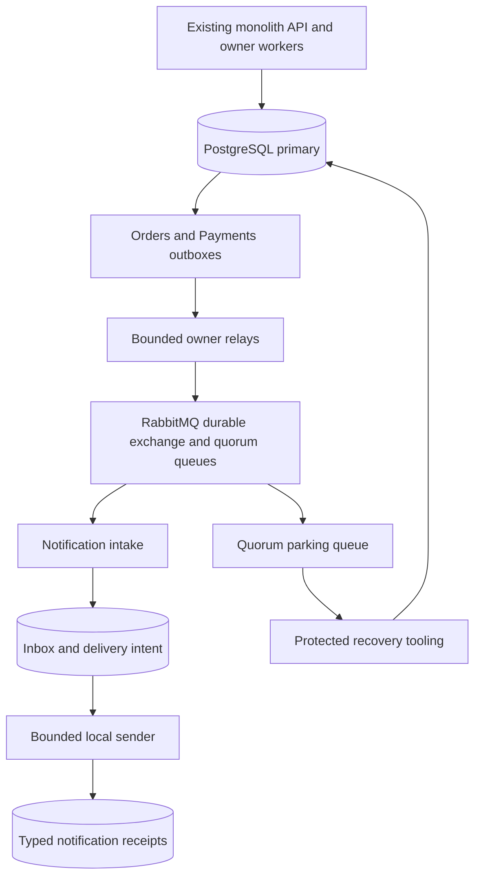

# Event-Driven System Design

**Status:** target design. The [global architecture](../00-project-overview/global-architecture-and-evolution.md), [Checkout locks](../06-checkout/database/schema-and-transactions.md) and [financial observation rules](../07-payments-and-refunds/database/schema-and-transactions.md#financial-observation-facts-and-wake) remain in force.

## Problem, topology and authority

A notification call on a purchase path couples the response to delivery availability. Publishing after the domain commit can lose an event; publishing before the commit can describe rolled-back work. Store immutable publication intent in the same owner transaction, then publish it independently. This follows the [transactional outbox pattern](https://docs.aws.amazon.com/prescriptive-guidance/latest/cloud-design-patterns/transactional-outbox.html).

Notifications owns its inbox, delivery work, receipts, quarantine and operator audit. Orders owns its outbox; Payments owns its outbox. Broker state is transport progress. No consumer writes Orders, Inventory, Checkout, identity authority or financial projections.

Deploy messaging workers inside the monolith deployment boundary. API replicas remain stateless; durable claims permit two enabled worker instances without a leader election service. One single-node broker with one-member quorum queues is the learning baseline. It provides persistent transport, **no node-failure availability claim**. PostgreSQL and retained outboxes permit broker reconstruction. A three-node broker is a later measured topology decision.

## Commit boundaries

| Boundary | Atomic work | A crash after commit permits |
| --- | --- | --- |
| Orders | Guarded status/version, transition audit and outbox | Relay discovers the original event |
| Payments | Admitted facts, projection/version/audit/wake and outbox | Relay publishes facts; existing financial wake still proceeds |
| Relay claim | One outbox lease, attempt count and next work identity | Lease expiry and repeated original publication |
| Broker publication | Persistent bytes accepted under publisher confirms | Lost confirmation can cause another publish |
| Intake | Inbox identity/digest and one delivery intent, or quarantine | Lost acknowledgement can cause another delivery |
| Local sender | Receipt and delivery completion in one PostgreSQL transaction | One persisted receipt; retry observes completion |

Publisher confirms and consumer acknowledgements cover different boundaries. A confirm alone cannot mark a notification Delivered. Manual acknowledgements follow durable intake. See [RabbitMQ acknowledgement semantics](https://www.rabbitmq.com/docs/confirms).

The local sink is a database table, so its receipt and completion can share a transaction. An email/HTTP adapter would introduce another uncertain boundary and require its own durable send identity and duplicate policy; none is introduced here.

## Producer paths

Orders constructs events from the locked owner row and newly inserted transition audit. Event ID equals transition-audit ID. Publish Create and effective changes to Confirmed, Processing, Shipped, Delivered, Cancelled or Failed. RequestCancellation increments the Order version but changes no business status, so it emits no lifecycle event. Rejected commands, exact replays and no-ops emit none. Confirmation event creation follows the existing verified-payment and consumed-stock guards.

Payments constructs events only for new admissible RefundSucceeded and RefundReversed facts from its immutable binding, refund and fact rows. Event ID equals fact ID. The binding supplies customer/order identity without an Orders query or lock. All origins qualify; Pending, Unknown, failed instructions, untrusted webhook hints and inadmissible evidence do not qualify. A reversal links the prior success fact ID. Several facts may share one financial version; each gets its own event.

Insert outbox rows after existing owner/audit/fact locks. The outboxes have no foreign keys to other owners. Relays lock only their outbox, never a parent domain row. Extend the established acyclic lock order by appending this leaf; never acquire Identity/Order/Inventory/financial locks from transport work. Domain transactions contain no broker operation.

## Relay and intake

Each owner relay claims one due row with FOR UPDATE SKIP LOCKED, advances its attempt count, creates a 30-second lease and commits. It publishes the stored bytes outside the database transaction, with mandatory routing, persistent delivery and a two-second confirm deadline. Mark Published only for a positive confirmation with no matching return, using a fresh primary time and matching unexpired lease token. Channel loss, negative confirmation, return or timeout preserves retry work. A stale result cannot overwrite another claim.

Intake validates bounded transport metadata and the strict [event schema](functional-requirements/event-contracts.md). It inserts inbox and delivery work together. A duplicate source/ID with identical frozen bytes is acknowledged after verifying the original durable receipt; it does not change any retry count or completion. Different bytes under the same identity are quarantined. Permanent invalid input is acknowledged only after quarantine commits. A database failure leaves the message unacknowledged, pauses intake and closes the channel with bounded reconnect backoff.

The sender claims delivery work in a short transaction, releases the claim lock, then uses another short transaction to verify the lease and insert the typed receipt with Delivered progress. No external I/O occurs. A unique source/event key is the local effect identity. Claim count persists even if processing crashes. Receipt and work updates roll back together on failure.

## Ordering and historical meaning

There is no global or per-aggregate arrival-order guarantee. Multiple relays, replicas and replay can deliver later versions first. Every distinct event is a historical fact, never a command or replacement for current owner state.

Store every admitted fact once. Operator history sorts by producer time, source and event ID, while displaying Order/financial version and actual receipt time. Versions are ordering hints within one aggregate; gaps are valid and different aggregates are incomparable. Do not discard a refund because a higher financial version has arrived. A reversal can precede its success event, or refer to a pre-cutover fact with no emitted event.

Typed receipts describe the exact observed status/fact and sandbox context. PendingPayment is not paid; Cancelled/Failed is not refund settlement; RefundSucceeded is not permission to fulfill; RefundReversed is a correction to the referenced fact. No current-state summary is inferred from notification arrival.

## Consistency, cutover and recovery

Primary state and outbox intent are strongly consistent within the local commit. Transport and notification visibility are eventual, subject to their separate lag targets. Accepted HTTP receipts remain original business receipts.

A maintenance release installs both producer hooks before opening traffic. Record a protected activation marker for each owner. Emit only new eligible mutations after activation; do not backfill current state, historical audits or simulator refunds. A later historical backfill requires its own scoped contract and identity plan.

Retain immutable outboxes and local deduplication evidence with purchase history. Replay reads original bytes and identity; it never reconstructs an event from today's mutable state. During database restore, stop publishers/intake and validate retained broker messages against restored owner outboxes before normal delivery. Missing or conflicting restored intent is quarantined. See [integrated recovery](deployment-and-devops/backup-and-restore.md).
