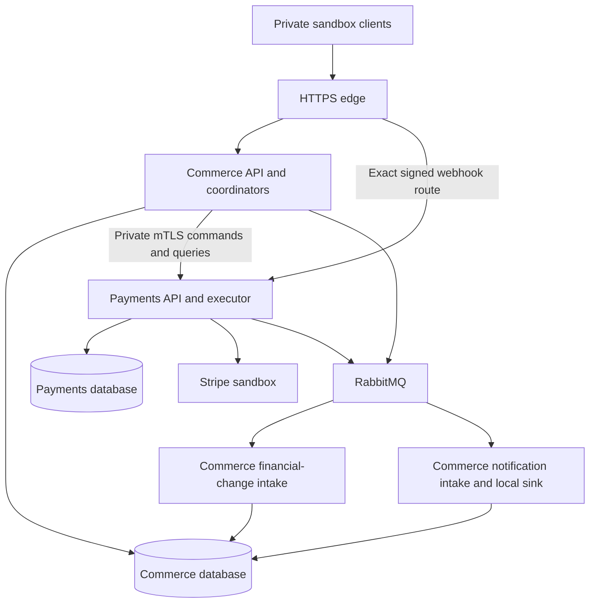

# Microservices System Design

**Status:** target topology. [Phase 10 precedence](README.md#compatibility-and-precedence) applies after cutover; [coordination](reliability-and-failure-scenarios/workflow-coordination.md) defines the required correctness protocol.

## Components and data ownership

| Owner | Responsibilities | Data/access |
| --- | --- | --- |
| Commerce Identity | Human credentials, sessions, revocation, Admin source networks, counters and durable authorization | Commerce database only |
| Commerce Catalog/Inventory/Cart/Orders | Current publication/prices, stock/reservations, cart versions, immutable Order history and fulfillment | Existing local transactions remain |
| Commerce Checkout | Accepted purchase, commands, confirmation decisions, cancellation, compensation coordination and cart cleanup | No Payments SQL/provider calls |
| Commerce Notifications | Historical event intake/local receipts and local review | Existing Phase 09 tables in Commerce |
| Payments | Immutable source descriptors/bindings, financial facts/projections, refund allocations, provider mutations, signed webhook inbox, holds and executor | Payments database/provider only |
| RabbitMQ | Confirmed durable transport and queue/parking progress | No business authority |
| Protected recovery tooling | Owner API inspections and attributed recovery under maintenance containment | No routine shared-database access |

Two logical databases share one PostgreSQL server initially. Separate credentials/CONNECT grants prohibit runtime access to the other database. No dblink/FDW/shared SQL credential. The shared server, disk, broker and edge remain physical failure domains.

## Calls, events and dependency direction

Commerce sends private commands and read queries to Payments. Human tokens terminate at Commerce; mTLS identifies the workload, while the immutable command records the previously authorized actor. Payments never queries Identity/Orders tables. Payment-owned reconciliation can call one bounded Commerce decision query for an unresolved confirmation hold after releasing every local lock.

Payments emits financial-change hints and the unchanged Phase 09 refund events. Commerce emits unchanged Order events. Notifications consumes only the original lifecycle/refund routes; financial-change intake has a separate queue/inbox and cannot confirm directly from event data. It schedules existing Checkout work, which retrieves owner evidence or resolves the held protocol.

No RabbitMQ command choreography, API gateway product, service mesh, discovery service or new Identity service is introduced. Explicit private base addresses and certificates suffice for this local topology.

## Local acceptance and remote initialization

The original Commerce acceptance transaction still commits Identity authority, accepted quote/cart version, reservation, immutable Order/audit/outbox, accepted Checkout receipt and four work rows. It now also freezes an opaque Payments source descriptor and writes InitializePayment command intent locally. It does not insert a remote financial binding.

The descriptor was registered immutably at Payments through protected setup; Commerce retains only descriptor UUID/fingerprint and allowed fixture selection, not provider method/key material. Assignment to a Customer/Checkout key remains local under existing Identity serialization. Defaults/assignments cannot change an accepted descriptor.

After acceptance, a bounded driver initializes the remote binding/intent using original payment/attempt/order/compensation IDs and deadline. Payments persists mapping, command receipt and work before any provider I/O. Unavailability leaves local purchase Pending; stock still expires at 15 minutes. An immutable 202 acceptance acknowledges local intent, not remote initialization or charge.

Commerce owns its purchasing admission gate; Payments owns its independent mutation/dispatch gate. A remote gate can change after local acceptance. Payments rejects/defer dispatch safely; Commerce cannot promise remote admission based on a stale copy. Missing/incompatible source descriptors trigger visible recovery, never a replacement method.

## Distributed consistency and holds

Source initialization, financial mutations and Order outcomes are separate commits. Extend existing durable Checkout work with private command progress and terminal confirmation decisions. There is no SQL transaction across an HTTP/broker call.

A Payments confirmation hold serializes conflicting monetary application while Commerce performs its original Order/Inventory transaction. It is durable application state, not an open database lock or expiring lease. New refunds are blocked; newly verified financial observations are retained as deferred owner evidence. Committed/Aborted Commerce decision releases the hold through bounded finalization. Unknown decision remains held and alerted.

Order Confirmed and actual mapped Consume commit together in Commerce. A new internal fulfillment-release guard remains closed until Payments records that terminal decision and finishes necessary deferred application. Manual processing cannot outrun the distributed handoff. Public Order/Checkout schemas retain their existing states and versions.

## Reads, authorization and secrets

Commerce authorizes/scopes each public financial read, then makes one private bounded query outside its local transaction. Payments returns its own current primary snapshot; GET never contacts Stripe. No stale balance or event projection authorizes a refund/confirmation. Admin access audit must commit at the relevant owner before the response returns; audit failure fails the read.

New Admin refund authorization commits at Commerce under fresh user/session locks and local Order ownership/source checks. Remote admission locks the payment and applies original version/amount/coverage rules. The public result is 202 only after known admission; timeout gives original-key recovery. A previously authorized command can complete after later revocation; new public requests remain denied.

Provider credentials, test-method descriptors, webhook/cursor/provider retry material live only at Payments after cutover. Commerce keeps its JWT/Identity, Order/Checkout and applicable event credentials. Restore current secret versions outside archives.

## Minimum recovery and isolation

Idempotent private receipts, stable identities, uncertain-result inspection, finite retries, confirmation holds, closure tombstones, original-case compensation and stale-runtime fencing are Phase 10 requirements. Phase 11 deepens fault experiments and operational tuning; it cannot supply missing basic correctness.

Stopping Payments leaves Catalog/Cart/history and local expiry operational. New locally admitted purchases may await recovery, expire and require original financial resolution; financial queries/refunds fail safely while unavailable. Stopping Commerce prevents new authorized requests and holds unproved confirmation decisions; Payments retains signed ingress/retrieval and original recovery subject to the hold protocol.
