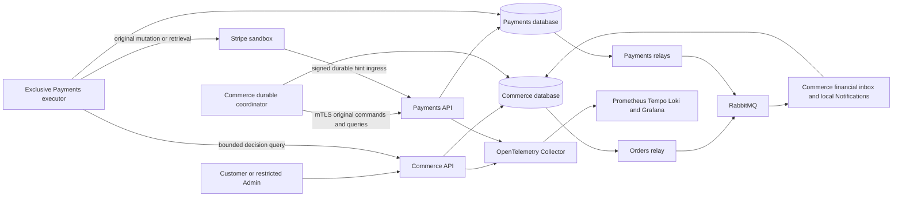

# Distributed Reliability System Design

## Problem and topology

A remote request can commit even when the caller receives no response. Services can disagree about which step completed. Retrying at the HTTP handler, worker, SDK and operator simultaneously can magnify load and create conflicting recovery.

Keep the [Phase 10 topology](../10-microservices/system-design.md). Both databases share one PostgreSQL server and therefore one physical failure and capacity domain. Private HTTPS and RabbitMQ provide communication, not a shared transaction.

Arrows to other processes happen outside database transactions. The financial inbox accelerates existing work; only current authenticated owner evidence can authorize a financial decision. Existing pool/slot limits apply to every arrow.

## Safety and progress

**Safety** means no duplicate ordinary financial effect, oversell, unbacked confirmation, lost refund allocation, unauthorized action or fabricated proof. **Progress** means eligible work advances, or becomes explicitly alerted ManualReview within a finite cycle.

A partition can stop progress while safety remains intact. An unknown hold stays held; Unknown money keeps coverage reserved. ManualReview is an operational disposition, not a payment outcome or permission to ship. Dependency recovery can make review possible; it cannot retroactively turn a timeout into proof of failure.

| Boundary | Strong local invariant | Eventual knowledge |
| --- | --- | --- |
| Commerce acceptance | Quote, original request receipt, reservation, PendingPayment Order, source mapping and work/intents commit together | Payments binding and provider result |
| Payments command admission | Mapping, money allocation, command receipt and required audit/work commit together | Commerce knowledge of the immutable receipt |
| Confirmation decision | Actual stock Consume, Confirmed, terminal Committed decision/audit/outbox commit together | Payments finalization and Commerce release receipt |
| Financial observation | Verified mapped facts/equations, integrity flags and required outboxes commit locally; Held effects are deferred | Commerce hint intake and notification sink |
| Messaging | Business mutation plus canonical outbox, or inbox plus work, commit locally | Broker confirm, redelivery and consumer completion |

A terminal local decision has one owner and cannot be rewritten by later observations. A database read is an observation with finite age, not a lock across the network.

## Distributed workflow, narrowly applied

The existing Checkout coordinator is an orchestrated distributed workflow. Describe it as a saga when discussing its local commits and compensating actions. Retain its existing state machines and typed work rather than adopting a new generic saga framework. Compensation is another durable, fallible financial operation. It does not roll back a provider call, consumed stock or a historical Order.

The confirmation hold restores the specific serialization lost when payment and Order moved to different databases. It temporarily closes financial admission/application while Commerce makes one terminal decision. It never has an expiry that grants permission. This is application coordination, not two-phase commit.

See the [step and race analysis](reliability-and-failure-scenarios/workflow-and-compensation-analysis.md). The general distinction between orchestration, local transactions and compensation is explained in Microsoft's [Saga pattern](https://learn.microsoft.com/en-us/azure/architecture/patterns/saga).

## Reliability controls and their boundaries

| Control | Protects | Does not prove |
| --- | --- | --- |
| Original command/provider identities | Safe recovery of uncertain repeats | That a remote operation failed |
| Persisted retry due time and cycle budget | Bounded load and visible exhaustion | Financial failure or refund completion |
| Private transport breaker | Temporary isolation of a failing RPC class | Current money, authority, stock or restored history |
| Bulkhead/admission bound | Finite concurrent work and resource isolation | Physical server independence |
| Worker token/version and process epoch | Guarded local application and stale-process rejection | That an already sent provider operation did not execute |
| Outbox/inbox and sink receipt | Durable publication/intake/deduplication boundaries | Cross-service atomicity or financial authorization |
| Paired backup plus reconciliation | Recoverable owner histories and accounted provider gap | A globally atomic snapshot |

Private breaker state is process-local, finite and non-authoritative. Business gates, provider gate, deployment epochs, work and receipts remain durable at their owners. No dependency circuit is allowed to return a successful default balance or simulated capture.

## Availability by route

- Catalog, Cart, Identity and ordinary Order reads continue when their own Commerce database and required dependencies are healthy.
- Financial reads fail within the existing response/error contract if Payments cannot provide authoritative data; Orders lists do not acquire one RPC per row.
- Checkout acceptance can retain its original local 202 while remote initialization is pending, provided current local gates/quote/stock allow acceptance. Known integrity/provider containment may close new purchases.
- An Admin refund returns 202 only after known Payments admission; timeout remains uncertain original intent.
- Unreleased historical confirmation cannot enter Processing. A previously recorded safe release remains historical evidence and does not require a fresh RPC on every fulfillment step.
- Notification/broker lag does not rewrite Orders or money. Disk/admission gates may stop new work while preserving capacity for resolving accepted work.

## Alternatives and growth limits

See [ADRs](architecture-decisions.md) for retries, breakers, compensation and recovery tooling. Continue one Payments executor and one Payments process. Horizontal capacity, safe caches and partitioning require Phase 12 measurements; additional failure domains and hosting require Phase 13. This phase cannot claim availability above the physical server/broker/storage envelope.
