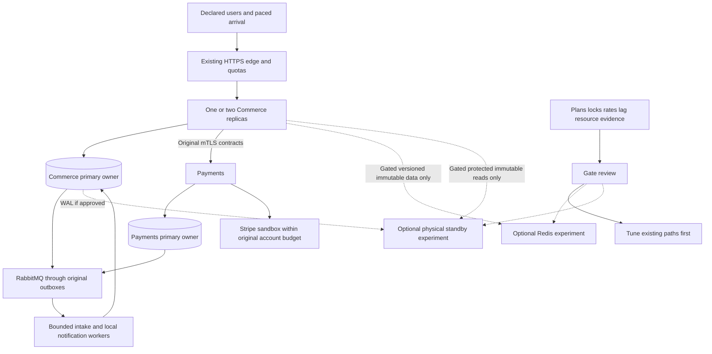

# Scalability System Design

## Problem first

More sessions increase authority/refresh history; more requests increase quota-counter writes and CPU/DB demand; skew concentrates work on single stock rows; retained events/Orders increase maintenance and restore cost. These are different bottlenecks. A new dependency must solve the measured one without changing owner truth.

Preserve the [Phase 11 design](../11-distributed-system-reliability/system-design.md). Both logical owner databases still share physical CPU/disk/connection failure. One Payments process/executor remains; no new domain extraction or physical HA is introduced.

Dotted paths are conditional designs, not active runtime components. Physical standby replication is server-wide when both databases share a cluster; selective runtime access does not prevent the standby disk from containing both owners' data. Partitioning changes an owner table layout only after its own migration/uniqueness review.

## Authority and permitted acceleration

| Data / decision | Required authority | Optional acceleration boundary |
| --- | --- | --- |
| Identity/session/role/revocation and quotas | Current Commerce primary | No cache/replica/global-counter approximation |
| Product/category publication, current price, page membership/order | One current primary statement snapshot | Candidate versioned immutable materialization only after primary guard; no stale page cache |
| Cart and quote acceptance/final totals | Commerce primary/owner contracts | No cached accepted price/availability |
| Stock reservation/consume/release/expiry | Inventory primary locks/invariants | No Redis stock counter/replica allocation |
| Order lifecycle/cancellation/decision/fulfillment release | Commerce primary | Public Order reads remain primary; optional protected immutable inspection requires the standby gate |
| Money/coverage/provider evidence/hold | Payments primary | No cached financial evidence or events-as-authority |
| Notifications/hints | Original outbox/inbox/sink semantics | More consumer work only within bounded grants/pools/routing |
| Protected retained-history analysis | Owner-approved immutable records | Candidate standby read with lag/ownership/restore checks; no new public reporting API |

Public no-store headers remain. Server-side derived materialization does not grant permission to change response freshness or expose unpublished data.

## Tuning sequence

1. Declare workload, useful outcome and original policies.
2. Measure offered/admitted/completed load, query/lock/pool/CPU/I/O/WAL/queue pressure and retained growth.
3. Correct query shape, statistics/indexes, unnecessary work and maintenance interference.
4. Compare one/two Commerce replicas within the same aggregate resources and pool envelope.
5. Evaluate measured skew/hot rows and fair recovery; preserve the locks that enforce stock/money.
6. Only then review safe cache, standby, partition or queue-layout proposals.
7. Rerun the affected class, full inherited baseline, failure/security/restore checks and actual growth economics.

No gate assumes its technology wins. A rejected cache or partition is a successful learning result when the evidence is sound; it is not an achieved capacity tier.

## Limits of horizontal scale

Commerce replica count changes local execution capacity and pool count. It does not multiply shared primary quotas, one provider account quota, single stock-row capacity or retained scan speed. Broker/consumer work can also create more DB traffic.

The planned connection maximum remains `31r+17`:48 at one,79 at two; three is 110 and disallowed. A third replica or larger resource allocation needs a reviewed new capacity envelope and user-authorized concrete infrastructure change. No silent increase to max_connections 100/reserve 20.

## Strong and eventual consistency

Strong local transactions continue for stock, accepted Order/quote, financial allocations/observations, authority and immutable receipts. Coordination/hints/notifications remain eventual and bounded by original work/review policies. Optional caches and standby reads are derived data with explicit fences, never a source of positive financial permission.

Unknown provider result keeps R/identity; late capture on unusable stock compensates; confirmation hold never expires; new retry schedules retain Phase 11 bounded persisted jitter/ten observations/five-minute cycle. Scaling cannot lengthen business deadlines or discard original evidence to regain capacity.
