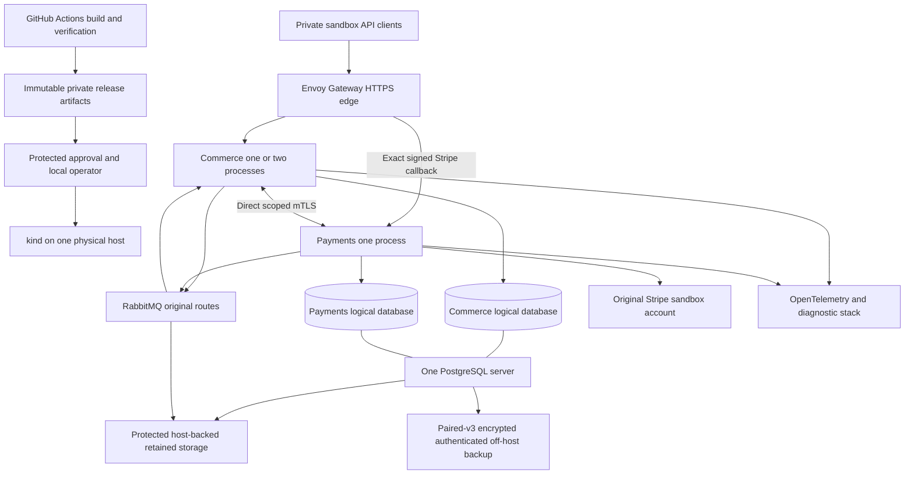

# Production Infrastructure System Design

## Triggering problem

Manual local starts do not establish which artifact, configuration, schema, certificate or data source is active. Replacement processes can overlap old provider work. Disposable cluster deletion can destroy durable owner evidence. Infrastructure must make those boundaries explicit.

The chosen kind topology teaches desired-state reconciliation, resource scheduling, Services, Gateway routing, secrets, storage and release control on one machine. It adds controllers and asynchronous transitions; it does not add physical redundancy or change business truth.

## Deployment topology

The CI build has no cluster/runtime secret access. The operator verifies the approved immutable bundle and target before using local scoped release authority. Gateway handles public HTTPS routing to retail listeners only; private Commerce/Payments calls bypass it and authenticate the original SAN/role/epoch.

HTTP and primary transactions remain synchronous. Outboxes, broker delivery, notification receipts, retries, backup and Kubernetes reconciliation remain asynchronous. Both databases share server and host failure. Diagnostics are nonauthoritative; off-host backup is a separate failure domain that must actually be available.

## Component ownership

| Component | Controller/owner boundary | Positive authority |
| --- | --- | --- |
| Commerce | Bounded application Deployment; owner-controlled release | Original users, prices, stock, Orders and terminal decisions |
| Payments | One application Deployment, controlled stop/start and dispatch handoff | Original money/facts/holds/provider evidence |
| PostgreSQL | One persistent server; two logical owner credentials | Local transactions and retained owner history |
| RabbitMQ | One persistent node; original single-member quorum queues | Transport receipts only; no money/stock authority |
| Gateway | Platform controller and separate data plane | Transport routing, never Customer/Admin/private role authority |
| Cluster/API/CNI | Protected platform administration | Scheduling/network administration, never a financial receipt |
| Backup | Scoped four-connection job plus separately protected recovery material | Authenticated original inventory and pair, subject to reconciliation |
| OTel/Prometheus/Tempo/Loki/Grafana | Restricted telemetry namespace and operators | Diagnostic evidence only |

StatefulSet identity/PVC attachment cannot prove an old process is dead. Namespaces/labels cannot prove mTLS identity. A Kubernetes Lease cannot replace the application hold, financial receipt or executor fencing protocol.

## Environment separation

Retain Compose for early development. The Phase 13 deployment exercise uses a distinct kind cluster identity, namespaces, vhost, credentials, data roots and release inventory. Never start the Compose and kind Payments executors against the same sandbox account simultaneously.

Simulator/transport experiments stay isolated Development, with provider egress fenced. Production-style sandbox startup uses the original StripeSandbox source and original verified account; it rejects simulator flags and live payment credentials.

## Release and failure decisions

Baseline owner releases use protected maintenance and complete stop/start, with Commerce and Payments Deployment strategy Recreate. The actual procedure must prove old processes/connections quiescent; controller status alone cannot authorize replacement dispatch.

An optional serialized rolling Commerce exercise is conditional on a measured overlap budget, mixed-version compatibility and proof of no more than two actual full processes, including terminating instances. It is not the baseline release strategy and is not permission for zero downtime during database or Payments handoff.

Resource pressure sheds bounded work using original errors/gates. Primary loss denies new authority; provider/broker/telemetry failures preserve unrelated capabilities where the owner contracts allow. Host loss may stop everything; paired recovery determines whether service can reopen.

## Design progression

Start with verified artifacts and a resource-admitted host. Establish persistent ownership, CNI enforcement, direct mTLS and exact edge routing. Then implement controlled release/migration, diagnostics and recovery. Only afterward run rolling/autoscaling experiments under their gates.

No mesh, GitOps controller, cloud-managed database, extra service, physical failover, public identity expansion or live-payment flow is introduced. A later hosting proposal must define cost, fault domains, storage, network, secret service, staffing and measured recovery before adoption.
